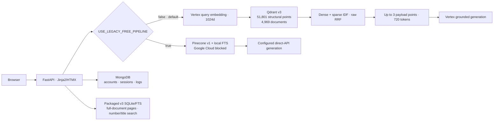

# VietLex — Vietnamese Legal RAG

<div align="center">

[](https://www.python.org/)
[](https://huggingface.co/datasets/vohuutridung/vietnamese-legal-documents)
[](https://cloud.google.com/vertex-ai/generative-ai/docs/embeddings/get-text-embeddings)
[](https://fastapi.tiangolo.com/)

**Vietnamese Legal RAG with Vertex/Qdrant v3 by default and an explicitly selected no-Google-Cloud full-corpus Pinecone path.**

Language: [Tiếng Việt](README.md) | **English**

</div>

VietLex is an AI/ML portfolio project for evidence-grounded Vietnamese legal question answering. A single boolean selects one of two runtime contracts: Vertex/Qdrant structural retrieval is the default, while the legacy/free path uses Pinecone plus SQLite FTS and blocks Google Cloud before a client is constructed.

> [!WARNING]
> The corpus comes from the third-party research dataset [`vohuutridung/vietnamese-legal-documents`](https://huggingface.co/datasets/vohuutridung/vietnamese-legal-documents). It is not an official legal database and does not establish current legal validity. Results are informational, not legal advice; always verify against current official sources.

## Key results

| Portfolio evidence | Result preserved in repository artifacts |
| :--- | :--- |
| Golden-50 v3 raw-RRF answer evaluation, 2026-09-01 | Deterministic exact match **0.0000** · Token F1 **0.2336** · Citation precision **0.9567** |
| Ragas opt-in, secondary evidence | Faithfulness **0.9197** · Answer Accuracy **0.9150** · Context Precision **0.8733** · Context Recall **0.9367** |
| Completed pipeline | **50/50** generation `STOP` · **50/50** NeMo input/output safe · **0** technical errors in the run |
| Verified retrieval subset | **40** cases with all required evidence verified · Document Recall@3 **1.0000**, micro **53/53** |
| Audited v3 data | **51,801** remote points · exactly **4,969** unique document IDs · matching local full-doc/FTS bundle |
| Automated verification | **917 passed, 2 skipped**; live-provider tests remain opt-in |
| Public SSR smoke | Vercel FastAPI/Jinja at <https://vietlex-legal-rag.vercel.app>: health, readiness, root, and `/chat` returned HTTP 200 |

Golden-50 v3 is the split, runnable Balanced-50 subset: 40 cases have fully verified required retrieval evidence and 10 are deterministic reference-only cases. These metrics demonstrate a bounded evaluation slice—not whole-corpus legal accuracy or production readiness. See [`PORTFOLIO_EVIDENCE.md`](docs/evaluation/PORTFOLIO_EVIDENCE.md) for full provenance and evidence boundaries.

## Demo


The repository includes a real FastAPI/Jinja2 chat interface. The screenshot is not a mockup. The online-only public deployment is live at <https://vietlex-legal-rag.vercel.app>; local-corpus pages shown in repository material are outside that deployment contract.

## Core capabilities

- **Default v3 hybrid retrieval:** Qdrant 1024d dense plus sparse IDF fused with raw RRF over **51,801** structural points.
- **v3 evidence:** chat reads `body` directly from Qdrant payloads; Supabase is not queried.
- **Local v3 bundle:** matching SQLite/Zstandard and FTS5 files contain exactly **4,969** audited documents for full-document pages, number/title search, and sparse-length calibration.
- **Reranking:** v3 retains raw RRF; identical-input A/B rejected Qdrant ColBERT after verified recall fell.
- **Grounded generation:** Vertex AI `gemini-3.5-flash` through ADC, with citations and typed provider diagnostics.
- **Evaluation:** deterministic retrieval/answer metrics by default; Ragas/LLM judges are opt-in offline audits.
- **Web backend:** FastAPI, Jinja2/HTMX, MongoDB session/log/feedback storage, rate limiting, and guardrail modes `off`/`shadow`/`enforce`.

## Architecture



`USE_LEGACY_FREE_PIPELINE=false` is the default and selects Qdrant v3. Set it to `true` to select exactly Pinecone-v1 + FTS and block Vertex for retrieval, rewrite, generation, guardrails, migration helpers, and judge selection. The boolean overrides the older structural selector.

The Vertex/Qdrant v3 collection `vietlex-legal-rag-v3-vertex-1024` contains **51,801** green points over exactly **4,969** unique audited document IDs. It is the default runtime retrieval path, but remains a narrow slice rather than full-corpus production-readiness evidence.

### Complete old-pipeline vs v3 comparison

| Concern | Legacy/free (`true`) | Default v3 (`false`) |
| :--- | :--- | :--- |
| Coverage | 518,255 documents | 51,801 points from exactly 4,969 audited document IDs |
| Vector store | Pinecone `vietlex-legal-rag-v1/legal-documents-v1` | Qdrant `vietlex-legal-rag-v3-vertex-1024` |
| Indexed unit | One representative vector per document | Structural chunks; migration caps at 16 evenly distributed chunks per document |
| Dense embedding | E5-small 384d through Qdrant inference | `gemini-embedding-2` 1024d through Vertex |
| Sparse representation | Local `FastSparseEncoder`, at most 64 terms; not full BM25 | Per-point sparse IDF in Qdrant |
| Retrieval | Pinecone hybrid concurrently with SQLite FTS number/title lookup | Qdrant dense+sparse fusion with RRF |
| Runtime text handling | Resolve SQLite/Zstandard full text, then chunk at 220/24 | Use structural payload text; migration chunks at 320/32 |
| Reranking | Qdrant ColBERT with Pinecone BGE fallback | Raw RRF; identical-input A/B rejected ColBERT because it was worse |
| Final evidence | Up to 3 chunks / 720 tokens | Up to 3 points / 720 tokens |
| Backend failure | May retain FTS evidence and report a partial error | Fails closed with a typed error; never silently jumps to Pinecone |
| Google Cloud | Blocked before Vertex client creation; generation uses configured direct-API fallbacks | Vertex supplies query embeddings and is primary for generation/guardrails |
| Main tradeoff | Broad coverage, but document-level vectors may miss deep Articles/Clauses | Finer granularity inside the migrated slice, but no candidate outside it |
| Cache/evaluation identity | Fingerprint and manifest record Pinecone and Google Cloud off | Fingerprint and manifest record v3 and Google Cloud on |

“Legacy/free” means **no Google Cloud calls**. It does not guarantee that every remaining provider is free or has unlimited quota. Without at least one working direct-API key, retrieval can still run while generation may fail with a typed provider error.

Cross-lane Pinecone BGE final reranking was implemented and evaluated on identical inputs but remains `CROSS_LANE_FINAL_RERANK_ENABLED=false`: the evidence did not justify cutover. The closure did not rerun that A/B benchmark.

## Tech stack

| Layer | Technology |
| :--- | :--- |
| API & UI | Python 3.12 (runtime package), FastAPI, Uvicorn, Jinja2, HTMX |
| Default vector retrieval | Qdrant v3, 1024d Vertex dense + sparse IDF + raw RRF |
| Legacy/free vector retrieval | Pinecone Serverless full corpus + Qdrant E5 384d/ColBERT staging |
| Lexical & content storage | SQLite FTS5, SQLite/Zstandard, local `FastSparseEncoder` |
| Generation | Vertex `gemini-3.5-flash` by default; direct-API fallback chain in no-GCloud mode |
| Runtime data | MongoDB for sessions, interaction logs, feedback, and admin data—not the legal corpus |
| Evaluation & safety | Pytest, deterministic metrics, optional Ragas, NeMo Guardrails |
| Delivery | Docker or online-only Vercel FastAPI SSR, GitHub Actions |

## Evaluation

### 1. Comprehensive Golden-50 v3 Benchmark (Deterministic + Ragas + Latency + Safety)

Evaluation results over the packaged **Golden-50 v3** dataset (26 Factoid + 24 Multi-hop questions) using Qdrant v3 raw-RRF, `separated_intent`, `guardrails=enforce`, and Google Cloud Vertex AI `gemini-3.5-flash`. Retrieval metrics score 40 verified cases; the other 10 are explicitly marked `no_verified_gold_label`:

| Metric Category | Metric Name | Achieved Value | Numerator / Sample | Technical Notes |
| :--- | :--- | ---: | :---: | :--- |
| **Reliability & Safety** | **Generation Finish** | **100.0%** | 50/50 | 100% clean `STOP` finish reason |
| | **NeMo Input Guardrail Safe** | **100.0%** | 50/50 | 0 prompt injection / off-topic violations |
| | **NeMo Output Guardrail Safe** | **100.0%** | 50/50 | 0 outputs blocked by the rail; this does not prove absence of hallucination |
| | **Technical Error Rate** | **0.0%** | 0/50 | Zero timeouts, 5xx, or unhandled exceptions |
| | **No-Candidate Rate** | **0.0%** | 0/50 | All queries retrieved valid evidence contexts |
| **Retrieval Quality (40/50 verified; 10 skipped)** | **Document Recall @ 3** | **100.0%** | 53/53 | Gold document present in Top 3 |
| | **Document Recall @ 24** | **100.0%** | 53/53 | All required gold documents retrieved in Top 24 |
| | **Article Recall @ 3** | **100.0%** | 30/30 | Exact legal article retrieval rate |
| | **Clause Recall @ 3** | **92.86%** | 13/14 | Exact legal clause retrieval rate |
| | **Document MRR** | **0.9750** | 39/40 | Mean Reciprocal Rank at document level |
| | **Article MRR** | **0.9074** | 24.5/27 | Mean Reciprocal Rank at article level |
| | **Clause MRR** | **0.7949** | 10.33/13 | Mean Reciprocal Rank at clause level |
| | **nDCG @ 10** | **0.9218 macro / 0.9007 micro** | 43.4165/48.2021 | Normalized Discounted Cumulative Gain |
| | **Exact Reference Hit** | **100.0%** | 40/40 | Verified legal-reference hit |
| | **Multi-hop All-Required** | **97.50%** | 39/40 | Full retrieval coverage on multi-hop questions |
| **Deterministic Answer (50/50)** | **Exact match / Token F1 / Character F1** | **0.0000 / 0.2336 / 0.2250** | 50/50 | Low lexical overlap; not a legal-correctness verdict |
| | **Citation precision / invalid rate** | **0.9567 / 0.0433** | 50/50 | Citation recall/coverage is applicable to only 1/50 cases |
| **Ragas opt-in (50/50; 0 judge errors)** | **Faithfulness** | **0.9197** | 50/50 | Judge and generator share the same model identity; not independent legal review |
| | **Answer Accuracy** | **0.9150** | 50/50 | Semantic alignment with human ground truth |
| | **Context Precision** | **0.8733** | 50/50 | Density and relevance of retrieved contexts |
| | **Context Recall** | **0.9367** | 50/50 | Information completeness for answers |
| **Latency Profile (50/50)** | **t_input_guardrail** | **1.0061 s** | P50 (P95: 1.2432s) | Input safety check latency |
| | **t_retrieval** | **0.6842 s** | P50 (P95: 1.6051s) | Bound persisted retrieval artifact |
| | **t_output_guardrail** | **1.1252 s** | P50 (P95: 1.4889s) | Output safety rail |
| | **t_total (End-to-End)** | **5.3818 s** | P50 (P95: 6.7163s) | Generation/guardrails over persisted evidence |

### 2. Final Reranker Head-to-Head Comparison (Qdrant ColBERT vs Pinecone BGE vs Raw RRF)

Empirical comparison over the identical 40 human-verified cases (`all-required-verified`):

| Algorithm / Provider | Doc Recall @3 | Article Recall @3 | Clause Recall @3 | All-Required Coverage | P50 Latency | Technical Verdict |
| :--- | :---: | :---: | :---: | :---: | :---: | :--- |
| **Raw RRF (Qdrant dense + sparse)** | **100.0%** (53/53) | **100.0%** (30/30) | **92.86%** (13/14) | **97.50%** (39/40) | **2.65 s** | **Best in this canary**: preserves exact Điều/Khoản |
| **Historical Qdrant v2 comparator** | **94.34%** (50/53) | **90.00%** (27/30) | **85.71%** (12/14) | **85.00%** (34/40) | **8.92 s** | Same case IDs, but a historical run rather than a simultaneous A/B |
| **Qdrant ColBERT (`answerai-colbert`)** | **100.0%** (53/53) | **90.00%** (27/30) | **78.57%** (11/14) | **87.50%** (35/40) | **2.97 s** | **Failed the gate** on the exact raw-RRF candidate pools |
| **Pinecone BGE (`bge-reranker-v2-m3`)** | NOT SCORED | NOT SCORED | NOT SCORED | NOT SCORED | 15.00 s timeout | Monthly 500-request rerank quota was exhausted; technical failures are not quality scores |

Raw v3 hybrid RRF is the strongest candidate in this narrow canary. Qdrant ColBERT should not be forced into production because it increases latency and drops verified legal structure.

### 3. Final Balanced-50 `qdrant-only` audit — cutover rejected

This historical 2026-08-27 run completed all 50 cases with Qdrant ColBERT, enforced guardrails, deterministic metrics, and Ragas. It exercised Pinecone-v1 + SQLite FTS and **did not run v3**, so it is not current v3 evidence.

| Metric | Result |
| :--- | ---: |
| Generation / guardrails / Ragas coverage | **50/50**; 0 technical errors |
| Verified Document Recall@3 | **0/53** |
| Ragas Faithfulness | **0.7467** |
| Ragas Answer Accuracy | **0.1500** |
| Ragas Context Precision / Recall | **0.1600 / 0.1567** |
| Deterministic token F1 / char F1 | **0.1585 / 0.1801** |
| End-to-end latency P50 / P95 | **10.65 s / 14.09 s** |

This historical run rejects forcing ColBERT into the pipeline. V3 raw-RRF is now the default runtime and is stronger in the new audit, but the 40 cases with verified retrieval gold remain a narrow slice and do not establish whole-corpus production readiness.

### 4. Immutable Verification Artifacts
- [`Golden-50 v3 answer + NeMo + Ragas, 2026-09-01`](docs/evaluation/runs/answer-v3-golden50-online-vercel-20260901/report.md)
- [`Golden-50 v3 retrieval, 2026-09-01`](docs/evaluation/runs/retrieval-v3-golden50-online-vercel-20260901/report.md)
- [`Split Golden-50 dataset and labels`](docs/evaluation/golden50-v3/README.md)
- [`Balanced-50 v3 raw-RRF answer + Ragas`](docs/evaluation/runs/answer-v3-raw-balanced50-20260827-final2/report.md)
- [`Balanced-50 v3 raw-RRF retrieval gate`](docs/evaluation/runs/retrieval-v3-raw-balanced50-20260827-final/report.md)
- [`Identical-pool Qdrant ColBERT A/B`](docs/evaluation/runs/retrieval-v3-colbert-identical40-20260827-final2/report.md)
- [`Balanced-50 report`](docs/evaluation/runs/answer-balanced50-v2-live-20260822/report.md)
- [`Balanced-50 Qdrant-only final audit`](docs/evaluation/runs/answer-balanced50-qdrant-only-final-20260827/report.md)
- [`Representative-10 report`](docs/evaluation/runs/answer-representative10-v6-live-20260822/report.md)
- [`Vertex/Qdrant v3 Canary report`](docs/evaluation/runs/retrieval-vertex-v3-goldenfull-verified40-20260826/report.md)
- [`Vertex/Qdrant v3 50k migration report`](docs/evaluation/runs/vertex-qdrant-v3-50k-20260827/report.md)
- [`Portfolio evidence`](docs/evaluation/PORTFOLIO_EVIDENCE.md)
- [`Current evaluation status`](docs/evaluation/CURRENT_STATUS.md)

---

## Supabase is not a runtime retrieval dependency

There is currently **no Supabase read client**. V3 chat consumes Qdrant payload evidence; full-document pages and number/title search read the packaged [`data/v3`](data/v3/README.md) bundle. [`run_supabase_full_doc_upload.py`](run_supabase_full_doc_upload.py) is an optional one-way exporter, not a production dependency.

Status on 2026-08-27: the exporter and checkpoint are ready, but the project returns `404 PGRST205` because `public.legal_documents` does not exist. Only a publishable key is available, so upload is **BLOCKED_SECURITY**; anonymous write/RLS will not be opened merely to finish the migration. Create the schema with admin authority and use a service-role or another tightly scoped ingestion credential/policy.

### 1. Environment Configuration (`.env`)
```env
SUPABASE_URL=https://YOUR_PROJECT.supabase.co
SUPABASE_SERVICE_ROLE_KEY=YOUR_SERVER_SIDE_SERVICE_ROLE_KEY
```

### 2. Create Table in Supabase SQL Editor
Print the standardized DDL schema:
```powershell
python run_supabase_full_doc_upload.py --print-schema
```
Execute in **Supabase SQL Editor**:
```sql
create table if not exists public.legal_documents (
  document_id bigint primary key,
  document_number text not null,
  title text not null,
  source_url text not null,
  legal_type text not null,
  legal_sectors text not null,
  issuing_authority text not null,
  issuance_date text,
  content text not null,
  content_sha256 text not null,
  content_store_key text not null,
  quality_flags jsonb not null default '[]'::jsonb,
  dataset_revision text not null,
  uploaded_at timestamptz not null default now()
);
create index if not exists legal_documents_document_number_idx on public.legal_documents (document_number);
create index if not exists legal_documents_content_sha256_idx on public.legal_documents (content_sha256);
alter table public.legal_documents enable row level security;
```

Keep `SUPABASE_SERVICE_ROLE_KEY` on the backend/CLI only. Never expose it through Vercel client variables or `NEXT_PUBLIC_*`; the uploader rejects publishable keys.

### 3. Check Connection & Upload
```powershell
# Verify connection and table existence
python run_supabase_full_doc_upload.py --check-connection

# Execute batch upload with resumable checkpointing
python run_supabase_full_doc_upload.py --max-documents 50000 --batch-size 50 --allow-remote-write
```

## Setup and usage

### Requirements

- Python 3.12. CI retains a Python 3.10 dependency-compatibility lane, while the runtime package in `pyproject.toml` requires `>=3.12,<3.13`.
- Local MongoDB or MongoDB Atlas
- Qdrant Cloud plus Google Cloud credentials for default v3, or Pinecone + Qdrant credentials and one direct generation API key for no-GCloud mode
- The packaged 4,969-document v3 bundle is ready after clone; full 518,255-document local stores are needed only for the full-corpus path

```powershell
python -m venv .venv
.venv\Scripts\Activate.ps1
python -m pip install -r requirements.txt
Copy-Item .env.example .env
```

Primary variables are documented in [`.env.example`](.env.example). `USE_LEGACY_FREE_PIPELINE=false` selects v3; set it to `true` to use Pinecone v1 and block Google Cloud. Inject secrets through environment/platform secret storage; never hardcode or commit credential files.

Run the application:

```powershell
uvicorn app.main:app --host 0.0.0.0 --port 8000
```

Run the default provider-free checks:

```powershell
python -m pytest -q
python -m compileall -q app tests
git diff --check
```

### Deployment topology

- **Vercel online-only SSR:** `app/server.py` runs FastAPI/Jinja directly; Qdrant v3 supplies payload evidence and the local corpus is excluded from the bundle.
- **Persistent alternative:** the `Dockerfile` still supports `/data` stores when `SERVERLESS_ONLINE_ONLY=false`.
- Direct FastAPI uses SSE; a live deployment is claimed only after HTTP checks and a manifest-backed benchmark.

See [`deploy/vercel-proxy/README.md`](deploy/vercel-proxy/README.md).

## Advanced evaluation and adjudication

### Provider-free gold adjudication

`run_gold_adjudication.py` creates immutable repository-local human-review artifacts without provider, Ragas, generation, guardrail, corpus/index, or vector writes.

```powershell
python -u run_gold_adjudication.py queue --dataset app/data/namsyntax_legal_qa_420.json --sidecar docs/evaluation/gold_labels/namsyntax_legal_qa_420_labels_v2.json --content-store data/huggingface/content_store.sqlite3 --fts data/huggingface/legal_fts.sqlite3 --target-cases 40 --candidate-limit 12
python -u run_gold_adjudication.py preview --dataset app/data/namsyntax_legal_qa_420.json --sidecar docs/evaluation/gold_labels/namsyntax_legal_qa_420_labels_v2.json --queue docs/evaluation/adjudication/queues/<run-id>/queue.json --decisions <decisions.json>
python -u run_gold_adjudication.py promote --dataset app/data/namsyntax_legal_qa_420.json --sidecar docs/evaluation/gold_labels/namsyntax_legal_qa_420_labels_v2.json --queue docs/evaluation/adjudication/queues/<run-id>/queue.json --decisions <decisions.json> --preview docs/evaluation/adjudication/previews/<run-id>/preview.json --approve-preview-sha256 <approved-preview-sha256>
```

Promotion never edits the source sidecar. It rebuilds the preview, requires the exact approved preview SHA-256, and writes a new `labels_v2.json`; insufficient verified coverage remains `BLOCKED_INSUFFICIENT_VERIFIED_CASES`.

### Deterministic evaluation

```powershell
python -u run_retrieval_eval.py --preflight-all-profiles --verified-only --gold-policy all-required-verified --rewrite off --reranker current
python -u run_retrieval_eval.py --profile separated_intent --verified-only --gold-policy all-required-verified --rewrite off --reranker current
python -u run_answer_eval.py --profile separated_intent --verified-only --judge none --guardrails off
```

Ragas is enabled only for an explicitly budgeted offline audit; `/chat` never enqueues Ragas. Live-provider tests/evaluations are outside the default suite and may consume quota or incur cost.

### Corpus operations

Full ingestion may delete/recreate the remote index and must only run with explicit migration/reingestion authority:

```powershell
python -u -m app.ingestion.hf_pipeline full --delete-existing --yes
```

Provider-free phases and FTS build:

```powershell
python -m app.ingestion.hf_pipeline download
python -m app.ingestion.hf_pipeline prepare
python -m app.ingestion.hf_pipeline smoke
python -m app.ingestion.hf_pipeline verify
python -u -m app.ingestion.legal_fts build --batch-size 256
```

## Declared limitations

- The third-party corpus does not guarantee current legal validity or independent verification of every document.
- Default v3 covers exactly 4,969 audited document IDs; the separate v2 pilot covers 827 primary-law documents. Neither represents all 518,255 documents.
- Evaluation results are a bounded slice, not evidence of whole-corpus legal accuracy or production readiness.
- Vercel FastAPI SSR retains a process-local progress registry; multiple replicas need sticky routing or a shared event backend.
- Cross-lane final reranking intentionally remains disabled under the `KEEP_DISABLED` decision.

## Documentation

- [`docs/PROJECT_CONTEXT.md`](docs/PROJECT_CONTEXT.md) — source-of-truth context
- [`docs/CURRENT_ARCHITECTURE.md`](docs/CURRENT_ARCHITECTURE.md) — runtime architecture
- [`docs/AGENT_WORKFLOW.md`](docs/AGENT_WORKFLOW.md) — engineering/evidence workflow
- [`docs/evaluation/PORTFOLIO_EVIDENCE.md`](docs/evaluation/PORTFOLIO_EVIDENCE.md) — recruiter-safe evidence
- [`docs/huggingface-ingestion-runbook.md`](docs/huggingface-ingestion-runbook.md) — ingestion operations
