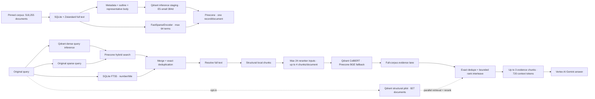

# VietLex — Vietnamese Legal RAG

<div align="center">

[](https://www.python.org/)
[](https://huggingface.co/datasets/vohuutridung/vietnamese-legal-documents)
[](https://huggingface.co/intfloat/multilingual-e5-small)
[](https://fastapi.tiangolo.com/)

**Evidence-grounded Vietnamese Legal RAG over 518,255 documents using hybrid retrieval, reranking, and Vertex AI.**

Language: [Tiếng Việt](README.md) | **English**

</div>

VietLex is an AI/ML portfolio project for evidence-grounded Vietnamese legal question answering. It combines Pinecone dense+sparse retrieval with SQLite FTS5 document-number/title search, resolves full text locally, creates legal-structure-aware chunks, reranks the evidence, and generates grounded answers with Vertex AI Gemini.

> [!WARNING]
> The corpus comes from the third-party research dataset [`vohuutridung/vietnamese-legal-documents`](https://huggingface.co/datasets/vohuutridung/vietnamese-legal-documents). It is not an official legal database and does not establish current legal validity. Results are informational, not legal advice; always verify against current official sources.

## Key results

| Portfolio evidence | Result preserved in repository artifacts |
| :--- | :--- |
| Balanced-50 answer evaluation | Faithfulness **0.9158** · Answer Accuracy **0.8950** · Context Precision **0.8757** · Context Recall **0.9333** |
| Completed pipeline | **50/50** generation `STOP` · **50/50** NeMo input/output safe · **0** technical errors in the run |
| Verified retrieval subset | **40** cases with all required evidence verified · Document Recall@3 macro **0.9250**, micro **50/53** |
| Automated verification | More than **800** unit/integration tests; live-provider tests are opt-in |

Balanced-50 contains 40 cases with fully verified required retrieval evidence and 10 deterministic reference-only cases. These metrics demonstrate a bounded evaluation slice—not whole-corpus legal accuracy or production readiness. See [`PORTFOLIO_EVIDENCE.md`](docs/evaluation/PORTFOLIO_EVIDENCE.md) for full provenance and evidence boundaries.

## Demo


The repository includes a real FastAPI/Jinja2 chat interface. This is a repository screenshot, not a mockup or a claim that a public deployment is live.

## Core capabilities

- **Full-corpus hybrid retrieval:** one Pinecone dense+sparse query runs in parallel with SQLite FTS5 exact document-number/title search.
- **Dense inference:** `intfloat/multilingual-e5-small`, 384 dimensions, through Qdrant Cloud inference staging; persistent vectors remain in Pinecone.
- **Sparse retrieval:** local `FastSparseEncoder`, up to 64 nonzero terms; it is not described as full BM25 because it has no corpus-level IDF.
- **Evidence resolution:** full text remains in SQLite/Zstandard and is chunked only after a document is resolved.
- **Legal-aware chunking:** Chapter → Section → Article → Clause, 220 approximate whitespace tokens with 24-token overlap for oversized units.
- **Remote reranking:** Qdrant ColBERT is primary; Pinecone `bge-reranker-v2-m3` is the technical fallback.
- **Grounded generation:** Vertex AI `gemini-3.5-flash` through ADC, with citations and typed provider diagnostics.
- **Evaluation:** deterministic retrieval/answer metrics by default; Ragas/LLM judges are opt-in offline audits.
- **Web backend:** FastAPI, Jinja2/HTMX, MongoDB session/log/feedback storage, rate limiting, and guardrail modes `off`/`shadow`/`enforce`.

## Architecture



The runtime default remains `STRUCTURAL_BACKEND_ENABLED=false`. When the structural pilot is enabled, its 827-document Qdrant lane runs **in parallel** with the full-corpus Pinecone-v1 + FTS lane; it does not replace full-corpus retrieval or imply structural coverage of all 518,255 documents.

Cross-lane Pinecone BGE final reranking was implemented and evaluated on identical inputs but remains `CROSS_LANE_FINAL_RERANK_ENABLED=false`: the evidence did not justify cutover. The closure did not rerun that A/B benchmark.

## Tech stack

| Layer | Technology |
| :--- | :--- |
| API & UI | Python 3.10+, FastAPI, Uvicorn, Jinja2, HTMX |
| Durable vector retrieval | Pinecone Serverless, index `vietlex-legal-rag-v1`, namespace `legal-documents-v1` |
| Dense inference & reranking | Qdrant Cloud, multilingual E5-small 384d, AnswerAI ColBERT-small-v1 |
| Lexical & content storage | SQLite FTS5, SQLite/Zstandard, local `FastSparseEncoder` |
| Generation | Google Vertex AI `gemini-3.5-flash` through Application Default Credentials |
| Runtime data | MongoDB for sessions, interaction logs, feedback, and admin data—not the legal corpus |
| Evaluation & safety | Pytest, deterministic metrics, optional Ragas, NeMo Guardrails |
| Delivery | Docker, GitHub Actions, Vercel thin gateway + persistent-disk FastAPI origin |

## Evaluation

### Verified portfolio evidence

| Evaluation set | Generation `STOP` | NeMo safe | Ragas coverage | Faithfulness | Answer accuracy | Context precision | Context recall | Technical errors |
| :--- | ---: | ---: | ---: | ---: | ---: | ---: | ---: | ---: |
| Representative-10, `all-required-verified` | 10/10 | 10/10 | 10/10 | 0.9857 | 0.9750 | 0.9400 | 1.0000 | 0 |
| Balanced-50, 26 factoid + 24 multi-hop | 50/50 | 50/50 | 50/50 | 0.9158 | 0.8950 | 0.8757 | 0.9333 | 0 |

Immutable sources:

- [`Balanced-50 report`](docs/evaluation/runs/answer-balanced50-v2-live-20260822/report.md)
- [`Representative-10 report`](docs/evaluation/runs/answer-representative10-v6-live-20260822/report.md)
- [`Portfolio evidence`](docs/evaluation/PORTFOLIO_EVIDENCE.md)
- [`Current evaluation status`](docs/evaluation/CURRENT_STATUS.md)

Code-based deterministic metrics are the default. Retrieval metrics cover Document/Article/Clause Recall@K, MRR, nDCG, exact-reference hit, multi-hop coverage, stage survival, no-candidate rate, and technical-error rates. Answer metrics cover exact match, token/character F1, ROUGE-L/CHRF, number/date/entity, citation, and refusal metrics. Aggregates preserve numerator, denominator, coverage, skipped cases, and skip reasons.

## Setup and usage

### Requirements

- Python 3.10+
- Local MongoDB or MongoDB Atlas
- Pinecone, Qdrant Cloud, and Google Cloud credentials for the live runtime
- Local corpus stores for full retrieval

```powershell
python -m venv .venv
.venv\Scripts\Activate.ps1
python -m pip install -r requirements.txt
Copy-Item .env.example .env
```

Primary variables are documented in [`.env.example`](.env.example). Inject secrets through environment/platform secret storage; never hardcode or commit credential files.

Run the application:

```powershell
uvicorn app.main:app --host 0.0.0.0 --port 8000
```

Run the default provider-free checks:

```powershell
python -m pytest -q
python -m compileall -q app tests
git diff --check
```

### Deployment topology

- **Vercel public gateway:** `vercel.json` and `api/proxy.py` proxy HTML/API/static content; the gateway uses one-second polling because the serverless proxy buffers responses.
- **FastAPI origin:** the `Dockerfile` runs on a host with persistent `/data` storage for `content_store.sqlite3` and `legal_fts.sqlite3`.
- Direct FastAPI clients use SSE progress; the repository does not claim end-to-end SSE through Vercel or an unverified live production URL.

See [`deploy/vercel-proxy/README.md`](deploy/vercel-proxy/README.md).

## Advanced evaluation and adjudication

### Provider-free gold adjudication

`run_gold_adjudication.py` creates immutable repository-local human-review artifacts without provider, Ragas, generation, guardrail, corpus/index, or vector writes.

```powershell
python -u run_gold_adjudication.py queue --dataset app/data/namsyntax_legal_qa_420.json --sidecar docs/evaluation/gold_labels/namsyntax_legal_qa_420_labels_v2.json --content-store data/huggingface/content_store.sqlite3 --fts data/huggingface/legal_fts.sqlite3 --target-cases 40 --candidate-limit 12
python -u run_gold_adjudication.py preview --dataset app/data/namsyntax_legal_qa_420.json --sidecar docs/evaluation/gold_labels/namsyntax_legal_qa_420_labels_v2.json --queue docs/evaluation/adjudication/queues/<run-id>/queue.json --decisions <decisions.json>
python -u run_gold_adjudication.py promote --dataset app/data/namsyntax_legal_qa_420.json --sidecar docs/evaluation/gold_labels/namsyntax_legal_qa_420_labels_v2.json --queue docs/evaluation/adjudication/queues/<run-id>/queue.json --decisions <decisions.json> --preview docs/evaluation/adjudication/previews/<run-id>/preview.json --approve-preview-sha256 <approved-preview-sha256>
```

Promotion never edits the source sidecar. It rebuilds the preview, requires the exact approved preview SHA-256, and writes a new `labels_v2.json`; insufficient verified coverage remains `BLOCKED_INSUFFICIENT_VERIFIED_CASES`.

### Deterministic evaluation

```powershell
python -u run_retrieval_eval.py --preflight-all-profiles --verified-only --gold-policy all-required-verified --rewrite off --reranker current
python -u run_retrieval_eval.py --profile separated_intent --verified-only --gold-policy all-required-verified --rewrite off --reranker current
python -u run_answer_eval.py --profile separated_intent --verified-only --judge none --guardrails off
```

Ragas is enabled only for an explicitly budgeted offline audit; `/chat` never enqueues Ragas. Live-provider tests/evaluations are outside the default suite and may consume quota or incur cost.

### Corpus operations

Full ingestion may delete/recreate the remote index and must only run with explicit migration/reingestion authority:

```powershell
python -u -m app.ingestion.hf_pipeline full --delete-existing --yes
```

Provider-free phases and FTS build:

```powershell
python -m app.ingestion.hf_pipeline download
python -m app.ingestion.hf_pipeline prepare
python -m app.ingestion.hf_pipeline smoke
python -m app.ingestion.hf_pipeline verify
python -u -m app.ingestion.legal_fts build --batch-size 256
```

## Declared limitations

- The third-party corpus does not guarantee current legal validity or independent verification of every document.
- The structural pilot covers 827 primary-law documents, not all 518,255 documents.
- Evaluation results are a bounded slice, not evidence of whole-corpus legal accuracy or production readiness.
- The Vercel gateway uses polling; the progress registry remains process-local.
- Cross-lane final reranking intentionally remains disabled under the `KEEP_DISABLED` decision.

## Documentation

- [`docs/PROJECT_CONTEXT.md`](docs/PROJECT_CONTEXT.md) — source-of-truth context
- [`docs/CURRENT_ARCHITECTURE.md`](docs/CURRENT_ARCHITECTURE.md) — runtime architecture
- [`docs/AGENT_WORKFLOW.md`](docs/AGENT_WORKFLOW.md) — engineering/evidence workflow
- [`docs/evaluation/PORTFOLIO_EVIDENCE.md`](docs/evaluation/PORTFOLIO_EVIDENCE.md) — recruiter-safe evidence
- [`docs/huggingface-ingestion-runbook.md`](docs/huggingface-ingestion-runbook.md) — ingestion operations
