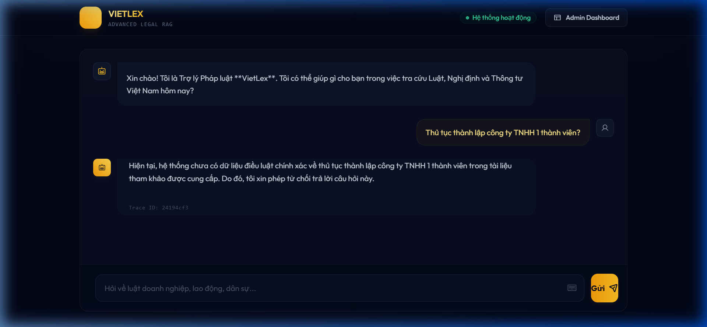
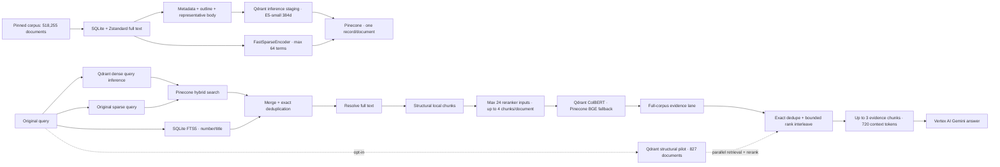

# VietLex — Vietnamese Legal RAG

<div align="center">

[](https://www.python.org/)
[](https://huggingface.co/datasets/vohuutridung/vietnamese-legal-documents)
[](https://huggingface.co/intfloat/multilingual-e5-small)
[](https://fastapi.tiangolo.com/)

**Evidence-grounded Vietnamese Legal RAG over 518,255 documents using hybrid retrieval, reranking, and Vertex AI.**

Language: [Tiếng Việt](README.md) | **English**

</div>

VietLex is an AI/ML portfolio project for evidence-grounded Vietnamese legal question answering. It combines Pinecone dense+sparse retrieval with SQLite FTS5 document-number/title search, resolves full text locally, creates legal-structure-aware chunks, reranks the evidence, and generates grounded answers with Vertex AI Gemini.

> [!WARNING]
> The corpus comes from the third-party research dataset [`vohuutridung/vietnamese-legal-documents`](https://huggingface.co/datasets/vohuutridung/vietnamese-legal-documents). It is not an official legal database and does not establish current legal validity. Results are informational, not legal advice; always verify against current official sources.

## Key results

| Portfolio evidence | Result preserved in repository artifacts |
| :--- | :--- |
| Balanced-50 v3 raw-RRF answer evaluation | Faithfulness **0.8841** · Answer Accuracy **0.9250** · Context Precision **0.8733** · Context Recall **0.9367** |
| Completed pipeline | **50/50** generation `STOP` · **50/50** NeMo input/output safe · **0** technical errors in the run |
| Verified retrieval subset | **40** cases with all required evidence verified · Document Recall@3 **1.0000**, micro **53/53** |
| Vertex/Qdrant v3 migration | **50,000/50,000** planned records acknowledged · **51,801** remote points · collection green |
| Automated verification | **897 passed, 2 skipped**; live-provider tests remain opt-in |

Balanced-50 contains 40 cases with fully verified required retrieval evidence and 10 deterministic reference-only cases. These metrics demonstrate a bounded evaluation slice—not whole-corpus legal accuracy or production readiness. See [`PORTFOLIO_EVIDENCE.md`](docs/evaluation/PORTFOLIO_EVIDENCE.md) for full provenance and evidence boundaries.

## Demo



The repository includes a real FastAPI/Jinja2 chat interface. This is a repository screenshot, not a mockup or a claim that a public deployment is live.

## Core capabilities

- **Full-corpus hybrid retrieval:** one Pinecone dense+sparse query runs in parallel with SQLite FTS5 exact document-number/title search.
- **Dense inference:** `intfloat/multilingual-e5-small`, 384 dimensions, through Qdrant Cloud inference staging; persistent vectors remain in Pinecone.
- **Sparse retrieval:** local `FastSparseEncoder`, up to 64 nonzero terms; it is not described as full BM25 because it has no corpus-level IDF.
- **Evidence resolution:** full text remains in SQLite/Zstandard and is chunked only after a document is resolved.
- **Legal-aware chunking:** Chapter → Section → Article → Clause, 220 approximate whitespace tokens with 24-token overlap for oversized units.
- **Remote reranking:** Qdrant ColBERT is primary; Pinecone `bge-reranker-v2-m3` is the technical fallback.
- **Grounded generation:** Vertex AI `gemini-3.5-flash` through ADC, with citations and typed provider diagnostics.
- **Evaluation:** deterministic retrieval/answer metrics by default; Ragas/LLM judges are opt-in offline audits.
- **Web backend:** FastAPI, Jinja2/HTMX, MongoDB session/log/feedback storage, rate limiting, and guardrail modes `off`/`shadow`/`enforce`.

## Architecture



The runtime default remains `STRUCTURAL_BACKEND_ENABLED=false`. When the structural pilot is enabled, its 827-document Qdrant lane runs **in parallel** with the full-corpus Pinecone-v1 + FTS lane; it does not replace full-corpus retrieval or imply structural coverage of all 518,255 documents.

The isolated Vertex/Qdrant v3 collection `vietlex-legal-rag-v3-vertex-1024` now contains **51,801** green points. Its acknowledged 50,000-record migration plan came from 5,000 balanced documents plus previously uploaded golden anchors. A typed offline-evaluation adapter and an opt-in shadow path now exist, but the production answer still uses Pinecone v1 by default; shadow results cannot replace production evidence.

Cross-lane Pinecone BGE final reranking was implemented and evaluated on identical inputs but remains `CROSS_LANE_FINAL_RERANK_ENABLED=false`: the evidence did not justify cutover. The closure did not rerun that A/B benchmark.

## Tech stack

| Layer | Technology |
| :--- | :--- |
| API & UI | Python 3.10+, FastAPI, Uvicorn, Jinja2, HTMX |
| Durable vector retrieval | Pinecone Serverless, index `vietlex-legal-rag-v1`, namespace `legal-documents-v1` |
| Dense inference & reranking | Qdrant Cloud, multilingual E5-small 384d, AnswerAI ColBERT-small-v1 |
| Lexical & content storage | SQLite FTS5, SQLite/Zstandard, local `FastSparseEncoder` |
| Generation | Google Vertex AI `gemini-3.5-flash` through Application Default Credentials |
| Runtime data | MongoDB for sessions, interaction logs, feedback, and admin data—not the legal corpus |
| Evaluation & safety | Pytest, deterministic metrics, optional Ragas, NeMo Guardrails |
| Delivery | Docker, GitHub Actions, Vercel thin gateway + persistent-disk FastAPI origin |

## Evaluation

### 1. Comprehensive Balanced-50 Benchmark (Deterministic + Ragas + Latency + Safety)

Evaluation results over the **Balanced-50** golden dataset (26 Factoid + 24 Multi-hop questions) using Qdrant v3 raw-RRF, `separated_intent`, `guardrails=enforce`, and Google Cloud Vertex AI `gemini-3.5-flash`. Retrieval metrics score 40 verified cases; the other 10 are explicitly marked `no_verified_gold_label`:

| Metric Category | Metric Name | Achieved Value | Numerator / Sample | Technical Notes |
| :--- | :--- | ---: | :---: | :--- |
| **Reliability & Safety** | **Generation Finish** | **100.0%** | 50/50 | 100% clean `STOP` finish reason |
| | **NeMo Input Guardrail Safe** | **100.0%** | 50/50 | 0 prompt injection / off-topic violations |
| | **NeMo Output Guardrail Safe** | **100.0%** | 50/50 | 0 hallucinated / toxic response generation |
| | **Technical Error Rate** | **0.0%** | 0/50 | Zero timeouts, 5xx, or unhandled exceptions |
| | **No-Candidate Rate** | **0.0%** | 0/50 | All queries retrieved valid evidence contexts |
| **Retrieval Quality** | **Document Recall @ 3** | **100.0%** | 53/53 | Gold document present in Top 3 |
| | **Document Recall @ 24** | **100.0%** | 53/53 | All required gold documents retrieved in Top 24 |
| | **Article Recall @ 3** | **100.0%** | 30/30 | Exact legal article retrieval rate |
| | **Clause Recall @ 3** | **92.86%** | 13/14 | Exact legal clause retrieval rate |
| | **Document MRR** | **0.9750** | 39/40 | Mean Reciprocal Rank at document level |
| | **Article MRR** | **0.9259** | 25/27 | Mean Reciprocal Rank at article level |
| | **Clause MRR** | **0.7949** | 10.33/13 | Mean Reciprocal Rank at clause level |
| | **nDCG @ 10** | **0.9182** | 43.42/48.20 | Normalized Discounted Cumulative Gain |
| | **Exact Reference Hit** | **100.0%** | 40/40 | Verified legal-reference hit |
| | **Multi-hop All-Required** | **97.50%** | 39/40 | Full retrieval coverage on multi-hop questions |
| **Deterministic Answer** | **Token F1** | **0.2423** | 50/50 | Low because full answers are longer than short references; not a legal-correctness metric |
| | **Citation precision / invalid rate** | **0.9727 / 0.0273** | 50/50 | Predictions checked against evidence without sample-specific rules |
| **Answer Quality (Ragas)** | **Faithfulness** | **0.8841** | 50/50 | LLM-as-a-judge, not proof of legal correctness |
| | **Answer Accuracy** | **0.9250** | 50/50 | Semantic alignment with human ground truth |
| | **Context Precision** | **0.8733** | 50/50 | Density and relevance of retrieved contexts |
| | **Context Recall** | **0.9367** | 50/50 | Information completeness for answers |
| **Latency Profile** | **t_input_guardrail** | **1.13 s** | P50 (Mean: 1.14s) | Input safety check latency |
| | **t_retrieval** | **3.25 s** | P50 (P95: 4.63s) | Bound persisted retrieval artifact |
| | **t_output_guardrail** | **1.21 s** | P50 (Mean: 1.23s) | Output safety rail |
| | **t_total (End-to-End)** | **5.32 s** | P50 (P95: 7.05s) | Generation/guardrails over persisted evidence |

### 2. Final Reranker Head-to-Head Comparison (Qdrant ColBERT vs Pinecone BGE vs Raw RRF)

Empirical comparison over the identical 40 human-verified cases (`all-required-verified`):

| Algorithm / Provider | Doc Recall @3 | Article Recall @3 | Clause Recall @3 | All-Required Coverage | P50 Latency | Technical Verdict |
| :--- | :---: | :---: | :---: | :---: | :---: | :--- |
| **Raw RRF (Qdrant dense + sparse)** | **100.0%** (53/53) | **100.0%** (30/30) | **92.86%** (13/14) | **97.50%** (39/40) | **2.65 s** | **Best in this canary**: preserves exact Điều/Khoản |
| **Historical Qdrant v2 comparator** | **94.34%** (50/53) | **90.00%** (27/30) | **85.71%** (12/14) | **85.00%** (34/40) | **8.92 s** | Same case IDs, but a historical run rather than a simultaneous A/B |
| **Qdrant ColBERT (`answerai-colbert`)** | **100.0%** (53/53) | **90.00%** (27/30) | **78.57%** (11/14) | **87.50%** (35/40) | **2.97 s** | **Failed the gate** on the exact raw-RRF candidate pools |
| **Pinecone BGE (`bge-reranker-v2-m3`)** | NOT SCORED | NOT SCORED | NOT SCORED | NOT SCORED | 15.00 s timeout | Monthly 500-request rerank quota was exhausted; technical failures are not quality scores |

Raw v3 hybrid RRF is the strongest candidate in this narrow canary. Qdrant ColBERT should not be forced into production because it increases latency and drops verified legal structure.

### 3. Final Balanced-50 `qdrant-only` audit — cutover rejected

The 2026-08-27 run completed all 50 cases with Qdrant ColBERT, enforced guardrails, deterministic metrics, and Ragas. It exercised the Pinecone-v1 + SQLite FTS runtime pipeline; the 51,801-point v3 collection remains isolated.

| Metric | Result |
| :--- | ---: |
| Generation / guardrails / Ragas coverage | **50/50**; 0 technical errors |
| Verified Document Recall@3 | **0/53** |
| Ragas Faithfulness | **0.7467** |
| Ragas Answer Accuracy | **0.1500** |
| Ragas Context Precision / Recall | **0.1600 / 0.1567** |
| Deterministic token F1 / char F1 | **0.1585 / 0.1801** |
| End-to-end latency P50 / P95 | **10.65 s / 14.09 s** |

This historical run rejects a forced `qdrant-only` production cutover. The new v3 raw-RRF run is stronger in the canary and answer audit, but remains evaluation/shadow-only because the 40 verified cases cover only two documents and one legal-document type.

### 4. Immutable Verification Artifacts
- [`Balanced-50 v3 raw-RRF answer + Ragas`](docs/evaluation/runs/answer-v3-raw-balanced50-20260827-final2/report.md)
- [`Balanced-50 v3 raw-RRF retrieval gate`](docs/evaluation/runs/retrieval-v3-raw-balanced50-20260827-final/report.md)
- [`Identical-pool Qdrant ColBERT A/B`](docs/evaluation/runs/retrieval-v3-colbert-identical40-20260827-final2/report.md)
- [`Balanced-50 report`](docs/evaluation/runs/answer-balanced50-v2-live-20260822/report.md)
- [`Balanced-50 Qdrant-only final audit`](docs/evaluation/runs/answer-balanced50-qdrant-only-final-20260827/report.md)
- [`Representative-10 report`](docs/evaluation/runs/answer-representative10-v6-live-20260822/report.md)
- [`Vertex/Qdrant v3 Canary report`](docs/evaluation/runs/retrieval-vertex-v3-goldenfull-verified40-20260826/report.md)
- [`Vertex/Qdrant v3 50k migration report`](docs/evaluation/runs/vertex-qdrant-v3-50k-20260827/report.md)
- [`Portfolio evidence`](docs/evaluation/PORTFOLIO_EVIDENCE.md)
- [`Current evaluation status`](docs/evaluation/CURRENT_STATUS.md)

---

## Supabase Full-Document Export (50,000 Documents)

The repository provides a dedicated streaming exporter [`run_supabase_full_doc_upload.py`](run_supabase_full_doc_upload.py) to upload 50,000 full legal documents from local Zstandard SQLite to Supabase Postgres:

Status on 2026-08-27: the exporter and checkpoint are ready, but the project returns `404 PGRST205` because `public.legal_documents` does not exist. Only a publishable key is available, so upload is **BLOCKED_SECURITY**; anonymous write/RLS will not be opened merely to finish the migration. Create the schema with admin authority and use a service-role or another tightly scoped ingestion credential/policy.

### 1. Environment Configuration (`.env`)
```env
SUPABASE_URL=https://YOUR_PROJECT.supabase.co
SUPABASE_SERVICE_ROLE_KEY=YOUR_SERVER_SIDE_SERVICE_ROLE_KEY
```

### 2. Create Table in Supabase SQL Editor
Print the standardized DDL schema:
```powershell
python run_supabase_full_doc_upload.py --print-schema
```
Execute in **Supabase SQL Editor**:
```sql
create table if not exists public.legal_documents (
  document_id bigint primary key,
  document_number text not null,
  title text not null,
  source_url text not null,
  legal_type text not null,
  legal_sectors text not null,
  issuing_authority text not null,
  issuance_date text,
  content text not null,
  content_sha256 text not null,
  content_store_key text not null,
  quality_flags jsonb not null default '[]'::jsonb,
  dataset_revision text not null,
  uploaded_at timestamptz not null default now()
);
create index if not exists legal_documents_document_number_idx on public.legal_documents (document_number);
create index if not exists legal_documents_content_sha256_idx on public.legal_documents (content_sha256);
alter table public.legal_documents enable row level security;
```

Keep `SUPABASE_SERVICE_ROLE_KEY` on the backend/CLI only. Never expose it through Vercel client variables or `NEXT_PUBLIC_*`; the uploader rejects publishable keys.

### 3. Check Connection & Upload
```powershell
# Verify connection and table existence
python run_supabase_full_doc_upload.py --check-connection

# Execute batch upload with resumable checkpointing
python run_supabase_full_doc_upload.py --max-documents 50000 --batch-size 50 --allow-remote-write
```

## Setup and usage

### Requirements

- Python 3.10+
- Local MongoDB or MongoDB Atlas
- Pinecone, Qdrant Cloud, and Google Cloud credentials for the live runtime
- Local corpus stores for full retrieval

```powershell
python -m venv .venv
.venv\Scripts\Activate.ps1
python -m pip install -r requirements.txt
Copy-Item .env.example .env
```

Primary variables are documented in [`.env.example`](.env.example). Inject secrets through environment/platform secret storage; never hardcode or commit credential files.

Run the application:

```powershell
uvicorn app.main:app --host 0.0.0.0 --port 8000
```

Run the default provider-free checks:

```powershell
python -m pytest -q
python -m compileall -q app tests
git diff --check
```

### Deployment topology

- **Vercel public gateway:** `vercel.json` and `api/proxy.py` proxy HTML/API/static content; the gateway uses one-second polling because the serverless proxy buffers responses.
- **FastAPI origin:** the `Dockerfile` runs on a host with persistent `/data` storage for `content_store.sqlite3` and `legal_fts.sqlite3`.
- Direct FastAPI clients use SSE progress; the repository does not claim end-to-end SSE through Vercel or an unverified live production URL.

See [`deploy/vercel-proxy/README.md`](deploy/vercel-proxy/README.md).

## Advanced evaluation and adjudication

### Provider-free gold adjudication

`run_gold_adjudication.py` creates immutable repository-local human-review artifacts without provider, Ragas, generation, guardrail, corpus/index, or vector writes.

```powershell
python -u run_gold_adjudication.py queue --dataset app/data/namsyntax_legal_qa_420.json --sidecar docs/evaluation/gold_labels/namsyntax_legal_qa_420_labels_v2.json --content-store data/huggingface/content_store.sqlite3 --fts data/huggingface/legal_fts.sqlite3 --target-cases 40 --candidate-limit 12
python -u run_gold_adjudication.py preview --dataset app/data/namsyntax_legal_qa_420.json --sidecar docs/evaluation/gold_labels/namsyntax_legal_qa_420_labels_v2.json --queue docs/evaluation/adjudication/queues/<run-id>/queue.json --decisions <decisions.json>
python -u run_gold_adjudication.py promote --dataset app/data/namsyntax_legal_qa_420.json --sidecar docs/evaluation/gold_labels/namsyntax_legal_qa_420_labels_v2.json --queue docs/evaluation/adjudication/queues/<run-id>/queue.json --decisions <decisions.json> --preview docs/evaluation/adjudication/previews/<run-id>/preview.json --approve-preview-sha256 <approved-preview-sha256>
```

Promotion never edits the source sidecar. It rebuilds the preview, requires the exact approved preview SHA-256, and writes a new `labels_v2.json`; insufficient verified coverage remains `BLOCKED_INSUFFICIENT_VERIFIED_CASES`.

### Deterministic evaluation

```powershell
python -u run_retrieval_eval.py --preflight-all-profiles --verified-only --gold-policy all-required-verified --rewrite off --reranker current
python -u run_retrieval_eval.py --profile separated_intent --verified-only --gold-policy all-required-verified --rewrite off --reranker current
python -u run_answer_eval.py --profile separated_intent --verified-only --judge none --guardrails off
```

Ragas is enabled only for an explicitly budgeted offline audit; `/chat` never enqueues Ragas. Live-provider tests/evaluations are outside the default suite and may consume quota or incur cost.

### Corpus operations

Full ingestion may delete/recreate the remote index and must only run with explicit migration/reingestion authority:

```powershell
python -u -m app.ingestion.hf_pipeline full --delete-existing --yes
```

Provider-free phases and FTS build:

```powershell
python -m app.ingestion.hf_pipeline download
python -m app.ingestion.hf_pipeline prepare
python -m app.ingestion.hf_pipeline smoke
python -m app.ingestion.hf_pipeline verify
python -u -m app.ingestion.legal_fts build --batch-size 256
```

## Declared limitations

- The third-party corpus does not guarantee current legal validity or independent verification of every document.
- The structural pilot covers 827 primary-law documents, not all 518,255 documents.
- Evaluation results are a bounded slice, not evidence of whole-corpus legal accuracy or production readiness.
- The Vercel gateway uses polling; the progress registry remains process-local.
- Cross-lane final reranking intentionally remains disabled under the `KEEP_DISABLED` decision.

## Documentation

- [`docs/PROJECT_CONTEXT.md`](docs/PROJECT_CONTEXT.md) — source-of-truth context
- [`docs/CURRENT_ARCHITECTURE.md`](docs/CURRENT_ARCHITECTURE.md) — runtime architecture
- [`docs/AGENT_WORKFLOW.md`](docs/AGENT_WORKFLOW.md) — engineering/evidence workflow
- [`docs/evaluation/PORTFOLIO_EVIDENCE.md`](docs/evaluation/PORTFOLIO_EVIDENCE.md) — recruiter-safe evidence
- [`docs/huggingface-ingestion-runbook.md`](docs/huggingface-ingestion-runbook.md) — ingestion operations
