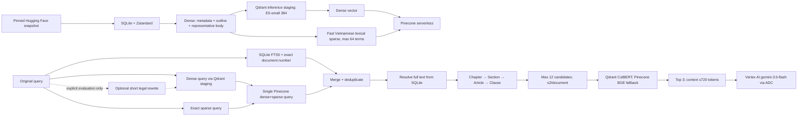

# VietLex — Vietnamese Legal RAG (English)

[](https://www.python.org/)
[](https://fastapi.tiangolo.com/)
[](#)
[](https://creativecommons.org/licenses/by/4.0/)

Language: [Tiếng Việt](README.md) | **English**

VietLex is a production-oriented RAG system for Vietnamese legal document
retrieval and grounded QA. The complete corpus is durably stored in Pinecone.
Qdrant Cloud provides remote inference and an opt-in structural collection for
827 primary-legislation documents. When enabled it is the primary retrieval
path, with the full-corpus Pinecone v1 path retained as an observable fallback.

> [!WARNING]
> The corpus comes from a third-party research dataset:
> [`vohuutridung/vietnamese-legal-documents`](https://huggingface.co/datasets/vohuutridung/vietnamese-legal-documents).
> It is **not** an official legal source and does not guarantee legal validity.
> Results are informational only, not legal advice. Always verify against
> official up-to-date legal sources before making decisions.

## ⚡ Quick scripts (professional README style)

| Script | Command | Purpose |
| --- | --- | --- |
| `setup` | `python -m venv .venv`<br>`.venv\Scripts\Activate.ps1`<br>`python -m pip install -r requirements.txt`<br>`Copy-Item .env.example .env` | Initialize local environment |
| `dev` | `uvicorn app.main:app --host 0.0.0.0 --port 8000` | Run local API server |
| `ingest:full` | `python -u -m app.ingestion.hf_pipeline full --delete-existing --yes` | Full corpus ingestion/rebuild |
| `ingest:download` | `python -m app.ingestion.hf_pipeline download` | Download dataset snapshot |
| `ingest:prepare` | `python -m app.ingestion.hf_pipeline prepare` | Prepare ingestion artifacts |
| `ingest:smoke` | `python -m app.ingestion.hf_pipeline smoke` | Ingestion smoke checks |
| `ingest:verify` | `python -m app.ingestion.hf_pipeline verify` | Validate ingestion state |
| `fts:build` | `python -u -m app.ingestion.legal_fts build --batch-size 256` | Build SQLite FTS5 index |
| `eval:full` | `python -u run_eval_suite.py --fresh --factoids 12 --multihop 12 --unanswerable 6 --concurrency 2 --judge-concurrency 4` | Full golden evaluation |
| `eval:smoke` | `python -u run_eval_suite.py --fresh --factoids 2 --multihop 2 --unanswerable 2 --concurrency 1 --judge-concurrency 1 --checkpoint docs/smoke_eval_checkpoints.json --report docs/smoke_evaluation_report.md` | Fast smoke evaluation |
| `test` | `python -m pytest -q` | Run test suite |
| `test:live-rerank` | `$env:RUN_LIVE_RERANK_TEST='1'`<br>`python -m pytest tests/integration/test_remote_reranker_live.py -q`<br>`Remove-Item Env:RUN_LIVE_RERANK_TEST` | Live reranker smoke test |
| `check` | `python -m compileall -q app tests`<br>`git diff --check` | Compile + whitespace checks |

## Corpus

- Revision pin: `4d4e10b201544e8a4c49a1d3fa496595a7d486d0`
- Document count: `518,255`
- Publisher-declared license: CC BY 4.0
- Snapshot integrity: 13 files with size + SHA-256 verification
- Full content stays in local SQLite/Zstandard, not in Pinecone payload

## Architecture



## Setup

Requires Python 3.10+:

```powershell
python -m venv .venv
.venv\Scripts\Activate.ps1
python -m pip install -r requirements.txt
Copy-Item .env.example .env
```

Required secrets:

- `PIPECONE_API` or `PINECONE_API_KEY`
- `QDRANT_URL`, `QDRANT_API_KEY` (embedding + ColBERT cloud inference)
- Structural primary (optional): `STRUCTURAL_BACKEND_ENABLED=true` and `STRUCTURAL_COLLECTION_NAME=vietlex-legal-rag-v2-pilot-384`; Pinecone v1 remains the full-corpus fallback
- Local: `GOOGLE_APPLICATION_CREDENTIALS=.secrets/vertex-adc.json` (project-relative path to a Git-ignored key)
- Vercel/serverless: `GOOGLE_SERVICE_ACCOUNT_JSON` (the complete service-account JSON stored as a platform secret and loaded in memory)
- `GOOGLE_CLOUD_PROJECT`, `GOOGLE_CLOUD_LOCATION=global`
- `VERTEX_LLM_MODEL=gemini-3.5-flash`, `VERTEX_EMBEDDING_MODEL=gemini-embedding-2`
- Optional secondary APIs: `OPENROUTER_API_KEY`, `GEMINI_API_KEY`, `NVIDIA_API_KEY`, `GROQ_API_KEY`

Production generation and the guardrail LLM use Vertex AI `gemini-3.5-flash`
as primary. A typed Vertex failure may fall back to OpenRouter, the Gemini Direct API, NVIDIA, and
Groq; runtime metadata records the actual provider/model and primary failure.
Query rewriting is off by default. `gemini-embedding-2` is probe-only at
384/768/1024 dimensions and never queries or mutates the production E5 index.
Ragas is an offline audit only and is never run by `/chat`. Its primary judge is Vertex AI `gemini-3.5-flash` through ADC; legacy APIs and OmniGate are best-effort fallbacks.
When the dense lane fails but FTS remains usable, retrieval reports
`partial_retrieval_error`: lexical evidence is still scored while the provider
failure is counted in the technical-error rate. Lawful questions about public
authorities, policy, and legal powers are explicitly allowed by the input rail.

## Ingestion

Run full ingestion:

```powershell
python -u -m app.ingestion.hf_pipeline full --delete-existing --yes
```

Optional phases:

```powershell
python -m app.ingestion.hf_pipeline download
python -m app.ingestion.hf_pipeline prepare
python -m app.ingestion.hf_pipeline smoke
python -m app.ingestion.hf_pipeline verify
```

Build FTS5 index:

```powershell
python -u -m app.ingestion.legal_fts build --batch-size 256
```

## Run application

```powershell
uvicorn app.main:app --host 0.0.0.0 --port 8000
```

### Shareable online demo

The deployment is deliberately split: Vercel runs the thin gateway in `api/proxy.py`, while the FastAPI `Dockerfile` runs on a host with a persistent `/data` disk for both SQLite stores. MongoDB stores only sessions, logs, feedback, and admin data—not the legal corpus. Public chat is anonymous with signed-cookie isolation; admin authentication fails closed; NeMo and public Ragas default to off; public endpoints are rate-limited.

See [`deploy/vercel-proxy/README.md`](deploy/vercel-proxy/README.md). The repository is deployment-ready but does not claim a live URL until an actual deployment is verified.

## Evaluation

Latest live evidence (2026-08-22):

| Evaluation set | Generation `STOP` | NeMo input/output safe | Ragas coverage | Faithfulness | Answer accuracy | Context precision | Context recall | Technical errors |
| :--- | ---: | ---: | ---: | ---: | ---: | ---: | ---: | ---: |
| Representative-10, `all-required-verified` | 10/10 | 10/10 | 10/10 | 0.9857 | 0.9750 | 0.9400 | 1.0000 | 0 |
| Balanced-50, 26 factoid + 24 multi-hop | 50/50 | 50/50 | 50/50 | 0.9158 | 0.8950 | 0.8757 | 0.9333 | 0 |

The Balanced-50 case-list SHA-256 is `56ae294f9698569ab4f7ae11ed87aabfa7c79b616919378dc0f5d4e32e53bdf3`. Forty cases have fully verified required retrieval evidence; ten reference-only cases extend the Ragas audit. On the verified 40-case subset, macro Document Recall@3 is `0.9250` and micro recall is `50/53 = 0.9434`. The project does not describe all 50 cases as fully verified golden data or use lexical similarity as proof of legal correctness.

Evidence: [`Representative-10 report`](docs/evaluation/runs/answer-representative10-v6-live-20260822/report.md), [`Balanced-50 report`](docs/evaluation/runs/answer-balanced50-v2-live-20260822/report.md), and [`CV/portfolio evidence`](docs/evaluation/PORTFOLIO_EVIDENCE.md).

Full golden evaluation:

```powershell
python -u run_eval_suite.py --fresh --factoids 12 --multihop 12 --unanswerable 6 --concurrency 2 --judge-concurrency 4
```

Smoke evaluation:

```powershell
python -u run_eval_suite.py --fresh --factoids 2 --multihop 2 --unanswerable 2 --concurrency 1 --judge-concurrency 1 --checkpoint docs/smoke_eval_checkpoints.json --report docs/smoke_evaluation_report.md
```

## Testing

```powershell
python -m pytest -q
python -m compileall -q app tests
git diff --check
```

Live reranker smoke:

```powershell
$env:RUN_LIVE_RERANK_TEST='1'
python -m pytest tests/integration/test_remote_reranker_live.py -q
Remove-Item Env:RUN_LIVE_RERANK_TEST
```

## Notes

- Runtime uses one Pinecone hybrid read and one SQLite FTS5 read in parallel.
- Semantic cache uses a dedicated namespace with threshold `0.96`.
- Production does not use mock retrieval/rerank paths.
- Detailed operations guide:
  [Hugging Face ingestion runbook](docs/huggingface-ingestion-runbook.md).
