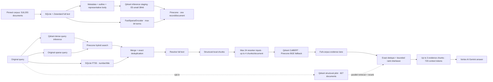

# VietLex — Vietnamese Legal RAG

<div align="center">

[](https://www.python.org/)
[](https://huggingface.co/datasets/vohuutridung/vietnamese-legal-documents)
[](https://huggingface.co/intfloat/multilingual-e5-small)
[](https://fastapi.tiangolo.com/)

**Evidence-grounded Vietnamese Legal RAG over 518,255 documents using hybrid retrieval, reranking, and Vertex AI.**

Ngôn ngữ: **Tiếng Việt** | [English](README.en.md)

</div>

VietLex là dự án portfolio AI/ML xây dựng hệ thống hỏi đáp pháp luật Việt Nam có dẫn chứng. Hệ thống kết hợp dense retrieval và sparse retrieval trên Pinecone với tra cứu số hiệu/tiêu đề bằng SQLite FTS5, sau đó resolve nội dung cục bộ, chunk theo cấu trúc pháp lý, rerank và sinh câu trả lời grounded bằng Vertex AI Gemini.

> [!WARNING]
> Corpus là dataset nghiên cứu của bên thứ ba [`vohuutridung/vietnamese-legal-documents`](https://huggingface.co/datasets/vohuutridung/vietnamese-legal-documents), không phải cơ sở dữ liệu pháp luật chính thức và không tự xác nhận hiệu lực hiện hành. Kết quả chỉ nhằm mục đích tham khảo thông tin, không phải tư vấn pháp lý; luôn đối chiếu với nguồn chính thức cập nhật.

## Kết quả nổi bật

| Bằng chứng portfolio | Kết quả đã lưu trong artifact |
| :--- | :--- |
| Balanced-50 answer evaluation | Faithfulness **0,9158** · Answer Accuracy **0,8950** · Context Precision **0,8757** · Context Recall **0,9333** |
| Hoàn tất pipeline | **50/50** generation `STOP` · **50/50** NeMo input/output safe · **0** lỗi kỹ thuật trong run |
| Verified retrieval subset | **40** case có toàn bộ required evidence đã xác minh · Document Recall@3 macro **0,9250**, micro **50/53** |
| Automated verification | Hơn **800** unit/integration tests; live-provider tests là opt-in |

Balanced-50 gồm 40 case có fully verified required retrieval evidence và 10 deterministic reference-only case. Các metric trên là bằng chứng cho một lát cắt đánh giá có giới hạn, không chứng minh độ chính xác pháp lý trên toàn corpus hoặc production readiness. Xem [`PORTFOLIO_EVIDENCE.md`](docs/evaluation/PORTFOLIO_EVIDENCE.md) để biết provenance và evidence boundary đầy đủ.

## Demo


Repository cung cấp giao diện chat FastAPI/Jinja2 thật; ảnh trên là screenshot đã lưu trong repository, không phải mockup hay tuyên bố về một deployment công khai.

## Năng lực cốt lõi

- **Hybrid retrieval toàn corpus:** một Pinecone dense+sparse query chạy song song với SQLite FTS5 exact document-number/title search.
- **Dense inference:** `intfloat/multilingual-e5-small`, 384 chiều, qua Qdrant Cloud inference staging; persistent vectors nằm trong Pinecone.
- **Sparse retrieval:** `FastSparseEncoder` cục bộ, tối đa 64 nonzero terms; không được mô tả là full BM25 vì không có corpus-level IDF.
- **Evidence resolution:** full text nằm trong SQLite/Zstandard và chỉ được chunk sau khi document được resolve.
- **Legal-aware chunking:** Chương → Mục → Điều → Khoản, 220 approximate whitespace tokens với overlap 24 cho đơn vị quá dài.
- **Remote reranking:** Qdrant ColBERT là primary; Pinecone `bge-reranker-v2-m3` là fallback kỹ thuật.
- **Grounded generation:** Vertex AI `gemini-3.5-flash` qua ADC, với citations và typed provider diagnostics.
- **Evaluation:** deterministic retrieval/answer metrics là mặc định; Ragas/LLM judge chỉ chạy opt-in offline.
- **Web backend:** FastAPI, Jinja2/HTMX, MongoDB cho session/log/feedback, rate limiting và guardrail modes `off`/`shadow`/`enforce`.

## Kiến trúc


```mermaid
flowchart LR
    Corpus["Pinned corpus: 518,255 documents"] --> Store["SQLite + Zstandard full text"]
    Store --> DenseText["Metadata + outline + representative body"]
    Store --> Sparse["FastSparseEncoder · max 64 terms"]
    DenseText --> Stage["Qdrant inference staging · E5-small 384d"]
    Stage --> Pinecone["Pinecone · one record/document"]
    Sparse --> Pinecone

    Query["Original query"] --> Embed["Qdrant dense query inference"]
    Query --> SparseQ["Original sparse query"]
    Query --> FTS["SQLite FTS5 · number/title"]
    Embed --> Hybrid["Pinecone hybrid search"]
    SparseQ --> Hybrid
    Hybrid --> Merge["Merge + exact deduplication"]
    FTS --> Merge
    Merge --> Resolve["Resolve full text"]
    Resolve --> Chunk["Structural local chunks"]
    Chunk --> Bound["Max 24 reranker inputs · up to 4 chunks/document"]
    Bound --> Rerank["Qdrant ColBERT · Pinecone BGE fallback"]
    Rerank --> FullEvidence["Full-corpus evidence lane"]
    FullEvidence --> Combine["Exact dedupe + bounded rank interleave"]
    Combine --> Evidence["Up to 3 evidence chunks · 720 context tokens"]
    Evidence --> Answer["Vertex AI Gemini answer"]

    Query -. opt-in .-> Structural["Qdrant structural pilot · 827 documents"]
    Structural -. parallel retrieval + rerank .-> Combine
```

Runtime mặc định giữ `STRUCTURAL_BACKEND_ENABLED=false`. Khi structural pilot được bật, lane Qdrant structural 827 văn bản chạy **song song** với lane Pinecone-v1 + FTS toàn corpus; nó không thay thế hoặc mở rộng structural coverage lên 518.255 văn bản.

Cross-lane Pinecone BGE final rerank đã được triển khai và đánh giá trên identical inputs nhưng vẫn giữ `CROSS_LANE_FINAL_RERANK_ENABLED=false`: bằng chứng không đủ để phê duyệt cutover. Không chạy lại A/B trong lần closure này.

## Tech stack

| Lớp | Công nghệ |
| :--- | :--- |
| API & UI | Python 3.10+, FastAPI, Uvicorn, Jinja2, HTMX |
| Durable vector retrieval | Pinecone Serverless, index `vietlex-legal-rag-v1`, namespace `legal-documents-v1` |
| Dense inference & reranking | Qdrant Cloud, multilingual E5-small 384d, AnswerAI ColBERT-small-v1 |
| Lexical & content store | SQLite FTS5, SQLite/Zstandard, local `FastSparseEncoder` |
| Generation | Google Vertex AI `gemini-3.5-flash` qua Application Default Credentials |
| Runtime data | MongoDB cho session, interaction log, feedback và admin data; không lưu corpus pháp luật |
| Evaluation & safety | Pytest, deterministic metrics, optional Ragas, NeMo Guardrails |
| Delivery | Docker, GitHub Actions, Vercel thin gateway + persistent-disk FastAPI origin |

## Đánh giá

### Bằng chứng portfolio đã xác minh

| Tập đánh giá | Generation `STOP` | NeMo safe | Ragas coverage | Faithfulness | Answer accuracy | Context precision | Context recall | Technical errors |
| :--- | ---: | ---: | ---: | ---: | ---: | ---: | ---: | ---: |
| Representative-10, `all-required-verified` | 10/10 | 10/10 | 10/10 | 0,9857 | 0,9750 | 0,9400 | 1,0000 | 0 |
| Balanced-50, 26 factoid + 24 multi-hop | 50/50 | 50/50 | 50/50 | 0,9158 | 0,8950 | 0,8757 | 0,9333 | 0 |

Nguồn bất biến:

- [`Balanced-50 report`](docs/evaluation/runs/answer-balanced50-v2-live-20260822/report.md)
- [`Representative-10 report`](docs/evaluation/runs/answer-representative10-v6-live-20260822/report.md)
- [`Portfolio evidence`](docs/evaluation/PORTFOLIO_EVIDENCE.md)
- [`Current evaluation status`](docs/evaluation/CURRENT_STATUS.md)

Metric deterministic trong code là mặc định. Retrieval metrics bao gồm Document/Article/Clause Recall@K, MRR, nDCG, exact-reference hit, multi-hop coverage, stage survival, no-candidate rate và technical-error rates. Answer metrics bao gồm exact match, token/character F1, ROUGE-L/CHRF, number/date/entity, citation và refusal metrics. Mọi aggregate lưu numerator, denominator, coverage, skipped cases và skip reasons.

## Cài đặt và sử dụng

### Yêu cầu

- Python 3.10+
- MongoDB local hoặc MongoDB Atlas
- Pinecone, Qdrant Cloud và Google Cloud credentials cho live runtime
- Local corpus stores nếu muốn chạy full retrieval

```powershell
python -m venv .venv
.venv\Scripts\Activate.ps1
python -m pip install -r requirements.txt
Copy-Item .env.example .env
```

Các biến chính được mô tả trong [`.env.example`](.env.example). Secret phải được inject qua environment/platform secret; không hardcode hoặc commit credential files.

Chạy ứng dụng:

```powershell
uvicorn app.main:app --host 0.0.0.0 --port 8000
```

Chạy kiểm thử provider-free mặc định:

```powershell
python -m pytest -q
python -m compileall -q app tests
git diff --check
```

### Deployment topology

- **Vercel public gateway:** `vercel.json` và `api/proxy.py` proxy HTML/API/static; gateway dùng polling 1 giây vì serverless proxy buffer response.
- **FastAPI origin:** chạy `Dockerfile` trên host có persistent `/data` disk cho `content_store.sqlite3` và `legal_fts.sqlite3`.
- Direct FastAPI clients dùng SSE progress; repository không tuyên bố end-to-end SSE qua Vercel hoặc một live production URL chưa được kiểm chứng.

Xem [`deploy/vercel-proxy/README.md`](deploy/vercel-proxy/README.md).

## Advanced evaluation và adjudication

### Provider-free gold adjudication

`run_gold_adjudication.py` tạo immutable human-review artifacts trong repository mà không gọi provider, Ragas, generation, guardrail, corpus/index hoặc vector writes.

```powershell
python -u run_gold_adjudication.py queue --dataset app/data/namsyntax_legal_qa_420.json --sidecar docs/evaluation/gold_labels/namsyntax_legal_qa_420_labels_v2.json --content-store data/huggingface/content_store.sqlite3 --fts data/huggingface/legal_fts.sqlite3 --target-cases 40 --candidate-limit 12
python -u run_gold_adjudication.py preview --dataset app/data/namsyntax_legal_qa_420.json --sidecar docs/evaluation/gold_labels/namsyntax_legal_qa_420_labels_v2.json --queue docs/evaluation/adjudication/queues/<run-id>/queue.json --decisions <decisions.json>
python -u run_gold_adjudication.py promote --dataset app/data/namsyntax_legal_qa_420.json --sidecar docs/evaluation/gold_labels/namsyntax_legal_qa_420_labels_v2.json --queue docs/evaluation/adjudication/queues/<run-id>/queue.json --decisions <decisions.json> --preview docs/evaluation/adjudication/previews/<run-id>/preview.json --approve-preview-sha256 <approved-preview-sha256>
```

Promotion không sửa source sidecar. Nó rebuild preview, yêu cầu đúng approved preview SHA-256 và ghi một `labels_v2.json` mới; coverage không đủ vẫn giữ `BLOCKED_INSUFFICIENT_VERIFIED_CASES`.

### Deterministic evaluation

```powershell
python -u run_retrieval_eval.py --preflight-all-profiles --verified-only --gold-policy all-required-verified --rewrite off --reranker current
python -u run_retrieval_eval.py --profile separated_intent --verified-only --gold-policy all-required-verified --rewrite off --reranker current
python -u run_answer_eval.py --profile separated_intent --verified-only --judge none --guardrails off
```

Ragas chỉ được bật rõ ràng cho offline audit có ngân sách; route `/chat` không enqueue Ragas. Các live-provider test/evaluation không thuộc default suite và có thể phát sinh quota hoặc chi phí.

### Corpus operations

Full ingestion có thể xóa/recreate remote index và chỉ nên chạy khi đã có quyền migration/reingestion rõ ràng:

```powershell
python -u -m app.ingestion.hf_pipeline full --delete-existing --yes
```

Các phase provider-free và FTS build:

```powershell
python -m app.ingestion.hf_pipeline download
python -m app.ingestion.hf_pipeline prepare
python -m app.ingestion.hf_pipeline smoke
python -m app.ingestion.hf_pipeline verify
python -u -m app.ingestion.legal_fts build --batch-size 256
```

## Giới hạn đã công bố

- Corpus của bên thứ ba không bảo đảm hiệu lực pháp luật hiện hành hoặc độc lập kiểm chứng toàn bộ dữ liệu.
- Structural pilot chỉ phủ 827 văn bản luật chính, không phải toàn bộ 518.255 văn bản.
- Kết quả evaluation là bounded slice; không chứng minh whole-corpus legal accuracy hoặc production readiness.
- Vercel gateway dùng polling; progress registry vẫn process-local.
- Cross-lane final rerank vẫn được chủ ý tắt theo quyết định `KEEP_DISABLED`.

## Tài liệu

- [`docs/PROJECT_CONTEXT.md`](docs/PROJECT_CONTEXT.md) — source-of-truth context
- [`docs/CURRENT_ARCHITECTURE.md`](docs/CURRENT_ARCHITECTURE.md) — runtime architecture
- [`docs/AGENT_WORKFLOW.md`](docs/AGENT_WORKFLOW.md) — engineering/evidence workflow
- [`docs/evaluation/PORTFOLIO_EVIDENCE.md`](docs/evaluation/PORTFOLIO_EVIDENCE.md) — recruiter-safe evidence
- [`docs/huggingface-ingestion-runbook.md`](docs/huggingface-ingestion-runbook.md) — ingestion operations
