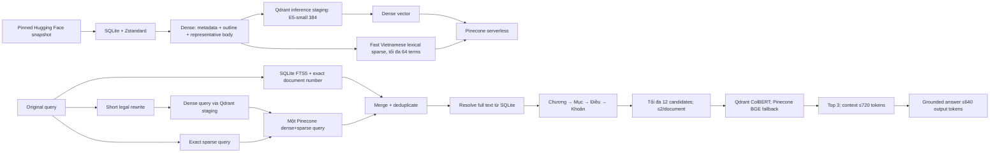

# VietLex — Vietnamese Legal RAG

<div align="center">

[](https://www.python.org/)
[](https://huggingface.co/datasets/vohuutridung/vietnamese-legal-documents)
[-orange.svg)](https://huggingface.co/intfloat/multilingual-e5-small)
[](https://huggingface.co/answerdotai/answerai-colbert-small-v1)
[](https://www.pinecone.io/)

**Hệ thống RAG chuyên sâu cho việc tra cứu và giải đáp văn bản pháp luật Việt Nam.**

Ngôn ngữ: **Tiếng Việt** | [English](README.en.md)

</div>

---

VietLex là hệ thống Retrieval-Augmented Generation (RAG) phục vụ tra cứu văn bản pháp luật Việt Nam. Toàn bộ corpus được lưu trữ trên **Pinecone**; **Qdrant Cloud** chỉ thực thi inference từ xa để tạo vector dense 384 chiều (`intfloat/multilingual-e5-small`) và rerank bằng **ColBERT**. Trong trường hợp Qdrant Cloud tạm thời quá tải, pipeline sẽ tự động fallback sang Pinecone Inference (`bge-reranker-v2-m3`). **Không có embedding hoặc reranker nào chạy tại local.**

> [!WARNING]
> **Tuyên bố miễn trừ trách nhiệm về dữ liệu:**
> Corpus là dataset nghiên cứu từ bên thứ ba [`vohuutridung/vietnamese-legal-documents`](https://huggingface.co/datasets/vohuutridung/vietnamese-legal-documents), không phải cơ sở dữ liệu pháp luật chính thức và không tự xác nhận hiệu lực văn bản. Kết quả do hệ thống cung cấp chỉ nhằm mục đích tham khảo thông tin, không phải tư vấn pháp lý. Luôn đối chiếu với nguồn chính thức hiện hành trước khi ra quyết định.

---

## Scripts nhanh

> Các lệnh dưới đây giữ nguyên đầy đủ luồng hiện tại, chỉ đóng gói theo nhóm để copy/paste nhanh khi phát triển và vận hành.

| Script | Lệnh | Mục đích |
| --- | --- | --- |
| `setup` | `python -m venv .venv`<br>`.venv\Scripts\Activate.ps1`<br>`python -m pip install -r requirements.txt`<br>`Copy-Item .env.example .env` | Khởi tạo môi trường local |
| `dev` | `uvicorn app.main:app --host 0.0.0.0 --port 8000` | Chạy API local |
| `ingest:full` | `python -u -m app.ingestion.hf_pipeline full --delete-existing --yes` | Nạp lại toàn bộ corpus |
| `ingest:download` | `python -m app.ingestion.hf_pipeline download` | Tải snapshot dataset |
| `ingest:prepare` | `python -m app.ingestion.hf_pipeline prepare` | Chuẩn hóa dữ liệu trước khi index |
| `ingest:smoke` | `python -m app.ingestion.hf_pipeline smoke` | Smoke ingestion |
| `ingest:verify` | `python -m app.ingestion.hf_pipeline verify` | Verify trạng thái ingestion |
| `fts:build` | `python -u -m app.ingestion.legal_fts build --batch-size 256` | Build SQLite FTS5 index |
| `eval:full` | `python -u run_eval_suite.py --fresh --factoids 12 --multihop 12 --unanswerable 6 --concurrency 2 --judge-concurrency 4` | Chạy full golden evaluation |
| `eval:smoke` | `python -u run_eval_suite.py --fresh --factoids 2 --multihop 2 --unanswerable 2 --concurrency 1 --judge-concurrency 1 --checkpoint docs/smoke_eval_checkpoints.json --report docs/smoke_evaluation_report.md` | Smoke evaluation nhanh |
| `test` | `python -m pytest -q` | Chạy test suite |
| `test:live-rerank` | `$env:RUN_LIVE_RERANK_TEST='1'`<br>`python -m pytest tests/integration/test_remote_reranker_live.py -q`<br>`Remove-Item Env:RUN_LIVE_RERANK_TEST` | Smoke live reranker |
| `check` | `python -m compileall -q app tests`<br>`git diff --check` | Kiểm tra compile + whitespace diff |

---

## Mục lục

- [Thông tin Corpus](#thông-tin-corpus)
- [Kiến trúc Hệ thống](#kiến-trúc-hệ-thống)
- [Yêu cầu & Cài đặt](#yêu-cầu--cài-đặt)
- [Nạp toàn bộ Corpus (Ingestion Pipeline)](#nạp-toàn-bộ-corpus-ingestion-pipeline)
- [Chạy Ứng dụng & Luồng Thực thi (Runtime)](#chạy-ứng-dụng--luồng-thực-thi-runtime)
- [Đánh giá Hệ thống (Golden Benchmark)](#đánh-giá-hệ-thống-golden-benchmark)
- [Kiểm thử Automated Testing](#kiểm-thử-automated-testing)
- [Tài liệu Vận hành](#tài-liệu-vận-hành)

---

## Thông tin Corpus

| Thông số | Giá trị / Chi tiết |
| :--- | :--- |
| **Revision Pin** | `4d4e10b201544e8a4c49a1d3fa496595a7d486d0` |
| **Quy mô Corpus** | **518.255** văn bản pháp luật |
| **Bản quyền (License)** | CC BY 4.0 (Do publisher công bố) |
| **Snapshot** | 13 file (Đã kiểm tra dung lượng và SHA-256 checksum) |
| **Lưu trữ Full Content** | SQLite / Zstandard local (không lưu trực tiếp full body vào Pinecone) |

---

## Kiến trúc Hệ thống

### Luồng Dữ liệu & Retrieval


```mermaid
flowchart LR
    HF["Pinned Hugging Face snapshot"] --> Store["SQLite + Zstandard"]
    Store --> Text["Dense: metadata + outline + representative body"]
    Text --> Stage["Qdrant inference staging: E5-small 384"]
    Stage --> Vector["Dense vector"]
    Text --> Sparse["Fast Vietnamese lexical sparse, tối đa 64 terms"]
    Vector --> Pinecone["Pinecone serverless"]
    Sparse --> Pinecone

    Query["Original query"] --> Rewrite["Short legal rewrite"]
    Query --> FTS["SQLite FTS5 + exact document number"]
    Rewrite --> QueryEmbed["Dense query via Qdrant staging"]
    Query --> SparseQuery["Exact sparse query"]
    QueryEmbed --> Hybrid["Một Pinecone dense+sparse query"]
    SparseQuery --> Hybrid
    FTS --> Merge["Merge + deduplicate"]
    Hybrid --> Merge
    Merge --> Resolve["Resolve full text từ SQLite"]
    Resolve --> Chunk["Chương → Mục → Điều → Khoản"]
    Chunk --> Bound["Tối đa 12 candidates; ≤2/document"]
    Bound --> Rerank["Qdrant ColBERT; Pinecone BGE fallback"]
    Rerank --> Budget["Top 3; context ≤720 tokens"]
    Budget --> Answer["Grounded answer ≤640 output tokens"]
```

### Chi tiết Lưu trữ & Inference Engine

* **Pinecone Serverless:** Lưu đúng 1 record/document với metadata tối thiểu: `document ID`, `content-store key`, `corpus revision`, và `content SHA-256`. Với 384 dense values và tối đa 64 sparse values, dung lượng raw vector payload ước tính khoảng **1,06 GB** (chưa tính ID, metadata và overhead của index). Thiết kế nhắm tới gói Starter 2 GB nhưng không thể bảo đảm quota nếu tài khoản chứa index khác; pipeline sẽ dừng rõ ràng khi Pinecone trả `QUOTA_EXCEEDED`.
* **Qdrant Cloud Staging & Inference:** Dense embedding sử dụng Qdrant Cloud Inference với model `intfloat/multilingual-e5-small`. Qdrant chỉ giữ collection staging tối đa 2.049 point ID cố định cho embedding và một collection rerank tạm thời cho tối đa 12 chunks/request. Toàn bộ dense + sparse vectors lâu dài vẫn nằm tại Pinecone; Qdrant không giữ bản sao corpus.

---

## Yêu cầu & Cài đặt

### Yêu cầu Hệ thống
* **Python:** 3.10+

### Các bước Cài đặt

```powershell
python -m venv .venv
.venv\Scripts\Activate.ps1
python -m pip install -r requirements.txt
Copy-Item .env.example .env
```

### Cấu hình Biến Môi trường (Secrets)

Các biến môi trường bắt buộc cấu hình trong tệp `.env`:

* `PIPECONE_API` hoặc `PINECONE_API_KEY`: API Key kết nối Pinecone Serverless.
* `QDRANT_URL`, `QDRANT_API_KEY`: Thông tin kết nối Qdrant Cloud Inference (cho Embedding & ColBERT).
* `OMNIGATE_BASE_URL`, `LITELLM_MASTER_KEY`: Thông tin API Gateway kết nối model sinh câu trả lời (Answer Model).

> [!NOTE]
> Tên `PIPECONE_API` được hỗ trợ để tương thích với cấu hình secret hiện có, mặc dù tên chuẩn của Pinecone là `PINECONE_API_KEY`. Tuyệt đối không hardcode hoặc ghi secret vào log/checkpoint.

---

## Nạp toàn bộ Corpus (Ingestion Pipeline)

Nếu snapshot và content store đã tồn tại local, khởi chạy quy trình nạp toàn bộ dữ liệu:

```powershell
python -u -m app.ingestion.hf_pipeline full --delete-existing --yes
```

### Tiến trình thực thi khi chạy mới:
1. **Xác minh:** Kiểm tra snapshot, content store, credentials và khớp chính xác **518.255** văn bản.
2. **Khởi tạo Index:** Xóa và tạo lại (recreate) index Pinecone `vietlex-legal-rag-v1`.
3. **Encoding:** Encode model `E5-small` qua Qdrant staging (đã giới hạn bộ nhớ/dung lượng).
4. **Batch Upsert:** Chuẩn bị và upload theo cửa sổ `16 batch × 128 documents`.
5. **Checkpoint:** Chỉ checkpoint trạng thái batch sau khi Pinecone xác nhận upsert thành công.

Nếu tiến trình bị ngắt giữa chừng, chạy lại cùng lệnh trên để tiếp tục. Checkpoint được quản lý riêng tại file SQLite `data/huggingface/pinecone_ingestion_state.sqlite3`; các batch đã hoàn thành sẽ không bị embed hoặc upload lại. Lệnh này không chạy live benchmark hay reranker smoke để tiết kiệm quota.

### Các Lệnh Phase Riêng lẻ (Tùy chọn):

```powershell
python -m app.ingestion.hf_pipeline download
python -m app.ingestion.hf_pipeline prepare
python -m app.ingestion.hf_pipeline smoke
python -m app.ingestion.hf_pipeline verify
```

---

## Chạy Ứng dụng & Luồng Thực thi (Runtime)

### Khởi chạy Server Web (FastAPI / Uvicorn)

```powershell
uvicorn app.main:app --host 0.0.0.0 --port 8000
```

### Cơ chế Hoạt động Runtime

* **Parallel Retrieval:** Runtime thực hiện đồng thời 1 truy vấn Pinecone hybrid read (remote) và 1 truy vấn SQLite FTS5 read (local).
* **Semantic Cache:** Được đặt ở namespace riêng trong cùng index Pinecone, với ngưỡng độ tương đồng (similarity threshold) **`0.96`**.
* **Dual-Reranker System:**
  * Reranker chính: Qdrant Cloud `answerdotai/answerai-colbert-small-v1`.
  * Fallback Reranker: Pinecone `bge-reranker-v2-m3` (chỉ kích hoạt khi Qdrant bị timeout, trả về lỗi 429/5xx, hoặc khi circuit breaker đang mở).
  * Nếu cả hai provider đều gặp lỗi, hệ thống sẽ ghi nhận lỗi `reranker_error` thay vì báo câu từ chối "không có dữ liệu".
* **Hybrid Retrieval & Fallback:** Ghi nhận timing riêng biệt cho Qdrant embedding và Pinecone query. Query Pinecone được thử lại tối đa 2 lượt với timeout 8 giây/lượt; nếu truy vấn hybrid remote vẫn thất bại nhưng FTS local có kết quả, request sẽ tự động chuyển sang chế độ `lexical_fallback` để phục vụ người dùng thay vì gây lỗi toàn pipeline.
* **Candidate Interleaving:** Khi cả FTS và Pinecone đều trả về kết quả, ngân sách document sẽ được xen kẽ cân bằng giữa lexical và semantic để 12 kết quả từ FTS không chiếm toàn bộ candidate rerank.
* **Query Processing & Chunking:**
  * Luồng query dùng bản rewrite ngắn cho dense embedding, nhưng **giữ nguyên câu hỏi gốc** cho sparse search để bảo toàn số Điều, số hiệu văn bản, ngày tháng và tên riêng.
  * Full text chỉ được chunk sau khi resolve từ SQLite: tách theo cấu trúc **Chương → Mục → Điều → Khoản**, tối đa **220 whitespace tokens/chunk** và overlap **24 tokens** (chỉ áp dụng khi một đơn vị cấu trúc quá dài).
  * Candidate rerank giới hạn tối đa **12 chunks**, không quá **2 chunks/document**.
  * Prompt cuối có ngân sách context toàn cục **720 tokens** và output model tối đa **640 tokens** (mọi thông số đều tùy chỉnh được qua `.env`).

### Xây dựng SQLite FTS5 Index

Tạo FTS5 index một lần từ content store đã có. File được tạo nguyên tử tại `data/huggingface/legal_fts.sqlite3` trên ổ D::

```powershell
python -u -m app.ingestion.legal_fts build --batch-size 256
```

* **Đặc tính FTS5:** FTS chỉ lưu metadata phục vụ tra cứu chính xác số hiệu văn bản và index tiêu đề `contentless` hỗ trợ BM25; full body duy nhất nằm ở content store.
* **Resume & Compact:** Nếu quá trình build bị dừng do hết dung lượng hoặc ngắt tiến trình, file tạm `.building` hợp lệ sẽ được giữ lại; chạy lại lệnh trên sẽ tiếp tục từ document đã commit cuối cùng. Tiến trình tự động compact file FTS body cũ bằng cơ chế thay thế nguyên tử mà không cần đọc/giải nén lại toàn bộ full text.
* **Lưu ý:** Lệnh này có thể mất thời gian và chiếm thêm dung lượng ổ D: do cần giải nén/index toàn bộ corpus, nhưng không gọi model hay API bên ngoài. Nếu chưa build FTS, runtime vẫn hoạt động bình thường qua Pinecone.

### Ghi chú Triển khai (Deployment Note)

* Trong môi trường Production Online, file `legal_fts.sqlite3` (~213 MiB đối với revision hiện tại) phải được đặt trên persistent volume hoặc tải về khi khởi động container và mở ở chế độ read-only.
* Không nên thêm MongoDB chỉ để sao chép lại 518 nghìn document: Pinecone hybrid đã đảm nhiệm tốt lớp semantic + sparse, trong khi SQLite bổ sung exact document number/title BM25.
* Chỉ nên chuyển lexical layer sang MongoDB Atlas Search khi hệ thống triển khai nhiều replica không dùng chung volume được, hoặc MongoDB đã là document store chính (cần đo lường recall và latency trước khi thay thế SQLite).

> [!IMPORTANT]
> **Tính tương thích Index:** Index đã được nạp (ingest) thành công từ trước hoàn toàn tương thích với phiên bản runtime mới mà không cần rebuild. Mã nguồn ingestion-v2 hiện tại tạo dense text theo thứ tự `metadata → outline → đại diện nội dung`, đồng thời tạo sparse text riêng từ `outline + full text`. Thay đổi biểu diễn này chỉ có hiệu lực khi bạn chủ động rebuild lại toàn bộ index; không nên chạy lệnh `full --delete-existing --yes` chỉ để nhận tối ưu runtime.

---

## Đánh giá Hệ thống (Golden Benchmark)

Bộ dữ liệu đánh giá chuẩn (Golden Suite) mặc định lấy 30 câu hỏi từ `app/data/namsyntax_legal_qa_420.json`, phân bổ cân bằng: **12 factoid**, **12 multi-hop**, và **6 unanswerable**.

### Chạy Đánh giá Đầy đủ (Full Benchmark)

```powershell
python -u run_eval_suite.py --fresh --factoids 12 --multihop 12 --unanswerable 6 --concurrency 2 --judge-concurrency 4
```

* **Checkpoint & Cache:** Nếu tiến trình bị ngắt, chạy lại lệnh và bỏ tham số `--fresh` để tiếp tục từ checkpoint. Semantic cache bị bỏ qua mặc định để đánh giá chính xác retrieval và generation (thêm `--use-cache` nếu muốn đo luồng cache).
* **Ragas:** Có thể thêm `--skip-ragas` cho smoke test nhanh, nhưng kết quả này không thay thế được báo cáo đánh giá chính thức.
* **Điều kiện tiên quyết:** Golden suite sẽ từ chối chạy nếu FTS index chưa được build hoàn tất nhằm tránh tạo ra các báo cáo hybrid giả.

### Chạy Smoke Test Đánh giá (6 câu)

Smoke test 6 câu thật, lưu artifact riêng biệt và không ghi đè báo cáo đầy đủ:

```powershell
python -u run_eval_suite.py --fresh --factoids 2 --multihop 2 --unanswerable 2 --concurrency 1 --judge-concurrency 1 --checkpoint docs/smoke_eval_checkpoints.json --report docs/smoke_evaluation_report.md
```

### Báo cáo & Tiêu chí Đánh giá (Metrics)

Suite lưu checkpoint nguyên tử và xuất báo cáo tại `docs/system_evaluation_report.md`. Các chỉ số đo lường bao gồm:
* **Metrics:** Faithfulness, Answer Accuracy, Context Precision / Recall, Gold-Context Hit Rate, Retrieval MRR, Answerable / Unanswerable Accuracy, Refusal Precision / Recall, và Latency chi tiết (Queue / Pipeline / Ragas).
* **LLM Judge Priority:** Thứ tự ưu tiên LLM Judge để đảm bảo tính độc lập với Answer Model (OpenRouter): **Gemini → NVIDIA → Groq → OpenRouter → OmniGate**. Quota, timeout hoặc lỗi 429/5xx sẽ tự động chuyển đổi (failover) sang provider tiếp theo.
* **Guardrail Failures:** Timeout từ Guardrail được ghi nhận là lỗi kỹ thuật, không tính thành câu hỏi vi phạm.
* **Chi phí:** Chạy suite sẽ phát sinh chi phí lượt đọc Pinecone, Qdrant inference, reranker và judge API. Sử dụng mức concurrency mặc định để tránh dính rate limit.

---

## Kiểm thử Automated Testing

### Kiểm thử Cơ bản & Kiểm tra Mã nguồn

```powershell
python -m pytest -q
python -m compileall -q app tests
git diff --check
```

Suite kiểm thử tự động mặc định sử dụng **test doubles** (mock client) nên **không tốn quota API**.

### Live Reranker Integration Test

Kiểm thử thực tế sử dụng 3 chunks thật từ content store, thực hiện đúng 1 lượt gọi Qdrant và 1 lượt gọi Pinecone:

```powershell
$env:RUN_LIVE_RERANK_TEST='1'
python -m pytest tests/integration/test_remote_reranker_live.py -q
Remove-Item Env:RUN_LIVE_RERANK_TEST
```

> [!NOTE]
> Test doubles chỉ tồn tại trong các kịch bản kiểm thử tự động. Môi trường Production **tuyệt đối không** fallback sang vector giả hoặc trả về kết quả chưa qua rerank.

---

## Tài liệu Vận hành

Chi tiết hướng dẫn nạp dữ liệu Hugging Face và các thao tác vận hành chuyên sâu:
* [Hugging Face Ingestion Runbook](docs/huggingface-ingestion-runbook.md)
