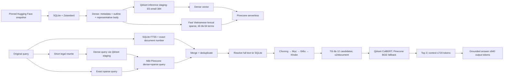

# VietLex — Vietnamese Legal RAG

VietLex là hệ thống RAG cho tra cứu văn bản pháp luật Việt Nam. Corpus được lưu
trên Pinecone; Qdrant Cloud chỉ chạy inference từ xa để tạo vector
`intfloat/multilingual-e5-small` 384 chiều và rerank bằng ColBERT. Nếu Qdrant
tạm thời quá tải, pipeline fallback sang Pinecone Inference
`bge-reranker-v2-m3`. Không có embedding hoặc reranker nào chạy local.

> [!WARNING]
> Corpus là dataset nghiên cứu bên thứ ba
> [`vohuutridung/vietnamese-legal-documents`](https://huggingface.co/datasets/vohuutridung/vietnamese-legal-documents),
> không phải cơ sở dữ liệu pháp luật chính thức và không tự xác nhận hiệu lực
> văn bản. Kết quả chỉ nhằm cung cấp thông tin, không phải tư vấn pháp lý. Luôn
> đối chiếu nguồn chính thức hiện hành trước khi ra quyết định.

## Corpus

- Revision pin: `4d4e10b201544e8a4c49a1d3fa496595a7d486d0`
- Số văn bản: `518.255`
- License do publisher công bố: CC BY 4.0
- Snapshot: 13 file, kiểm tra size và SHA-256
- Full content: SQLite/Zstandard local, không đưa vào Pinecone

## Kiến trúc


```mermaid
flowchart LR
    HF["Pinned Hugging Face snapshot"] --> Store["SQLite + Zstandard"]
    Store --> Text["Dense: metadata + outline + representative body"]
    Text --> Stage["Qdrant inference staging: E5-small 384"]
    Stage --> Vector["Dense vector"]
    Text --> Sparse["Fast Vietnamese lexical sparse, tối đa 64 terms"]
    Vector --> Pinecone["Pinecone serverless"]
    Sparse --> Pinecone

    Query["Original query"] --> Rewrite["Short legal rewrite"]
    Query --> FTS["SQLite FTS5 + exact document number"]
    Rewrite --> QueryEmbed["Dense query via Qdrant staging"]
    Query --> SparseQuery["Exact sparse query"]
    QueryEmbed --> Hybrid["Một Pinecone dense+sparse query"]
    SparseQuery --> Hybrid
    FTS --> Merge["Merge + deduplicate"]
    Hybrid --> Merge
    Merge --> Resolve["Resolve full text từ SQLite"]
    Resolve --> Chunk["Chương → Mục → Điều → Khoản"]
    Chunk --> Bound["Tối đa 12 candidates; ≤2/document"]
    Bound --> Rerank["Qdrant ColBERT; Pinecone BGE fallback"]
    Rerank --> Budget["Top 3; context ≤720 tokens"]
    Budget --> Answer["Grounded answer ≤640 output tokens"]
```

Pinecone lưu đúng một record/document với metadata tối thiểu: document ID,
content-store key, corpus revision và content SHA-256. Với 384 dense values và
tối đa 64 sparse values, raw vector payload ước tính khoảng 1,06 GB trước ID,
metadata và index overhead. Thiết kế nhắm tới Starter 2 GB nhưng không thể bảo
đảm quota nếu tài khoản còn chứa index khác; pipeline sẽ dừng rõ ràng khi
Pinecone trả `QUOTA_EXCEEDED`.

Dense embedding dùng Qdrant Cloud Inference với model
`intfloat/multilingual-e5-small`. Qdrant chỉ giữ collection staging tối đa
2.049 point ID cố định cho embedding và một collection rerank nhỏ, tạm thời cho
tối đa 12 chunks/request. Toàn bộ dense+sparse vectors lâu dài vẫn nằm ở
Pinecone; Qdrant không giữ bản sao corpus.

## Cài đặt

Yêu cầu Python 3.10+:

```powershell
python -m venv .venv
.venv\Scripts\Activate.ps1
python -m pip install -r requirements.txt
Copy-Item .env.example .env
```

Secret bắt buộc:

- `PIPECONE_API` hoặc `PINECONE_API_KEY`;
- `QDRANT_URL`, `QDRANT_API_KEY` cho embedding và ColBERT Cloud Inference;
- `OMNIGATE_BASE_URL`, `LITELLM_MASTER_KEY` cho answer model.

Tên `PIPECONE_API` được hỗ trợ để tương thích với secret hiện có, dù chính tả
chuẩn của Pinecone là `PINECONE_API_KEY`. Không hardcode hoặc ghi secret vào
log/checkpoint.

## Nạp toàn bộ corpus

Nếu snapshot và content store đã tồn tại, chạy trực tiếp:

```powershell
python -u -m app.ingestion.hf_pipeline full --delete-existing --yes
```

Lần chạy mới sẽ:

1. xác minh snapshot, content store, credentials và đúng 518.255 documents;
2. xóa/recreate index Pinecone `vietlex-legal-rag-v1`;
3. encode E5-small qua Qdrant staging giới hạn dung lượng;
4. chuẩn bị/upload theo window 16 batch × 128 documents;
5. chỉ checkpoint batch sau khi Pinecone xác nhận upsert.

Nếu bị ngắt, chạy lại cùng lệnh. Checkpoint Pinecone riêng nằm tại
`data/huggingface/pinecone_ingestion_state.sqlite3`; completed batches không bị
embed hoặc upload lại. Lệnh không chạy live benchmark hay reranker smoke để
không lãng phí quota.

Các phase tùy chọn:

```powershell
python -m app.ingestion.hf_pipeline download
python -m app.ingestion.hf_pipeline prepare
python -m app.ingestion.hf_pipeline smoke
python -m app.ingestion.hf_pipeline verify
```

## Chạy ứng dụng

```powershell
uvicorn app.main:app --host 0.0.0.0 --port 8000
```

Runtime thực hiện một Pinecone hybrid read và một SQLite FTS5 read song song.
Semantic cache nằm ở namespace riêng trong cùng index, dùng threshold `0.96`.
Reranker chính là Qdrant Cloud
`answerdotai/answerai-colbert-small-v1`; Pinecone
`bge-reranker-v2-m3` chỉ được gọi khi Qdrant timeout, trả 429/5xx hoặc circuit
breaker đang mở. Lỗi cả hai provider được báo là `reranker_error`, không bị
biến thành câu từ chối do “không có dữ liệu”.

Luồng query dùng bản rewrite ngắn cho dense embedding nhưng giữ nguyên câu hỏi
gốc cho sparse search để không làm mất số Điều, số hiệu văn bản, ngày tháng và
tên riêng. Full text chỉ được chunk sau khi resolve từ SQLite: tách theo
Điều/Khoản, tối đa 220 whitespace tokens/chunk và overlap 24 tokens chỉ khi một
đơn vị cấu trúc quá dài. Candidate rerank được giới hạn 12, tối đa 2 chunk mỗi
document. Prompt cuối có một ngân sách toàn cục 720 tokens và output model tối
đa 640 tokens; mọi giới hạn đều có thể chỉnh qua `.env`.

Tạo FTS5 một lần từ content store đã có; file được tạo nguyên tử tại
`data/huggingface/legal_fts.sqlite3` trên ổ D:

```powershell
python -u -m app.ingestion.legal_fts build --batch-size 256
```

Lệnh có thể mất thời gian và thêm dung lượng trên ổ D vì phải giải nén/index
toàn bộ corpus, nhưng không gọi model hoặc API. Nếu chưa tạo FTS, runtime vẫn
hoạt động bằng Pinecone và không tự build nặng trong request đầu tiên.

> [!IMPORTANT]
> Index đã ingestion xong tiếp tục tương thích với runtime mới và không cần
> rebuild. Code ingestion-v2 hiện tạo dense text theo thứ tự metadata → outline
> → nội dung đại diện, đồng thời tạo sparse text riêng từ outline + full text.
> Thay đổi representation này chỉ có hiệu lực khi chủ động rebuild toàn index;
> không chạy lệnh `full --delete-existing --yes` chỉ để nhận tối ưu runtime.

## Đánh giá golden dataset

Golden suite mặc định lấy 30 câu từ `app/data/namsyntax_legal_qa_420.json`, cân
bằng 12 factoid, 12 multi-hop và 6 unanswerable. Lần chạy đánh giá đầy đủ:

```powershell
python -u run_eval_suite.py --fresh --factoids 12 --multihop 12 --unanswerable 6 --concurrency 2 --judge-concurrency 4
```

Nếu tiến trình bị ngắt, chạy lại cùng lệnh nhưng bỏ `--fresh` để tiếp tục từ
checkpoint. Semantic cache bị bỏ qua mặc định để mỗi câu thực sự kiểm tra
retrieval và generation; chỉ thêm `--use-cache` khi chủ động đo luồng cache.
Có thể thêm `--skip-ragas` cho smoke test nhanh, nhưng kết quả đó không thay thế
đánh giá cuối.

Suite ghi checkpoint nguyên tử và tạo báo cáo tại `docs/system_evaluation_report.md`.
Các metric gồm faithfulness, answer accuracy, context precision/recall,
gold-context hit rate, retrieval MRR, answerable/unanswerable accuracy, refusal
precision/recall và latency riêng cho queue/pipeline/Ragas. Judge ưu tiên Gemini
để độc lập với answer model OpenRouter, sau đó NVIDIA, Groq, OpenRouter và
OmniGate. Chạy suite sẽ phát sinh lượt đọc Pinecone,
Qdrant inference, reranker và chi phí judge API; dùng concurrency mặc định để
tránh rate limit, không tăng đồng thời nếu chưa kiểm tra quota.

## Kiểm thử

```powershell
python -m pytest -q
python -m compileall -q app tests
git diff --check
```

Full suite mặc định dùng client giả và không tốn quota. Smoke sau dùng 3 chunks
thật từ content store và gọi đúng một lượt Qdrant cùng một lượt Pinecone:

```powershell
$env:RUN_LIVE_RERANK_TEST='1'
python -m pytest tests/integration/test_remote_reranker_live.py -q
Remove-Item Env:RUN_LIVE_RERANK_TEST
```

Test doubles chỉ tồn tại trong automated tests. Production không fallback sang
vector giả hoặc kết quả chưa rerank.

Chi tiết vận hành: [Hugging Face ingestion runbook](docs/huggingface-ingestion-runbook.md).
