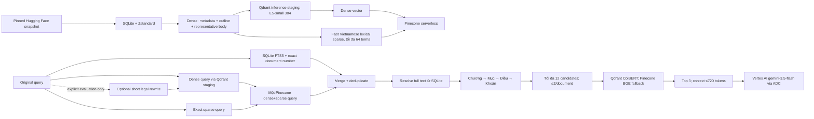

# VietLex — Vietnamese Legal RAG

## Provider-free gold adjudication

`run_gold_adjudication.py` creates immutable, repository-local human-review artifacts without provider, Ragas, generation, guardrail, corpus, index, or vector writes.

```powershell
python -u run_gold_adjudication.py queue --dataset app/data/namsyntax_legal_qa_420.json --sidecar docs/evaluation/gold_labels/namsyntax_legal_qa_420_labels_v2.json --content-store data/huggingface/content_store.sqlite3 --fts data/huggingface/legal_fts.sqlite3 --target-cases 40 --candidate-limit 12
python -u run_gold_adjudication.py preview --dataset app/data/namsyntax_legal_qa_420.json --sidecar docs/evaluation/gold_labels/namsyntax_legal_qa_420_labels_v2.json --queue docs/evaluation/adjudication/queues/<run-id>/queue.json --decisions <decisions.json>
python -u run_gold_adjudication.py promote --dataset app/data/namsyntax_legal_qa_420.json --sidecar docs/evaluation/gold_labels/namsyntax_legal_qa_420_labels_v2.json --queue docs/evaluation/adjudication/queues/<run-id>/queue.json --decisions <decisions.json> --preview docs/evaluation/adjudication/previews/<run-id>/preview.json --approve-preview-sha256 <approved-preview-sha256>
```

Promotion never edits the source sidecar. It rebuilds the preview, requires the exact approved preview hash, and writes a new `labels_v2.json`; insufficient verified coverage remains `BLOCKED_INSUFFICIENT_VERIFIED_CASES`.

<div align="center">

[](https://www.python.org/)
[](https://huggingface.co/datasets/vohuutridung/vietnamese-legal-documents)
[-orange.svg)](https://huggingface.co/intfloat/multilingual-e5-small)
[](https://huggingface.co/answerdotai/answerai-colbert-small-v1)
[](https://www.pinecone.io/)

**Hệ thống RAG chuyên sâu cho việc tra cứu và giải đáp văn bản pháp luật Việt Nam.**

Ngôn ngữ: **Tiếng Việt** | [English](README.en.md)

</div>

---

VietLex là hệ thống Retrieval-Augmented Generation (RAG) phục vụ tra cứu văn bản pháp luật Việt Nam. Toàn bộ corpus 518.255 văn bản được lưu trữ bền vững trên **Pinecone**. **Qdrant Cloud** thực thi inference từ xa và có collection structural opt-in `vietlex-legal-rag-v2-pilot-384` cho 827 văn bản luật chính. Khi bật structural, đây là retrieval primary; Pinecone v1 vẫn là fallback full-corpus có observability. **Không có embedding hoặc reranker nào chạy tại local.**

> [!WARNING]
> **Tuyên bố miễn trừ trách nhiệm về dữ liệu:**
> Corpus là dataset nghiên cứu từ bên thứ ba [`vohuutridung/vietnamese-legal-documents`](https://huggingface.co/datasets/vohuutridung/vietnamese-legal-documents), không phải cơ sở dữ liệu pháp luật chính thức và không tự xác nhận hiệu lực văn bản. Kết quả do hệ thống cung cấp chỉ nhằm mục đích tham khảo thông tin, không phải tư vấn pháp lý. Luôn đối chiếu với nguồn chính thức hiện hành trước khi ra quyết định.

---

## Scripts nhanh

> Các lệnh dưới đây giữ nguyên đầy đủ luồng hiện tại, chỉ đóng gói theo nhóm để copy/paste nhanh khi phát triển và vận hành.

| Script | Lệnh | Mục đích |
| --- | --- | --- |
| `setup` | `python -m venv .venv`<br>`.venv\Scripts\Activate.ps1`<br>`python -m pip install -r requirements.txt`<br>`Copy-Item .env.example .env` | Khởi tạo môi trường local |
| `dev` | `uvicorn app.main:app --host 0.0.0.0 --port 8000` | Chạy API local |
| `ingest:full` | `python -u -m app.ingestion.hf_pipeline full --delete-existing --yes` | Nạp lại toàn bộ corpus |
| `ingest:download` | `python -m app.ingestion.hf_pipeline download` | Tải snapshot dataset |
| `ingest:prepare` | `python -m app.ingestion.hf_pipeline prepare` | Chuẩn hóa dữ liệu trước khi index |
| `ingest:smoke` | `python -m app.ingestion.hf_pipeline smoke` | Smoke ingestion |
| `ingest:verify` | `python -m app.ingestion.hf_pipeline verify` | Verify trạng thái ingestion |
| `fts:build` | `python -u -m app.ingestion.legal_fts build --batch-size 256` | Build SQLite FTS5 index |
| `eval:preflight` | `python -u run_retrieval_eval.py --preflight-all-profiles --verified-only --gold-policy all-required-verified --rewrite off --reranker current` | Kiểm tra provider-free cho mọi profile |
| `eval:retrieval` | `python -u run_retrieval_eval.py --profile separated_intent --verified-only --gold-policy all-required-verified --rewrite off --reranker current` | Đánh giá retrieval bằng metric xác định |
| `eval:answer` | `python -u run_answer_eval.py --profile separated_intent --verified-only --judge none --guardrails off` | Đánh giá câu trả lời, không dùng LLM judge |
| `test` | `python -m pytest -q` | Chạy test suite |
| `test:live-rerank` | `$env:RUN_LIVE_RERANK_TEST='1'`<br>`python -m pytest tests/integration/test_remote_reranker_live.py -q`<br>`Remove-Item Env:RUN_LIVE_RERANK_TEST` | Smoke live reranker |
| `test:live-vertex` | `$env:RUN_VERTEX_LIVE_TESTS='1'`<br>`python -m pytest --run-live tests/integration/test_vertex_ai_live.py -q`<br>`Remove-Item Env:RUN_VERTEX_LIVE_TESTS` | Một generation + một embedding live qua Vertex AI |
| `probe:vertex-g0` | `python run_vertex_g0_probe.py` | Probe cô lập `gemini-embedding-2` 384/768/1024; không ghi vector DB |
| `check` | `python -m compileall -q app tests`<br>`git diff --check` | Kiểm tra compile + whitespace diff |

---

## Mục lục

- [Thông tin Corpus](#thông-tin-corpus)
- [Kiến trúc Hệ thống](#kiến-trúc-hệ-thống)
- [Yêu cầu & Cài đặt](#yêu-cầu--cài-đặt)
- [Nạp toàn bộ Corpus (Ingestion Pipeline)](#nạp-toàn-bộ-corpus-ingestion-pipeline)
- [Chạy Ứng dụng & Luồng Thực thi (Runtime)](#chạy-ứng-dụng--luồng-thực-thi-runtime)
- [Đánh giá Hệ thống (Golden Benchmark)](#đánh-giá-hệ-thống-golden-benchmark)
- [Kiểm thử Automated Testing](#kiểm-thử-automated-testing)
- [Tài liệu Vận hành](#tài-liệu-vận-hành)

---

## Thông tin Corpus

| Thông số | Giá trị / Chi tiết |
| :--- | :--- |
| **Revision Pin** | `4d4e10b201544e8a4c49a1d3fa496595a7d486d0` |
| **Quy mô Corpus** | **518.255** văn bản pháp luật |
| **Bản quyền (License)** | CC BY 4.0 (Do publisher công bố) |
| **Snapshot** | 13 file (Đã kiểm tra dung lượng và SHA-256 checksum) |
| **Lưu trữ Full Content** | SQLite / Zstandard local (không lưu trực tiếp full body vào Pinecone) |

---

## Kiến trúc Hệ thống

### Luồng Dữ liệu & Retrieval


```mermaid
flowchart LR
    HF["Pinned Hugging Face snapshot"] --> Store["SQLite + Zstandard"]
    Store --> Text["Dense: metadata + outline + representative body"]
    Text --> Stage["Qdrant inference staging: E5-small 384"]
    Stage --> Vector["Dense vector"]
    Text --> Sparse["Fast Vietnamese lexical sparse, tối đa 64 terms"]
    Vector --> Pinecone["Pinecone serverless"]
    Sparse --> Pinecone

    Query["Original query"] --> QueryEmbed["Dense query via Qdrant staging"]
    Query -. "explicit evaluation only" .-> Rewrite["Optional short legal rewrite"]
    Query --> FTS["SQLite FTS5 + exact document number"]
    Rewrite -.-> QueryEmbed
    Query --> SparseQuery["Exact sparse query"]
    QueryEmbed --> Hybrid["Một Pinecone dense+sparse query"]
    SparseQuery --> Hybrid
    FTS --> Merge["Merge + deduplicate"]
    Hybrid --> Merge
    Merge --> Resolve["Resolve full text từ SQLite"]
    Resolve --> Chunk["Chương → Mục → Điều → Khoản"]
    Chunk --> Bound["Tối đa 12 candidates; ≤2/document"]
    Bound --> Rerank["Qdrant ColBERT; Pinecone BGE fallback"]
    Rerank --> Budget["Top 3; context ≤720 tokens"]
    Budget --> Answer["Vertex AI gemini-3.5-flash via ADC"]
```

### Chi tiết Lưu trữ & Inference Engine

* **Pinecone Serverless:** Lưu đúng 1 record/document với metadata tối thiểu: `document ID`, `content-store key`, `corpus revision`, và `content SHA-256`. Với 384 dense values và tối đa 64 sparse values, dung lượng raw vector payload ước tính khoảng **1,06 GB** (chưa tính ID, metadata và overhead của index). Thiết kế nhắm tới gói Starter 2 GB nhưng không thể bảo đảm quota nếu tài khoản chứa index khác; pipeline sẽ dừng rõ ràng khi Pinecone trả `QUOTA_EXCEEDED`.
* **Qdrant Cloud Staging, Inference & Structural Pilot:** Dense embedding sử dụng Qdrant Cloud Inference với model `intfloat/multilingual-e5-small`. Ngoài các collection staging/rerank tạm thời, collection opt-in `vietlex-legal-rag-v2-pilot-384` giữ 134.334 structural chunks của 827 văn bản luật chính. Đây không phải bản sao đầy đủ của corpus; Pinecone vẫn là durable full-corpus store.

---

## Yêu cầu & Cài đặt

### Yêu cầu Hệ thống
* **Python:** 3.10+
* **MongoDB:** một instance đang chạy (local hoặc MongoDB Atlas). Cấu hình URI qua `MONGO_URL`; ứng dụng sẽ dừng khi không kết nối được vì session và log phụ thuộc vào MongoDB.

### Các bước Cài đặt

```powershell
python -m venv .venv
.venv\Scripts\Activate.ps1
python -m pip install -r requirements.txt
Copy-Item .env.example .env
```

Nếu chưa có MongoDB local và đã cài Docker, có thể khởi động nhanh:

```powershell
docker run --name vietlex-mongodb -p 127.0.0.1:27017:27017 -d mongo:7
```

### Cấu hình Biến Môi trường (Secrets)

Các biến môi trường bắt buộc cấu hình trong tệp `.env`:

* `PIPECONE_API` hoặc `PINECONE_API_KEY`: API Key kết nối Pinecone Serverless.
* `QDRANT_URL`, `QDRANT_API_KEY`: Thông tin kết nối Qdrant Cloud Inference (cho Embedding & ColBERT).
* `MONGO_URL`: MongoDB dùng cho session, log, feedback và trang admin; local mặc định có thể dùng `mongodb://localhost:27017/vietlex`.
* Để dùng structural primary: `STRUCTURAL_BACKEND_ENABLED=true`, `STRUCTURAL_COLLECTION_NAME=vietlex-legal-rag-v2-pilot-384`. Collection này chỉ phủ 827 văn bản; Pinecone v1 vẫn fallback cho lỗi kỹ thuật/no-candidate.
* Local: `GOOGLE_APPLICATION_CREDENTIALS=.secrets/vertex-adc.json` dùng đường dẫn tương đối tới key đã được Git ignore; không hardcode đường dẫn Windows.
* Vercel/serverless: đặt toàn bộ JSON service account trong secret `GOOGLE_SERVICE_ACCOUNT_JSON`. Provider tạo credential trực tiếp trong memory, không cần ghi key ra filesystem.
* `GOOGLE_CLOUD_PROJECT`, `GOOGLE_CLOUD_LOCATION=global`: Project/location cho Vertex AI.
* `VERTEX_LLM_MODEL=gemini-3.5-flash`, `VERTEX_EMBEDDING_MODEL=gemini-embedding-2`: generation production và embedding probe-only.
* Tùy chọn fallback: `OPENROUTER_API_KEY`, `GEMINI_API_KEY`, `NVIDIA_API_KEY`, `GROQ_API_KEY`. Các API này chỉ chạy khi Vertex primary gặp lỗi kỹ thuật.

> [!NOTE]
> Tên `PIPECONE_API` được hỗ trợ để tương thích với cấu hình secret hiện có, mặc dù tên chuẩn của Pinecone là `PINECONE_API_KEY`. Tuyệt đối không hardcode hoặc ghi secret vào log/checkpoint. Không đặt đồng thời JSON thô vào `GOOGLE_APPLICATION_CREDENTIALS`; biến chuẩn này vẫn dành cho đường dẫn local.

---

## Nạp toàn bộ Corpus (Ingestion Pipeline)

Nếu snapshot và content store đã tồn tại local, khởi chạy quy trình nạp toàn bộ dữ liệu:

```powershell
python -u -m app.ingestion.hf_pipeline full --delete-existing --yes
```

### Tiến trình thực thi khi chạy mới:
1. **Xác minh:** Kiểm tra snapshot, content store, credentials và khớp chính xác **518.255** văn bản.
2. **Khởi tạo Index:** Xóa và tạo lại (recreate) index Pinecone `vietlex-legal-rag-v1`.
3. **Encoding:** Encode model `E5-small` qua Qdrant staging (đã giới hạn bộ nhớ/dung lượng).
4. **Batch Upsert:** Chuẩn bị và upload theo cửa sổ `16 batch × 128 documents`.
5. **Checkpoint:** Chỉ checkpoint trạng thái batch sau khi Pinecone xác nhận upsert thành công.

Nếu tiến trình bị ngắt giữa chừng, chạy lại cùng lệnh trên để tiếp tục. Checkpoint được quản lý riêng tại file SQLite `data/huggingface/pinecone_ingestion_state.sqlite3`; các batch đã hoàn thành sẽ không bị embed hoặc upload lại. Lệnh này không chạy live benchmark hay reranker smoke để tiết kiệm quota.

### Các Lệnh Phase Riêng lẻ (Tùy chọn):

```powershell
python -m app.ingestion.hf_pipeline download
python -m app.ingestion.hf_pipeline prepare
python -m app.ingestion.hf_pipeline smoke
python -m app.ingestion.hf_pipeline verify
```

---

## Chạy Ứng dụng & Luồng Thực thi (Runtime)

### Khởi chạy Server Web (FastAPI / Uvicorn)

```powershell
uvicorn app.main:app --host 0.0.0.0 --port 8000
```

### Cơ chế Hoạt động Runtime

* **Parallel Retrieval:** Runtime thực hiện đồng thời 1 truy vấn Pinecone hybrid read (remote) và 1 truy vấn SQLite FTS5 read (local).
* **Semantic Cache:** Được đặt ở namespace riêng trong cùng index Pinecone, với ngưỡng độ tương đồng (similarity threshold) **`0.96`**.
* **Dual-Reranker System:**
  * Reranker chính: Qdrant Cloud `answerdotai/answerai-colbert-small-v1`.
  * Fallback Reranker: Pinecone `bge-reranker-v2-m3` (chỉ kích hoạt khi Qdrant bị timeout, trả về lỗi 429/5xx, hoặc khi circuit breaker đang mở).
  * Nếu cả hai provider đều gặp lỗi, hệ thống sẽ ghi nhận lỗi `reranker_error` thay vì báo câu từ chối "không có dữ liệu".
* **Hybrid Retrieval & Fallback:** Ghi nhận timing riêng biệt cho Qdrant embedding và Pinecone query. Query Pinecone được thử lại tối đa 2 lượt với timeout 8 giây/lượt; nếu truy vấn hybrid remote vẫn thất bại nhưng FTS local có kết quả, request sẽ tự động chuyển sang chế độ `lexical_fallback` để phục vụ người dùng thay vì gây lỗi toàn pipeline.
  Luồng này mang status `partial_retrieval_error`: vẫn score chất lượng từ FTS nhưng đồng thời được tính vào retrieval technical-error rate, không che lỗi dense provider.
* **Candidate Interleaving:** Khi cả FTS và Pinecone đều trả về kết quả, ngân sách document sẽ được xen kẽ cân bằng giữa lexical và semantic để 12 kết quả từ FTS không chiếm toàn bộ candidate rerank.
* **Query Processing & Chunking:**
  * Mặc định không gọi rewrite: câu hỏi gốc cấp cả dense, sparse và exact retrieval. Rewrite chỉ bật rõ ràng trong thí nghiệm evaluation; sparse/exact vẫn luôn dùng câu hỏi gốc.
  * Full text chỉ được chunk sau khi resolve từ SQLite: tách theo cấu trúc **Chương → Mục → Điều → Khoản**, tối đa **220 whitespace tokens/chunk** và overlap **24 tokens** (chỉ áp dụng khi một đơn vị cấu trúc quá dài).
  * Candidate rerank giới hạn tối đa **12 chunks**, không quá **2 chunks/document**.
  * Prompt cuối có ngân sách context toàn cục **720 tokens** và output model tối đa **640 tokens** (mọi thông số đều tùy chỉnh được qua `.env`).
* **Generation và guardrail LLM:** Primary là Google Cloud Vertex AI `gemini-3.5-flash` qua ADC. Khi Vertex gặp lỗi auth/permission/quota/model/network, pipeline thử các model phụ OpenRouter → Gemini Direct API → NVIDIA → Groq, gồm secondary pass theo `provider_catalog.py`. Các model cũ giữ nguyên ID hiện có; metadata lưu provider/model thực tế, `fallback_used` và loại lỗi primary. OmniGate còn trong chuỗi evaluator Ragas, không phải answer hoặc guardrail primary.
  Input guardrail cho phép các câu hỏi pháp luật hợp pháp về cơ quan nhà nước, chính sách và thẩm quyền; trường hợp mơ hồ được cho qua thay vì false-positive block.
* **Embedding G0:** `gemini-embedding-2` chỉ dùng trong `run_vertex_g0_probe.py` cho 384/768/1024 chiều. Không gửi vector Gemini vào index E5 hiện tại và không ghi Pinecone/Qdrant.

### Xây dựng SQLite FTS5 Index

Tạo FTS5 index một lần từ content store đã có. File được tạo nguyên tử tại `data/huggingface/legal_fts.sqlite3` trên ổ D::

```powershell
python -u -m app.ingestion.legal_fts build --batch-size 256
```

* **Đặc tính FTS5:** FTS chỉ lưu metadata phục vụ tra cứu chính xác số hiệu văn bản và index tiêu đề `contentless` hỗ trợ BM25; full body duy nhất nằm ở content store.
* **Resume & Compact:** Nếu quá trình build bị dừng do hết dung lượng hoặc ngắt tiến trình, file tạm `.building` hợp lệ sẽ được giữ lại; chạy lại lệnh trên sẽ tiếp tục từ document đã commit cuối cùng. Tiến trình tự động compact file FTS body cũ bằng cơ chế thay thế nguyên tử mà không cần đọc/giải nén lại toàn bộ full text.
* **Lưu ý:** Lệnh này có thể mất thời gian và chiếm thêm dung lượng ổ D: do cần giải nén/index toàn bộ corpus, nhưng không gọi model hay API bên ngoài. Nếu chưa build FTS, runtime vẫn hoạt động bình thường qua Pinecone.

### Ghi chú Triển khai (Deployment Note)

* Trong môi trường Production Online, file `legal_fts.sqlite3` (~213 MiB đối với revision hiện tại) phải được đặt trên persistent volume hoặc tải về khi khởi động container và mở ở chế độ read-only.
* Không nên thêm MongoDB chỉ để sao chép lại 518 nghìn document: Pinecone hybrid đã đảm nhiệm tốt lớp semantic + sparse, trong khi SQLite bổ sung exact document number/title BM25.
* Chỉ nên chuyển lexical layer sang MongoDB Atlas Search khi hệ thống triển khai nhiều replica không dùng chung volume được, hoặc MongoDB đã là document store chính (cần đo lường recall và latency trước khi thay thế SQLite).

> [!IMPORTANT]
> **Tính tương thích Index:** Index đã được nạp (ingest) thành công từ trước hoàn toàn tương thích với phiên bản runtime mới mà không cần rebuild. Mã nguồn ingestion-v2 hiện tại tạo dense text theo thứ tự `metadata → outline → đại diện nội dung`, đồng thời tạo sparse text riêng từ `outline + full text`. Thay đổi biểu diễn này chỉ có hiệu lực khi bạn chủ động rebuild lại toàn bộ index; không nên chạy lệnh `full --delete-existing --yes` chỉ để nhận tối ưu runtime.

---

## Đánh giá Hệ thống (Golden Benchmark)

Nguồn đánh giá hiện tại gồm 420 câu hỏi trong `app/data/namsyntax_legal_qa_420.json`. Metric xác định trong code là mặc định; Ragas và các LLM judge khác chỉ là audit tùy chọn. Xem trạng thái có hiệu lực tại [`docs/evaluation/CURRENT_STATUS.md`](docs/evaluation/CURRENT_STATUS.md).

### Preflight provider-free

```powershell
python -u run_retrieval_eval.py --preflight-all-profiles --verified-only --gold-policy all-required-verified --rewrite off --reranker current
```

Preflight không gọi Pinecone, Qdrant, reranker, generation, guardrail hoặc LLM judge. Nó ghi một batch artifact bất biến cho ba profile và trả exit code khác 0 nếu bất kỳ profile nào chưa đủ điều kiện. Với sidecar hiện tại (**420 cases, 483 evidence items, 0 verified**), kết quả đúng phải là `BLOCKED` và exit code 1.

### Đánh giá retrieval và answer

Chỉ chạy sau khi preflight đạt và có gold evidence đã xác minh:

```powershell
python -u run_retrieval_eval.py --profile separated_intent --verified-only --gold-policy all-required-verified --rewrite off --reranker current
python -u run_answer_eval.py --profile separated_intent --verified-only --judge none --guardrails off
```

Mỗi lần chạy tạo thư mục riêng tại `docs/evaluation/runs/<run-id>/` với manifest, configuration, case set, raw results và report. Không tái sử dụng hoặc ghi đè artifact của lần chạy khác.

Metric retrieval xác định gồm Document/Article/Clause Recall@K, MRR, nDCG@10, exact-reference hit, multi-hop coverage, candidate survival/first loss, no-candidate rate và technical-error rates. Metric answer xác định gồm exact match, token/character F1, ROUGE-L, CHRF, number/date/entity, citation và refusal metrics. Mọi aggregate phải công bố numerator, denominator, coverage, skipped cases và skip reasons.

### Legacy compatibility và Ragas audit tùy chọn

`run_eval_suite.py` được giữ để tương thích với workflow cũ, nhưng nay cũng mặc định `--judge none`:

```powershell
python -u run_eval_suite.py --fresh --factoids 12 --multihop 12 --unanswerable 6 --concurrency 2 --judge none
```

Chỉ bật Ragas khi chủ động thực hiện audit offline có ngân sách và chấp nhận phụ thuộc provider; route `/chat` không bao giờ enqueue Ragas:

```powershell
python -u run_eval_suite.py --fresh --factoids 12 --multihop 12 --unanswerable 6 --concurrency 2 --judge ragas --judge-concurrency 4
```

Ragas dùng Vertex AI `gemini-3.5-flash` qua ADC làm judge primary; các API cũ và OmniGate chỉ là fallback best-effort. Ragas có thể phát sinh chi phí và lỗi quota/timeout; kết quả của nó không thay thế metric retrieval xác định. Lỗi kỹ thuật của judge hoặc guardrail phải được ghi riêng, không được phân loại thành hallucination hay vi phạm nội dung.

---

## Kiểm thử Automated Testing

### Kiểm thử Cơ bản & Kiểm tra Mã nguồn

```powershell
python -m pytest -q
python -m compileall -q app tests
git diff --check
```

Suite kiểm thử tự động mặc định sử dụng **test doubles** (mock client) nên **không tốn quota API**.

### Live Reranker Integration Test

Kiểm thử thực tế sử dụng 3 chunks thật từ content store, thực hiện đúng 1 lượt gọi Qdrant và 1 lượt gọi Pinecone:

```powershell
$env:RUN_LIVE_RERANK_TEST='1'
python -m pytest tests/integration/test_remote_reranker_live.py -q
Remove-Item Env:RUN_LIVE_RERANK_TEST
```

> [!NOTE]
> Test doubles chỉ tồn tại trong các kịch bản kiểm thử tự động. Môi trường Production **tuyệt đối không** fallback sang vector giả hoặc trả về kết quả chưa qua rerank.

---

## Tài liệu Vận hành

Chi tiết hướng dẫn nạp dữ liệu Hugging Face và các thao tác vận hành chuyên sâu:
* [Hugging Face Ingestion Runbook](docs/huggingface-ingestion-runbook.md)
