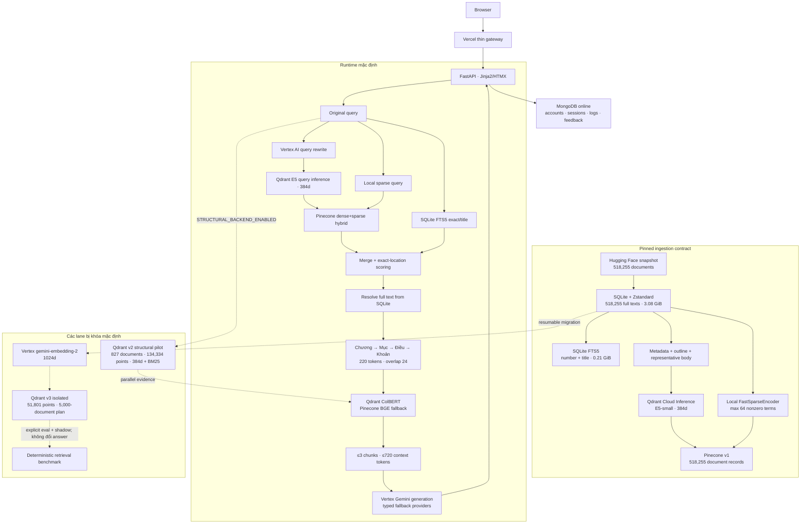

# VietLex — Vietnamese Legal RAG

<div align="center">

[](https://www.python.org/)
[](https://huggingface.co/datasets/vohuutridung/vietnamese-legal-documents)
[](https://huggingface.co/intfloat/multilingual-e5-small)
[](https://fastapi.tiangolo.com/)

**Evidence-grounded Vietnamese Legal RAG over 518,255 documents using hybrid retrieval, reranking, and Vertex AI.**

Ngôn ngữ: **Tiếng Việt** | [English](README.en.md)

</div>

VietLex là dự án portfolio AI/ML xây dựng hệ thống hỏi đáp pháp luật Việt Nam có dẫn chứng. Hệ thống kết hợp dense retrieval và sparse retrieval trên Pinecone với tra cứu số hiệu/tiêu đề bằng SQLite FTS5, sau đó resolve nội dung cục bộ, chunk theo cấu trúc pháp lý, rerank và sinh câu trả lời grounded bằng Vertex AI Gemini.

> [!WARNING]
> Corpus là dataset nghiên cứu của bên thứ ba [`vohuutridung/vietnamese-legal-documents`](https://huggingface.co/datasets/vohuutridung/vietnamese-legal-documents), không phải cơ sở dữ liệu pháp luật chính thức và không tự xác nhận hiệu lực hiện hành. Kết quả chỉ nhằm mục đích tham khảo thông tin, không phải tư vấn pháp lý; luôn đối chiếu với nguồn chính thức cập nhật.

## Kết quả nổi bật

| Bằng chứng portfolio | Kết quả đã lưu trong artifact |
| :--- | :--- |
| Balanced-50 answer evaluation v3 raw-RRF | Faithfulness **0,8841** · Answer Accuracy **0,9250** · Context Precision **0,8733** · Context Recall **0,9367** |
| Hoàn tất pipeline | **50/50** generation `STOP` · **50/50** NeMo input/output safe · **0** lỗi kỹ thuật trong run |
| Verified retrieval subset | **40** case có toàn bộ required evidence đã xác minh · Document Recall@3 **1,0000**, micro **53/53** |
| Migration Vertex/Qdrant v3 | **50.000/50.000** record kế hoạch đã ACK · **51.801** point remote · collection green |
| Automated verification | **897 passed, 2 skipped**; live-provider tests vẫn là opt-in |

Balanced-50 gồm 40 case có fully verified required retrieval evidence và 10 deterministic reference-only case. Các metric trên là bằng chứng cho một lát cắt đánh giá có giới hạn, không chứng minh độ chính xác pháp lý trên toàn corpus hoặc production readiness. Xem [`PORTFOLIO_EVIDENCE.md`](docs/evaluation/PORTFOLIO_EVIDENCE.md) để biết provenance và evidence boundary đầy đủ.

## Demo

### Hỏi đáp có dẫn nguồn


### Tra cứu văn bản trong local corpus


Hai ảnh được chụp ngày **2026-08-26** từ web FastAPI/Jinja2 chạy thật với local corpus và MongoDB online; đây không phải mockup hay tuyên bố về một deployment công khai.

## Năng lực cốt lõi

- **Hybrid retrieval toàn corpus:** một Pinecone dense+sparse query chạy song song với SQLite FTS5 exact document-number/title search.
- **Dense inference:** `intfloat/multilingual-e5-small`, 384 chiều, qua Qdrant Cloud inference staging; persistent vectors nằm trong Pinecone.
- **Sparse retrieval:** `FastSparseEncoder` cục bộ, tối đa 64 nonzero terms; không được mô tả là full BM25 vì không có corpus-level IDF.
- **Evidence resolution:** full text nằm trong SQLite/Zstandard và chỉ được chunk sau khi document được resolve.
- **Legal-aware chunking:** Chương → Mục → Điều → Khoản, 220 approximate whitespace tokens với overlap 24 cho đơn vị quá dài.
- **Remote reranking:** Qdrant ColBERT là primary; Pinecone `bge-reranker-v2-m3` là fallback kỹ thuật.
- **Grounded generation:** Vertex AI `gemini-3.5-flash` qua ADC, với citations và typed provider diagnostics.
- **Evaluation:** deterministic retrieval/answer metrics là mặc định; Ragas/LLM judge chỉ chạy opt-in offline.
- **Web backend:** FastAPI, Jinja2/HTMX, MongoDB cho session/log/feedback, rate limiting và guardrail modes `off`/`shadow`/`enforce`.
- **Tài khoản:** đăng ký/đăng nhập, Gmail verification/reset, lịch sử theo chủ sở hữu, export và xóa dữ liệu.
- **Tra cứu văn bản:** tìm theo số hiệu/tiêu đề và xem toàn văn từ SQLite cục bộ, kèm cảnh báo chưa xác minh hiệu lực.

## Kiến trúc


```mermaid
flowchart TB
    User["Browser"] --> Gateway["Vercel thin gateway"]
    Gateway --> Web["FastAPI · Jinja2/HTMX"]
    Web --> Mongo["MongoDB online<br/>accounts · sessions · logs · feedback"]

    subgraph Ingest["Pinned ingestion contract"]
        Corpus["Hugging Face snapshot<br/>518,255 documents"] --> Store["SQLite + Zstandard<br/>518,255 full texts · 3.08 GiB"]
        Store --> FTSBuild["SQLite FTS5<br/>number + title · 0.21 GiB"]
        Store --> DocRepresentation["Metadata + outline + representative body"]
        DocRepresentation --> E5Ingest["Qdrant Cloud Inference<br/>E5-small · 384d"]
        Store --> SparseIngest["Local FastSparseEncoder<br/>max 64 nonzero terms"]
        E5Ingest --> PCV1["Pinecone v1<br/>518,255 document records"]
        SparseIngest --> PCV1
    end

    subgraph Runtime["Runtime mặc định"]
        Web --> Query["Original query"]
        Query --> Rewrite["Vertex AI query rewrite"]
        Rewrite --> DenseQ["Qdrant E5 query inference · 384d"]
        Query --> SparseQ["Local sparse query"]
        Query --> FTS["SQLite FTS5 exact/title"]
        DenseQ --> Hybrid["Pinecone dense+sparse hybrid"]
        SparseQ --> Hybrid
        Hybrid --> Merge["Merge + exact-location scoring"]
        FTS --> Merge
        Merge --> Resolve["Resolve full text from SQLite"]
        Resolve --> Chunk["Chương → Mục → Điều → Khoản<br/>220 tokens · overlap 24"]
        Chunk --> Rerank["Qdrant ColBERT<br/>Pinecone BGE fallback"]
        Rerank --> Evidence["≤3 chunks · ≤720 context tokens"]
        Evidence --> Generate["Vertex Gemini generation<br/>typed fallback providers"]
        Generate --> Web
    end

    subgraph Optional["Các lane bị khóa mặc định"]
        Query -. "STRUCTURAL_BACKEND_ENABLED" .-> QV2["Qdrant v2 structural pilot<br/>827 documents · 134,334 points · 384d + BM25"]
        QV2 -. "parallel evidence" .-> Rerank
        Store -. "resumable migration" .-> Embed2["Vertex gemini-embedding-2<br/>1024d"]
        Embed2 -.-> QV3["Qdrant v3 isolated<br/>51,801 points · 5,000-document plan"]
        QV3 -. "explicit eval + shadow; không đổi answer" .-> Audit["Deterministic retrieval benchmark"]
    end
```

Runtime mặc định giữ `STRUCTURAL_BACKEND_ENABLED=false`. Khi structural pilot được bật, lane Qdrant structural 827 văn bản chạy **song song** với lane Pinecone-v1 + FTS toàn corpus; nó không thay thế hoặc mở rộng structural coverage lên 518.255 văn bản.

Cross-lane Pinecone BGE final rerank đã được triển khai và đánh giá trên identical inputs nhưng vẫn giữ `CROSS_LANE_FINAL_RERANK_ENABLED=false`: bằng chứng không đủ để phê duyệt cutover. Không chạy lại A/B trong lần closure này.

## Trạng thái dữ liệu và giới hạn hiện tại

Số liệu dưới đây được đọc lại ngày **2026-08-27** bằng API chỉ-đọc của Pinecone/Qdrant và SQLite ở chế độ read-only.

| Kho dữ liệu | Vai trò thực tế | Số lượng quan sát được | Trạng thái / giới hạn |
| :--- | :--- | ---: | :--- |
| SQLite/Zstandard `content_store.sqlite3` | Nguồn full text cục bộ | **518.255** văn bản | 3.309.723.648 byte ≈ **3,08 GiB**; đầy đủ theo revision pin |
| SQLite FTS5 `legal_fts.sqlite3` | Tìm số hiệu và tiêu đề | **518.255** văn bản | 223.526.912 byte ≈ **0,21 GiB**; không tìm full body/Điều/Khoản |
| Pinecone `vietlex-legal-rag-v1/legal-documents-v1` | Vector store production mặc định | **518.255** vector 384d | Một vector/văn bản; index ready, dot-product |
| Pinecone `semantic-cache-v1` | Cache câu hỏi đã trả lời | **9** vector | Cùng index v1; chỉ nhận cache hit ở ngưỡng nghiêm ngặt |
| Pinecone `llama-text-embed-v2-index/national-primary-v2` | Thử nghiệm structural cũ, không phải runtime mặc định | **21.696** vector 1024d | Bị dừng trước mục tiêu 134.334 vì hosted-inference quota |
| Qdrant `vietlex-embedding-staging` | E5 inference staging | **2.049** point 384d | Collection kỹ thuật, không phải corpus durable |
| Qdrant `vietlex-rerank-staging` | ColBERT transient staging | **0** point thường trú | Point tạm được dọn sau rerank |
| Qdrant `vietlex-legal-rag-v2-pilot-384` | Structural pilot opt-in | **134.334** point từ **827** văn bản | Dense 384d + sparse BM25/IDF; collection green nhưng coverage hẹp |
| Qdrant `vietlex-legal-rag-v3-vertex-1024` | Migration pilot tách biệt | **51.801** point; kế hoạch **50.000/50.000** record từ **5.000** văn bản đã ACK | Dense 1024d + sparse IDF; collection green; chưa tham gia chat production |
| MongoDB online | Tài khoản, phiên, interaction, feedback | Dữ liệu vận hành thay đổi theo người dùng | Không chứa corpus hoặc vector pháp luật |

### Usage limit nào đang áp dụng?

API database cho biết schema và số vector/point, nhưng **không trả về phần trăm quota tháng của tài khoản**. Con số RU/WU, token đã dùng và dung lượng cluster thực tế phải xem trong Pinecone/Qdrant/Google Cloud Console; README không suy đoán chúng.

- Nếu Pinecone đang ở **Starter**, giới hạn công khai hiện tại là 2 GiB storage toàn organization, 5 serverless index, 1.000.000 read units/tháng, 2.000.000 write units/tháng, 5.000.000 embedding tokens/model/tháng và 100 query/giây/namespace. Xem [Pinecone database limits](https://docs.pinecone.io/reference/api/database-limits).
- Nếu Qdrant đang ở **Free Tier**, cluster có 1 GiB RAM, 0,5 vCPU và 4 GiB disk, một node, không có HA. Selected free inference models có thể miễn phí; usage/model cụ thể chỉ hiện trong tab Inference. Xem [Qdrant pricing](https://qdrant.tech/pricing/) và [Cloud Inference](https://qdrant.tech/documentation/cloud/inference/).
- `gemini-embedding-2` nhận tối đa 8.192 input token và xuất tối đa 3.072 chiều; VietLex chọn 1.024 chiều. Quota Vertex thực tế phụ thuộc project/region và phải kiểm tra trong Google Cloud Console. Xem [model card](https://docs.cloud.google.com/gemini-enterprise-agent-platform/models/gemini/embedding-2).
- Application tự giới hạn chat ở **6 request/phút/client**; public evaluation 6/phút. Ragas public mặc định tắt; nếu bật thì tối đa 3 lượt/client/ngày và 20 lượt toàn hệ thống/ngày.

### Vấn đề retrieval hiện tại

1. Pinecone v1 bao phủ đủ 518.255 văn bản nhưng chỉ có **một vector đại diện cho mỗi văn bản**. Một Điều/Khoản nằm sâu trong full text có thể không xuất hiện trong representation dùng để embedding.
2. SQLite FTS5 giúp bắt số hiệu và tiêu đề, nhưng không phải article/body search. Các câu hỏi diễn đạt tự nhiên không nêu số hiệu vẫn phụ thuộc vào document-level semantic recall.
3. Qdrant v2 có structural chunk tốt hơn nhưng chỉ phủ 827 văn bản. Bật nó không tự biến coverage thành toàn corpus.
4. Qdrant v3 đã vượt mốc 50.000 point nhưng mới lấy từ 5.000/518.255 văn bản. Code hiện có adapter evaluation và shadow opt-in, nhưng shadow không thay evidence production nên **chưa tự sửa được** các câu chat production gần đây. Canary 40 case cho thấy raw RRF tốt, còn Qdrant ColBERT làm giảm recall; coverage đại diện vẫn là bottleneck.

## Migration sắp tới và mốc hết Google Cloud Trial

Mục tiêu của migration v3 là tìm ở cấp **đoạn pháp lý/Điều/Khoản**, dùng `gemini-embedding-2` 1.024 chiều + sparse IDF + RRF, thay vì phụ thuộc hoàn toàn vào một vector đại diện cho cả văn bản. Điều này có khả năng cải thiện câu hỏi tự nhiên, nhưng chỉ khi chunk liên quan thật sự đã được upload và A/B benchmark chứng minh stage survival/Recall@K tốt hơn.

| Giai đoạn | Phạm vi | Quy mô quan sát / dự kiến | Trạng thái qua cổng |
| :--- | :--- | ---: | :--- |
| G0 — hoàn tất | Tập cân bằng 5.000 văn bản + golden anchors | **50.000/50.000** record kế hoạch đã ACK; **51.801** point remote | Upload/resume/collection green đã chứng minh; production routing không đổi |
| G1 — quality gate | 40 case / 53 evidence đã xác minh, nhưng chỉ thuộc 2 văn bản | Raw RRF all-required@3 **39/40**; Qdrant ColBERT **33/40** | Raw RRF qua canary hẹp; ColBERT bị loại; chưa đủ coverage để cutover |
| G2 — targeted expansion | 20.000 văn bản được ưu tiên từ query logs/gold set | tối đa **320.000 point** | Capacity preflight; dense float32 thô đã ≈1,22 GiB, chưa gồm sparse/payload/HNSW |
| Full theoretical cap | 518.255 văn bản | tối đa **8.292.080 point** | Dense float32 thô ≈31,6 GiB; **không khả thi** trên Qdrant Free 4 GiB |

> [!CAUTION]
> Code hiện tại lấy tối đa 16 chunk phân bố đều trên mỗi văn bản để giữ chi phí hữu hạn. Cách này có thể vẫn bỏ sót một Điều cụ thể, nên không được quảng bá là đã giải quyết hoàn toàn lỗi chat. Trước G2 cần chọn một trong hai contract: lưu đầy đủ Điều/Khoản cho tập văn bản ưu tiên, hoặc giữ Pinecone làm document router rồi chunk/rerank full text cục bộ theo request.

Theo thông tin vận hành hiện tại, Google Cloud Trial còn khoảng **3 tháng** (mốc chính xác phải xác nhận ở Cloud Billing). Kế hoạch an toàn:

1. **Tháng 1:** chạy G1 có checkpoint, đo Recall/MRR/nDCG và kiểm kê token/chi phí thật; chưa cutover.
2. **Tháng 2:** quyết định giữ Vertex có billing hay chuyển sang embedding tự host/open-weight. Nếu đổi model, phải tạo collection mới và re-embed; không được query vector Vertex bằng model khác.
3. **Tháng 3:** chỉ chạy G2 sau capacity gate; đóng băng manifest/model/dimension, hoàn tất benchmark và chuẩn bị fallback trước ngày trial hết.

Nếu trial tự đóng mà không nâng cấp billing, Google cho biết billing project sẽ bị vô hiệu hóa, tài nguyên bị dừng và bước vào grace period 30 ngày. Vector đã ghi trong Qdrant/Pinecone không tự mất vì nằm ở provider khác, nhưng VietLex sẽ không thể gọi Vertex để rewrite/generate hoặc tạo/query embedding v3. Khi đó answer generation chỉ còn hoạt động nếu ít nhất một fallback OpenRouter/Gemini Direct/NVIDIA/Groq vẫn có key và quota. Xem [Google Cloud Free Trial lifecycle](https://docs.cloud.google.com/free/docs/free-cloud-features).

Khuyến nghị thực tế: **không full-migrate hàng triệu point chỉ để tận dụng credit trial**. Hoàn tất G1, đo chất lượng và chi phí, sau đó hoặc bật billing có budget alert cho Vertex, hoặc chọn embedding tự host trước khi G2 để tránh phải re-embed lần hai.

## Đánh giá

### 1. Bảng chỉ số toàn diện Balanced-50 (Deterministic + Ragas + Latency + Safety)

Đánh giá thực thi trên tập **Balanced-50** (26 câu hỏi Factoid + 24 câu hỏi Multi-hop) với Qdrant v3 raw-RRF, cấu hình `separated_intent`, `guardrails=enforce`, và Vertex AI `gemini-3.5-flash`. Retrieval metric chấm được 40 case đã xác minh; 10 case còn lại được ghi rõ `no_verified_gold_label`:

| Nhóm chỉ số | Tên chỉ số | Giá trị đạt được | Mẫu số / Mẫu kiểm thử | Ghi chú kỹ thuật |
| :--- | :--- | ---: | :---: | :--- |
| **Độ tin cậy & An toàn** | **Generation Finish** | **100,0%** | 50/50 | 100% phản hồi kết thúc trạng thái `STOP` sạch sẽ |
| | **NeMo Input Guardrail Safe** | **100,0%** | 50/50 | 0 vi phạm prompt injection / off-topic |
| | **NeMo Output Guardrail Safe** | **100,0%** | 50/50 | 0 phản hồi chứa ảo giác / thông tin độc hại |
| | **Technical Error Rate** | **0,0%** | 0/50 | Không có lỗi timeout, 5xx hoặc exception |
| | **No-Candidate Rate** | **0,0%** | 0/50 | Mọi câu hỏi đều truy xuất được ngữ cảnh hợp lệ |
| **Chất lượng Truy xuất (Retrieval)** | **Document Recall @ 3** | **100,0%** | 53/53 | Văn bản chứa căn cứ nằm trong Top 3 |
| | **Document Recall @ 24** | **100,0%** | 53/53 | Toàn bộ văn bản căn cứ được tìm thấy ở Top 24 |
| | **Article Recall @ 3** | **100,0%** | 30/30 | Tỷ lệ trúng chính xác Điều luật cụ thể |
| | **Clause Recall @ 3** | **92,86%** | 13/14 | Tỷ lệ trúng chính xác Khoản luật cụ thể |
| | **Document MRR** | **0,9750** | 39/40 | Mean Reciprocal Rank cấp văn bản |
| | **Article MRR** | **0,9259** | 25/27 | Mean Reciprocal Rank cấp Điều luật |
| | **Clause MRR** | **0,7949** | 10,33/13 | Mean Reciprocal Rank cấp Khoản luật |
| | **nDCG @ 10** | **0,9182** | 43,42/48,20 | Normalized Discounted Cumulative Gain |
| | **Exact Reference Hit** | **100,0%** | 40/40 | Trúng dẫn chiếu pháp lý đã xác minh |
| | **Multi-hop All-Required** | **97,50%** | 39/40 | Thu hồi đủ 100% căn cứ trong câu hỏi đa bước |
| **Câu trả lời deterministic** | **Token F1** | **0,2423** | 50/50 | Thấp do answer đầy đủ dài hơn reference ngắn; không phải metric pháp lý |
| | **Citation precision / invalid rate** | **0,9727 / 0,0273** | 50/50 | Kiểm chứng dẫn chiếu dự đoán với evidence, không hardcode sample |
| **Chất lượng Câu trả lời (Ragas)** | **Faithfulness (Tính trung thực)** | **0,8841** | 50/50 | LLM-as-a-judge, không phải chứng minh pháp lý |
| | **Answer Accuracy (Độ chuẩn xác)** | **0,9250** | 50/50 | Mức độ trùng khớp ngữ nghĩa với ground truth |
| | **Context Precision (Độ chuẩn ngữ cảnh)** | **0,8733** | 50/50 | Mức độ tập trung của tài liệu được trích dẫn |
| | **Context Recall (Độ phủ ngữ cảnh)** | **0,9367** | 50/50 | Độ bao phủ thông tin cần thiết để giải đáp |
| **Thời gian Phản hồi (Latency)** | **t_input_guardrail** | **1,13 s** | P50 (Mean: 1,14s) | Kiểm duyệt an toàn đầu vào |
| | **t_retrieval** | **3,25 s** | P50 (P95: 4,63s) | Lấy từ retrieval artifact đã bind |
| | **t_output_guardrail** | **1,21 s** | P50 (Mean: 1,23s) | Kiểm duyệt an toàn đầu ra |
| | **t_total (End-to-End)** | **5,32 s** | P50 (P95: 7,05s) | Generation/guardrail trên evidence đã persist |

### 2. Đánh giá So sánh Reranker lần cuối (Qdrant ColBERT vs Pinecone BGE vs Raw RRF)

Thử nghiệm đối đầu trực tiếp trên cùng một tập 40 ca kiểm thử đã xác minh (`all-required-verified`):

| Thuật toán / Provider | Doc Recall @3 | Article Recall @3 | Clause Recall @3 | All-Required Coverage | Độ trễ P50 | Đánh giá kỹ thuật |
| :--- | :---: | :---: | :---: | :---: | :---: | :--- |
| **Raw RRF (Qdrant dense + sparse)** | **100,0%** (53/53) | **100,0%** (30/30) | **92,86%** (13/14) | **97,50%** (39/40) | **2,65 s** | **Tốt nhất trong canary**: giữ được Điều/Khoản |
| **Qdrant v2 comparator lịch sử** | **94,34%** (50/53) | **90,00%** (27/30) | **85,71%** (12/14) | **85,00%** (34/40) | **8,92 s** | Cùng case ID nhưng là run lịch sử, không phải A/B đồng thời |
| **Qdrant ColBERT (`answerai-colbert`)** | **100,0%** (53/53) | **90,00%** (27/30) | **78,57%** (11/14) | **87,50%** (35/40) | **2,97 s** | **Không đạt gate** trên chính candidate pool raw-RRF |
| **Pinecone BGE (`bge-reranker-v2-m3`)** | NOT SCORED | NOT SCORED | NOT SCORED | NOT SCORED | 15,00 s timeout | Monthly rerank limit 500 đã hết; không biến lỗi kỹ thuật thành điểm chất lượng |

**Kết luận**: Raw hybrid RRF của v3 là ứng viên tốt nhất trong canary hẹp. Qdrant ColBERT không nên bật bắt buộc vì tăng latency và loại nhầm Điều/Khoản; Pinecone BGE chưa có điểm A/B hợp lệ trong run này.

### 3. Final audit Balanced-50 với `qdrant-only` — không đạt cutover

Run ngày 2026-08-27 thực thi đủ 50/50 câu với Qdrant ColBERT, guardrails enforce, deterministic metrics và Ragas. Đây là pipeline runtime Pinecone-v1 + SQLite FTS, **không phải** v3 đang isolated.

| Chỉ số | Kết quả |
| :--- | ---: |
| Generation / guardrails / Ragas coverage | **50/50**; 0 technical error |
| Verified Document Recall@3 | **0/53** |
| Ragas Faithfulness | **0,7467** |
| Ragas Answer Accuracy | **0,1500** |
| Ragas Context Precision / Recall | **0,1600 / 0,1567** |
| Deterministic token F1 / char F1 | **0,1585 / 0,1801** |
| End-to-end latency P50 / P95 | **10,65 s / 14,09 s** |

Kết quả lịch sử này loại phương án ép `qdrant-only` vào production hiện tại. Run v3 raw-RRF mới tốt hơn trên canary và answer audit, nhưng vẫn tiếp tục ở lane evaluation/shadow vì 40 case đã xác minh chỉ phủ 2 văn bản và 1 loại văn bản.

### 4. Nguồn Bằng chứng Bất biến (Artifacts)
- [`Balanced-50 v3 raw-RRF answer + Ragas`](docs/evaluation/runs/answer-v3-raw-balanced50-20260827-final2/report.md)
- [`Balanced-50 v3 raw-RRF retrieval gate`](docs/evaluation/runs/retrieval-v3-raw-balanced50-20260827-final/report.md)
- [`Identical-pool Qdrant ColBERT A/B`](docs/evaluation/runs/retrieval-v3-colbert-identical40-20260827-final2/report.md)
- [`Balanced-50 report`](docs/evaluation/runs/answer-balanced50-v2-live-20260822/report.md)
- [`Balanced-50 Qdrant-only final audit`](docs/evaluation/runs/answer-balanced50-qdrant-only-final-20260827/report.md)
- [`Representative-10 report`](docs/evaluation/runs/answer-representative10-v6-live-20260822/report.md)
- [`Vertex/Qdrant v3 Canary report`](docs/evaluation/runs/retrieval-vertex-v3-goldenfull-verified40-20260826/report.md)
- [`Vertex/Qdrant v3 50k migration report`](docs/evaluation/runs/vertex-qdrant-v3-50k-20260827/report.md)
- [`Portfolio evidence`](docs/evaluation/PORTFOLIO_EVIDENCE.md)
- [`Current evaluation status`](docs/evaluation/CURRENT_STATUS.md)

---

## Tải Toàn bộ Dữ liệu Văn bản Lên Supabase (Full 50.000 Docs)

Hệ thống cung cấp sẵn script chuyên dụng [`run_supabase_full_doc_upload.py`](run_supabase_full_doc_upload.py) để đẩy toàn bộ 50.000 văn bản pháp luật nén từ SQLite cục bộ lên Supabase Postgres:

Trạng thái 2026-08-27: exporter và checkpoint đã sẵn sàng, nhưng project trả `404 PGRST205` vì bảng `public.legal_documents` chưa tồn tại. Chỉ có publishable key nên upload đang **BLOCKED_SECURITY**; không mở anonymous write/RLS chỉ để hoàn tất migration. Cần tạo schema bằng quyền admin và cung cấp service-role hoặc một ingestion credential/policy giới hạn trước khi chạy 50.000 dòng.

### 1. Cấu hình biến môi trường (`.env`)
```env
SUPABASE_URL=https://YOUR_PROJECT.supabase.co
SUPABASE_SERVICE_ROLE_KEY=YOUR_SERVER_SIDE_SERVICE_ROLE_KEY
```

### 2. Tạo bảng trên Supabase SQL Editor
Chạy lệnh sau để lấy câu lệnh SQL DDL chuẩn hóa:
```powershell
python run_supabase_full_doc_upload.py --print-schema
```
Sao chép và thực thi trong **Supabase SQL Editor**:
```sql
create table if not exists public.legal_documents (
  document_id bigint primary key,
  document_number text not null,
  title text not null,
  source_url text not null,
  legal_type text not null,
  legal_sectors text not null,
  issuing_authority text not null,
  issuance_date text,
  content text not null,
  content_sha256 text not null,
  content_store_key text not null,
  quality_flags jsonb not null default '[]'::jsonb,
  dataset_revision text not null,
  uploaded_at timestamptz not null default now()
);
create index if not exists legal_documents_document_number_idx on public.legal_documents (document_number);
create index if not exists legal_documents_content_sha256_idx on public.legal_documents (content_sha256);
alter table public.legal_documents enable row level security;
```

`SUPABASE_SERVICE_ROLE_KEY` chỉ được đặt ở backend/CLI, không đưa vào Vercel client hoặc biến `NEXT_PUBLIC_*`. Uploader chủ động từ chối publishable key.

### 3. Kiểm tra kết nối & Thực hiện Upload 50.000 văn bản
```powershell
# Kiểm tra kết nối và bảng
python run_supabase_full_doc_upload.py --check-connection

# Thực hiện upload với streaming batch và checkpoint resumable
python run_supabase_full_doc_upload.py --max-documents 50000 --batch-size 50 --allow-remote-write
```

## Tech stack

| Lớp | Công nghệ |
| :--- | :--- |
| API & UI | Python 3.10+, FastAPI, Uvicorn, Jinja2, HTMX |
| Durable vector retrieval | Pinecone Serverless, index `vietlex-legal-rag-v1`, namespace `legal-documents-v1` |
| Dense inference & reranking | Qdrant Cloud, multilingual E5-small 384d, AnswerAI ColBERT-small-v1 |
| Lexical & content store | SQLite FTS5, SQLite/Zstandard, local `FastSparseEncoder` |
| Generation | Google Vertex AI `gemini-3.5-flash` qua Application Default Credentials |
| Runtime data | MongoDB cho session, interaction log, feedback và admin data; không lưu corpus pháp luật |
| Evaluation & safety | Pytest, deterministic metrics, optional Ragas, NeMo Guardrails |
| Delivery | Docker, GitHub Actions, Vercel thin gateway + persistent-disk FastAPI origin |


### Bằng chứng portfolio đã xác minh

| Tập đánh giá | Generation `STOP` | NeMo safe | Ragas coverage | Faithfulness | Answer accuracy | Context precision | Context recall | Technical errors |
| :--- | ---: | ---: | ---: | ---: | ---: | ---: | ---: | ---: |
| Representative-10, `all-required-verified` | 10/10 | 10/10 | 10/10 | 0,9857 | 0,9750 | 0,9400 | 1,0000 | 0 |
| Balanced-50 v3 raw-RRF, 26 factoid + 24 multi-hop | 50/50 | 50/50 | 50/50 | 0,8841 | 0,9250 | 0,8733 | 0,9367 | 0 |

Nguồn bất biến:

- [`Balanced-50 v3 raw-RRF report`](docs/evaluation/runs/answer-v3-raw-balanced50-20260827-final2/report.md)
- [`Representative-10 report`](docs/evaluation/runs/answer-representative10-v6-live-20260822/report.md)
- [`Portfolio evidence`](docs/evaluation/PORTFOLIO_EVIDENCE.md)
- [`Current evaluation status`](docs/evaluation/CURRENT_STATUS.md)

Metric deterministic trong code là mặc định. Retrieval metrics bao gồm Document/Article/Clause Recall@K, MRR, nDCG, exact-reference hit, multi-hop coverage, stage survival, no-candidate rate và technical-error rates. Answer metrics bao gồm exact match, token/character F1, ROUGE-L/CHRF, number/date/entity, citation và refusal metrics. Mọi aggregate lưu numerator, denominator, coverage, skipped cases và skip reasons.

## Chạy dự án từ một máy mới

### 1. Yêu cầu và tài nguyên

- Python 3.10+ và Git.
- MongoDB local hoặc MongoDB Atlas.
- Ít nhất khoảng **8 GiB disk trống** để download snapshot, build file tạm và giữ local stores. Trên bản build hiện tại, `content_store.sqlite3` khoảng 3,08 GiB và `legal_fts.sqlite3` khoảng 0,21 GiB.
- Pinecone, Qdrant Cloud và Google Cloud ADC nếu muốn chạy chat RAG thật giống môi trường tác giả. Chỉ đọc/search văn bản cục bộ không tạo vector mới.

> [!IMPORTANT]
> Git không chứa corpus vì kích thước lớn và `data/huggingface/` được ignore. Clone repository xong **chưa đủ** để chạy retrieval. Phải dựng local stores theo bước 3 và kết nối đúng Pinecone index nếu muốn chat trên toàn bộ 518.255 văn bản.

### 2. Cài Python và cấu hình

```powershell
git clone https://github.com/TanNguyen234/VietLex-Tech-Spec.git
Set-Location VietLex-Tech-Spec
python -m venv .venv
.venv\Scripts\Activate.ps1
python -m pip install --upgrade pip
python -m pip install -r requirements.txt
Copy-Item .env.example .env
```

Điền `.env` theo nhu cầu:

| Chức năng | Biến bắt buộc |
| :--- | :--- |
| Web/session | `MONGO_URL`, `WEB_SESSION_SECRET` (bắt buộc ổn định và ≥32 ký tự ở production) |
| Full-corpus retrieval/cache | `PINECONE_API_KEY`, index `vietlex-legal-rag-v1`, namespace `legal-documents-v1` |
| Dense inference/rerank | `QDRANT_URL`, `QDRANT_API_KEY` |
| Sinh câu trả lời | `GOOGLE_APPLICATION_CREDENTIALS`, `GOOGLE_CLOUD_PROJECT` |
| Xác minh email | `ACCOUNT_EMAIL_ENABLED=true`, `EMAIL_USER`, Gmail App Password trong `EMAIL_PASS`, `EMAIL_FROM`, `PUBLIC_BASE_URL` |

Các biến và giá trị mặc định đầy đủ nằm trong [`.env.example`](.env.example). Không commit `.env`, JSON service account, cookie hoặc token. Ở production, `FRONTEND_URL` và `PUBLIC_BASE_URL` phải là HTTPS thật.

### 3. Dựng dữ liệu cục bộ

Pipeline tải đúng revision đã pin, hỗ trợ resume HTTP Range, kiểm tra kích thước/SHA-256, rồi stream Parquet thành SQLite/Zstandard:

```powershell
python -m app.ingestion.hf_pipeline download
python -m app.ingestion.hf_pipeline prepare
python -u -m app.ingestion.legal_fts build --batch-size 256
python -m app.ingestion.hf_pipeline smoke
```

Sau bước này cần có:

```text
data/huggingface/content_store.sqlite3   # 518.255 metadata + full-text documents
data/huggingface/legal_fts.sqlite3       # number/title search index
```

`smoke` phải báo `snapshot_verified=true`, `content_store_verified=true` và `joined_count=518255`. FTS chỉ tìm số hiệu/tiêu đề; không được mô tả là full-body/article search.

> [!CAUTION]
> `download` dùng Internet và có thể tải vài GiB. Không copy hai file SQLite đang mở giữa các máy; dùng snapshot/backup đã kiểm tra integrity theo [`docs/PRODUCTION_OPERATIONS.md`](docs/PRODUCTION_OPERATIONS.md).

### 4. Kết nối vector store

Runtime mặc định dùng Pinecone v1 có **518.255 record, một record/văn bản**. Con số **134.334** là số structural chunk của pilot 827 văn bản và không phải kích thước corpus production.

- Nếu bạn được cấp quyền vào index hiện có: chỉ cấu hình đúng key/index/namespace trong `.env`; không ingestion lại.
- Nếu dùng tài khoản Pinecone mới: phải tự dựng index bằng runbook. Lệnh full có thể xóa/recreate remote index, tốn quota/chi phí và không thuộc quickstart thông thường.
- Index Pinecone thử nghiệm riêng `llama-text-embed-v2-index` có 21.696 vector và không được runtime mặc định đọc. `STRUCTURAL_BACKEND_ENABLED` chỉ điều khiển Qdrant v2 134.334 point, không điều khiển index Pinecone thử nghiệm này.

Lane migration Vertex–Qdrant mới là **isolated pilot**, không tham gia runtime mặc định. Nó dùng `gemini-embedding-2` 1.024 chiều, dense cosine và sparse IDF trong collection `vietlex-legal-rag-v3-vertex-1024`. Dữ liệu được lấy cân bằng giữa nhiều loại văn bản, chunk theo Điều/Khoản và giới hạn số chunk trên mỗi văn bản để không làm tràn cluster. Lệnh mặc định chỉ lập kế hoạch cục bộ:

```powershell
# Provider-free dry-run: không tạo collection, không gọi Vertex, không upload.
python run_vertex_qdrant_migration.py --max-documents 12 --max-points 24

# Pilot live có checkpoint; chỉ chạy khi đã duyệt chi phí/quota và remote write.
python run_vertex_qdrant_migration.py --max-documents 12 --max-points 24 `
  --allow-create --allow-remote-write

# Chạy lại bỏ qua các point đã được Qdrant ACK; có thể probe hybrid/RRF.
python run_vertex_qdrant_migration.py --max-documents 12 --max-points 24 `
  --allow-remote-write --probe-query "thời gian thử việc"
```

Tăng `--max-documents` và `--max-points` theo từng đợt; checkpoint mặc định ở `data/huggingface/vertex_qdrant_checkpoint.sqlite3`. Không bật lane này thay Pinecone trước khi có benchmark A/B trên identical inputs, đủ coverage và capacity gate theo bảng migration phía trên. `gemini-embedding-2` hỗ trợ tối đa 3.072 chiều, nhưng 1.024 được chọn để cân bằng chất lượng và storage; xem [Google Cloud model card](https://docs.cloud.google.com/gemini-enterprise-agent-platform/models/gemini/embedding-2) và [Qdrant hybrid vectors](https://qdrant.tech/documentation/manage-data/vectors/).

Chi tiết và điều kiện resume: [`docs/huggingface-ingestion-runbook.md`](docs/huggingface-ingestion-runbook.md).

### 5. Chạy ứng dụng


```powershell
uvicorn app.main:app --host 0.0.0.0 --port 8000
```

Mở <http://localhost:8000>. Các endpoint kiểm tra là `GET /healthz` và `GET /readyz`; `/readyz` chỉ xanh khi các dependency được cấu hình thực sự sẵn sàng.

### 6. Kiểm thử vừa đủ

Không cần chạy toàn bộ evaluation suite sau mỗi sửa UI. Dùng tầng nhỏ nhất chứng minh thay đổi:

```powershell
# Smoke web/account/legal hằng ngày
python -m pytest -q tests/test_account_routes.py tests/test_legal_routes.py tests/test_public_web_routes.py tests/test_web_security.py

# Lint mã chạy
python -m ruff check app

# Full provider-free suite: chỉ trước release/merge hoặc khi đổi retrieval/evaluation
python -m pytest -q
```

Các live tests được đánh dấu `live` và không chạy mặc định. Không xóa test evaluation chỉ để giảm số lượng: chúng là bằng chứng tái lập metric. Khi sửa một module, ưu tiên `pytest <file>::<test>` rồi chạy gate rộng đúng một lần khi source đã ổn định.

Kiểm tra packaging/tĩnh bổ sung:

```powershell
python -m compileall -q app tests
git diff --check
```

### Deployment topology

- **Vercel public gateway:** `vercel.json` và `api/proxy.py` proxy HTML/API/static; gateway dùng polling 1 giây vì serverless proxy buffer response.
- **FastAPI origin:** chạy `Dockerfile` trên host có persistent `/data` disk cho `content_store.sqlite3` và `legal_fts.sqlite3`.
- Direct FastAPI clients dùng SSE progress; repository không tuyên bố end-to-end SSE qua Vercel hoặc một live production URL chưa được kiểm chứng.

Xem [`deploy/vercel-proxy/README.md`](deploy/vercel-proxy/README.md).

## Advanced evaluation và adjudication

### Provider-free gold adjudication

`run_gold_adjudication.py` tạo immutable human-review artifacts trong repository mà không gọi provider, Ragas, generation, guardrail, corpus/index hoặc vector writes.

```powershell
python -u run_gold_adjudication.py queue --dataset app/data/namsyntax_legal_qa_420.json --sidecar docs/evaluation/gold_labels/namsyntax_legal_qa_420_labels_v2.json --content-store data/huggingface/content_store.sqlite3 --fts data/huggingface/legal_fts.sqlite3 --target-cases 40 --candidate-limit 12
python -u run_gold_adjudication.py preview --dataset app/data/namsyntax_legal_qa_420.json --sidecar docs/evaluation/gold_labels/namsyntax_legal_qa_420_labels_v2.json --queue docs/evaluation/adjudication/queues/<run-id>/queue.json --decisions <decisions.json>
python -u run_gold_adjudication.py promote --dataset app/data/namsyntax_legal_qa_420.json --sidecar docs/evaluation/gold_labels/namsyntax_legal_qa_420_labels_v2.json --queue docs/evaluation/adjudication/queues/<run-id>/queue.json --decisions <decisions.json> --preview docs/evaluation/adjudication/previews/<run-id>/preview.json --approve-preview-sha256 <approved-preview-sha256>
```

Promotion không sửa source sidecar. Nó rebuild preview, yêu cầu đúng approved preview SHA-256 và ghi một `labels_v2.json` mới; coverage không đủ vẫn giữ `BLOCKED_INSUFFICIENT_VERIFIED_CASES`.

### Deterministic evaluation

```powershell
python -u run_retrieval_eval.py --preflight-all-profiles --verified-only --gold-policy all-required-verified --rewrite off --reranker current
python -u run_retrieval_eval.py --profile separated_intent --verified-only --gold-policy all-required-verified --rewrite off --reranker current
python -u run_answer_eval.py --profile separated_intent --verified-only --judge none --guardrails off
```

Ragas chỉ được bật rõ ràng cho offline audit có ngân sách; route `/chat` không enqueue Ragas. Các live-provider test/evaluation không thuộc default suite và có thể phát sinh quota hoặc chi phí.

### Corpus operations dành cho operator

Full ingestion có thể xóa/recreate remote index và chỉ chạy khi đã có quyền migration/reingestion rõ ràng, quota phù hợp và backup/checkpoint:

```powershell
python -u -m app.ingestion.hf_pipeline full --delete-existing --yes
```

`verify` sau ingestion đọc trạng thái Pinecone từ xa; nó không phải provider-free. Các bước local `download`, `prepare`, `smoke` và FTS build đã được mô tả trong quickstart phía trên.

## Giới hạn đã công bố

- Corpus của bên thứ ba không bảo đảm hiệu lực pháp luật hiện hành hoặc độc lập kiểm chứng toàn bộ dữ liệu.
- Structural pilot chỉ phủ 827 văn bản luật chính, không phải toàn bộ 518.255 văn bản.
- Kết quả evaluation là bounded slice; không chứng minh whole-corpus legal accuracy hoặc production readiness.
- Vercel gateway dùng polling; progress registry vẫn process-local.
- Cross-lane final rerank vẫn được chủ ý tắt theo quyết định `KEEP_DISABLED`.

## Tài liệu

- [`docs/PROJECT_CONTEXT.md`](docs/PROJECT_CONTEXT.md) — source-of-truth context
- [`docs/CURRENT_ARCHITECTURE.md`](docs/CURRENT_ARCHITECTURE.md) — runtime architecture
- [`docs/AGENT_WORKFLOW.md`](docs/AGENT_WORKFLOW.md) — engineering/evidence workflow
- [`docs/evaluation/PORTFOLIO_EVIDENCE.md`](docs/evaluation/PORTFOLIO_EVIDENCE.md) — recruiter-safe evidence
- [`docs/huggingface-ingestion-runbook.md`](docs/huggingface-ingestion-runbook.md) — ingestion operations
