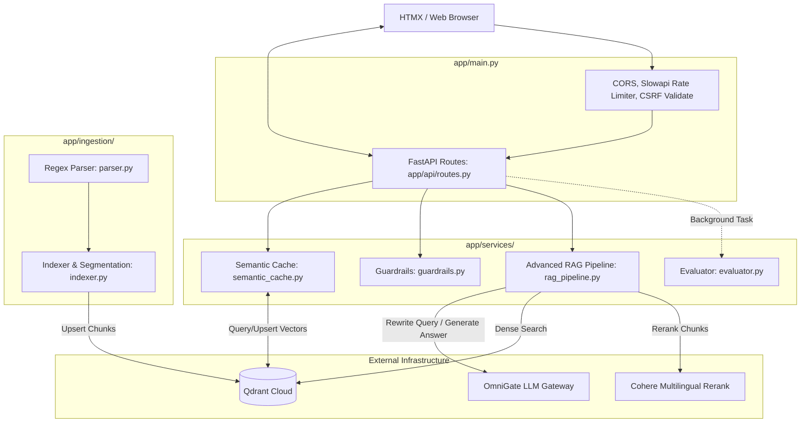
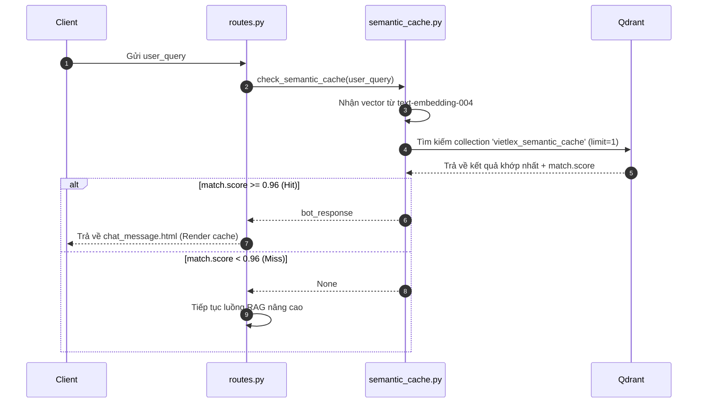
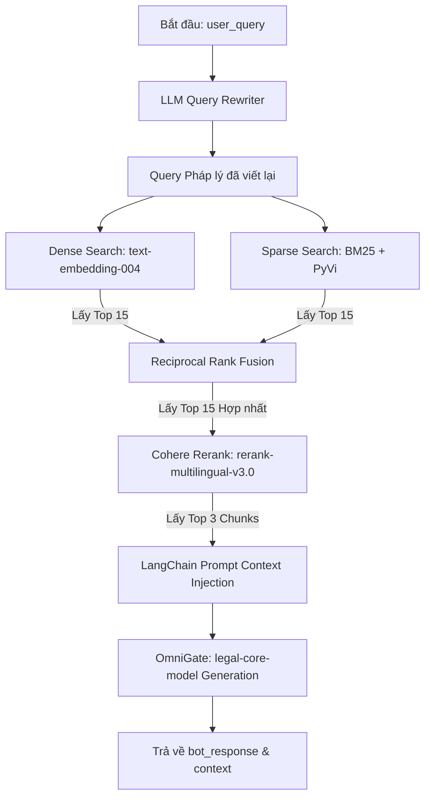
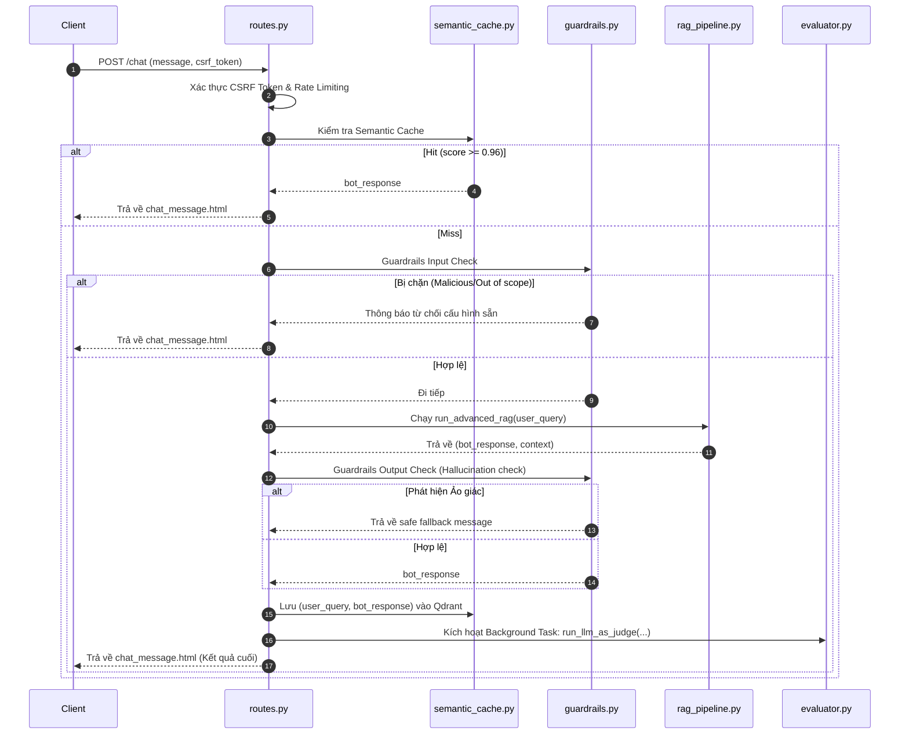

# Tài liệu Kiến trúc Hệ thống (System Architecture) - Vietlex Legal RAG

Tài liệu này chi tiết hóa kiến trúc kỹ thuật và các luồng xử lý dữ liệu của hệ thống **VIETLEX (ADVANCED LEGAL RAG)**.

---

## 1. Tổng quan Kiến trúc (Clean Architecture)

Hệ thống được thiết kế theo mô hình Clean Architecture phân tách rõ ràng giữa hạ tầng (infrastructure), giao tiếp bên ngoài (API routes, templates) và lõi nghiệp vụ (services, ingestion).

---

## 2. Các Luồng Dữ liệu (Logic Flows)

### Luồng 1: Semantic Caching (Bộ nhớ đệm Ngữ nghĩa)
- Nhằm tối ưu hóa chi phí và tốc độ phản hồi đối với các câu hỏi trùng lặp hoặc tương đương.
- Sử dụng mô hình `text-embedding-004` của Google (thông qua OmniGate) để embedding query.
- Truy vấn Qdrant collection `vietlex_semantic_cache` và lấy 1 kết quả duy nhất có điểm số cao nhất.
- Điểm tương đồng cosine threshold >= **0.96** được định cấu hình làm mốc quyết định hit/miss.

### Luồng 2: Advanced Retrieval Pipeline (RAG nâng cao)
- **Query Rewriter**: Chuyển đổi câu hỏi phi cấu trúc của người dùng sang dạng thuật ngữ pháp lý.
- **Hybrid Search**: Tìm kiếm song song Dense Search (Vector) và Sparse Search (BM25 được tokenize bởi PyVi).
- **RRF (Reciprocal Rank Fusion)**: Hợp nhất kết quả Dense và Sparse để giữ độ phủ.
- **Reranker (Cohere)**: Tái định vị mức độ liên quan sử dụng mô hình multilingual chuyên dụng để chọn 3 kết quả chất lượng nhất.

### Luồng 3: Request Lifecycle với Guardrails & Evals
- Quản lý quy trình kiểm duyệt nội dung đầu vào, đầu ra và đánh giá chất lượng tự động sau khi phản hồi.

