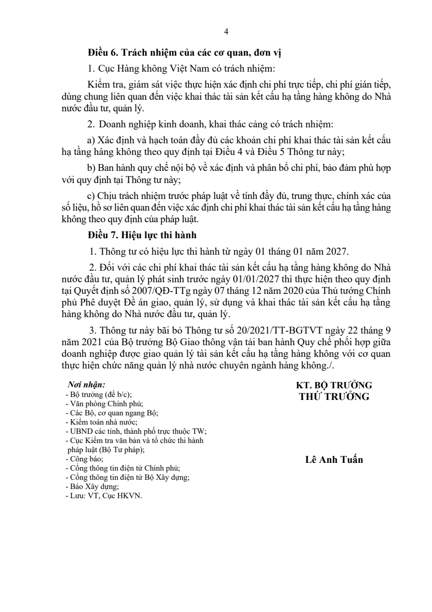

# Official full-document reading — empirical result

10 documents / 178 pages yielded nonempty extracted page text after 43 calls, including 4 failed attempts retained in results. All cases retained one PDF SHA-256 across page windows; missing pages: 0. This measures extraction availability only. OCR transcription accuracy, answer correctness, legal completeness and current legal effect were NOT ASSESSED. These were ten previously discovered URLs, not a fresh open-web discovery evaluation.

| Case | Nonempty pages / PDF pages | Attempts | Failed attempts |
| --- | ---: | ---: | ---: |
| aviation | 4/4 | 1 | 0 |
| health | 6/6 | 2 | 0 |
| procurement | 23/23 | 6 | 1 |
| resources_tax | 3/3 | 1 | 0 |
| credit | 4/4 | 1 | 0 |
| maritime | 17/17 | 4 | 0 |
| agriculture | 24/24 | 5 | 0 |
| imports | 39/39 | 10 | 2 |
| reserves | 40/40 | 9 | 1 |
| electricity | 18/18 | 4 | 0 |

Failures: procurement source_transport_error; imports ocr_incomplete and source_transport_error; reserves ocr_technical. Successful retries do not erase initial failures. Raw attempt files preserve all observed results and timing.

## Critical temporal counterexample

The original Government PDF for aviation (68/2026/TT-BXD) was downloaded separately and matched SHA-256 `316352ed8a263d22b45e0653abc4d40dbb5a9b39ee3b1d6aaf2e847577add9e7`. Direct visual inspection of page 4 confirms Article 7 states an effective date of 1 January 2027. The test question concerns September 2026. Therefore a hit on this newly issued document cannot establish the law applicable at the query date. Article 7 also contains transitional treatment and repeal text; determining all applicable law requires further source checking. No legal status was promoted in the database.

[Official PDF](https://datafiles.chinhphu.vn/cpp/files/vbpq/2026/9/68-bxd.signed.pdf)

## Reproducibility limits

The run crossed a process restart, then resumed from retained attempt files. The exact loaded Git SHA was not captured. Reader processes used the OCR request predating the structured-output fix; do not label this as validation of the new OCR implementation. Scripts retain their original workspace-relative paths. The manifest hashes the case file and the locally retained raw artifacts. Only the curated report, aggregate summary and public page image are published; raw extraction outputs remain local.

## Publication boundary

Raw response, model output, logs and diagnostic runners referenced above are retained locally; they are not published in this commit. The manifest records their hashes for local verification. Published evidence is limited to this curated report, aggregate results where present and public-source references. Production workspace identifiers and cookie values are excluded. This restricts public reproducibility; it does not turn summaries into raw evidence.
