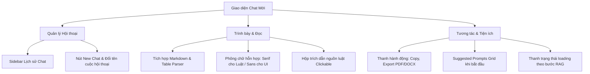

# BÁO CÁO ĐÁNH GIÁ UX/UI & ĐỀ XUẤT NÂNG CẤP LÊN PRODUCTION (VIETLEX LEGAL RAG)

Báo cáo này tập trung phân tích sâu các điểm hạn chế về mặt Trải nghiệm Người dùng (UX) và Giao diện Đồ họa (UI) hiện tại của hệ thống **VietLex Legal RAG**, đồng thời đề xuất lộ trình cải tiến chi tiết để đưa sản phẩm đạt tiêu chuẩn vận hành thực tế (Production-Ready).

---

## 1. Đánh giá Hiện trạng & Điểm hạn chế (Current State Analysis)

Hiện tại, hệ thống VietLex sở hữu một backend RAG tiên tiến (Hybrid Search, RRF, Cohere Reranker, NeMo Guardrails, Ragas Evaluator). Tuy nhiên, phần giao diện frontend (HTMX + Jinja2 + Tailwind) mới chỉ dừng lại ở mức **Minimum Viable Product (MVP) / Demo kỹ thuật**, mang đậm phong cách sinh tự động từ AI ("rất AI và rất xấu") và thiếu các tính năng tương tác thực tế của người dùng.

### 1.1 Khía cạnh Giao diện (UI Aesthetics) - "Thiết kế rập khuôn & Thiếu bản sắc pháp lý"
*   **Bảng màu generic (AI template style):** Sử dụng tông nền xám tối (`bg-slate-950`) kết hợp với màu nhấn vàng hổ phách (`amber-500`). Đây là bảng màu quá phổ biến trong các template chatbot AI phổ thông, tạo cảm giác công nghệ giả tưởng (cyberpunk/tech-heavy) hơn là một **hệ thống tra cứu pháp lý trang trọng, đáng tin cậy**.
*   **Không hỗ trợ định dạng văn bản (Raw Markdown Text):** Bot trả về câu trả lời ở dạng văn bản thuần (`whitespace-pre-wrap` tại [chat_message.html](file:///d:/Download/ProfessionalLegalRAG/app/templates/chat_message.html#L19)). Các điều khoản luật pháp Việt Nam thường có cấu trúc phân cấp phức tạp (Chương, Mục, Điều, Khoản, Điểm) kèm bảng biểu. Việc hiển thị thô các ký tự markdown như `**`, `-`, `|` làm giao diện cực kỳ lộn xộn và rất khó đọc.
*   **Typography chưa tối ưu:** Toàn bộ trang sử dụng font sans-serif (`Outfit`). Kiểu chữ này hiện đại nhưng không phù hợp cho việc đọc các đoạn văn bản luật dài. Độ rộng dòng (line-length) và chiều cao dòng (line-height) chưa được tinh chỉnh tốt cho việc đọc tài liệu.
*   **Thiếu các hiệu ứng chuyển động vi mô (Micro-animations):** Các tương tác như hover vào các nút phản hồi (Thumbs up/down), nút gửi tin nhắn, hoặc click vào Admin Dashboard diễn ra khá thô cứng, thiếu độ mượt mà của một ứng dụng SaaS cao cấp.
*   **Bố cục Bento Grid chưa được khai thác sâu:** Giao diện Dashboard Admin ở [admin.html](file:///d:/Download/ProfessionalLegalRAG/app/templates/admin.html) xếp chồng các hộp thông tin tĩnh, tạo cảm giác chật chội và không có phân cấp thị giác rõ ràng.

### 1.2 Khía cạnh Trải nghiệm (UX Capabilities) - "Thiếu tính năng Production"
*   **Không có lịch sử hội thoại (Chat History / Session Management):** Giao diện chat hoàn toàn trống trải khi tải lại trang. Người dùng không có thanh sidebar bên trái để quản lý, tìm kiếm hoặc chuyển đổi qua lại giữa các phiên chat cũ.
*   **Hạn chế hiển thị & tương tác với Nguồn trích dẫn (Interactive Citations):** Mặc dù backend RAG trích xuất ngữ cảnh rất chi tiết từ Qdrant, giao diện chat của người dùng **hoàn toàn giấu đi phần này**. Người dùng không thể biết câu trả lời dựa trên văn bản luật nào, trừ khi quản trị viên vào trang Admin để xem. Một trợ lý pháp lý bắt buộc phải minh bạch nguồn trích dẫn.
*   **Thiếu bộ công cụ thao tác với kết quả (Action Toolbar):** Người dùng không có tùy chọn nhanh để:
    *   *Sao chép (Copy)* nội dung câu trả lời.
    *   *Xuất bản (Export)* câu trả lời ra file PDF/Word để đưa vào hồ sơ/văn bản tư vấn.
    *   *Chia sẻ (Share)* link hội thoại.
*   **Trạng thái chờ (Loading State) quá đơn điệu:** Chỉ có 3 dấu chấm chuyển động và dòng text cố định. Khi truy vấn phức tạp (vừa rewrite, vừa hybrid search, rerank, check guardrails mất từ 3-7 giây), người dùng dễ có cảm giác hệ thống bị đơ do không thấy tiến độ xử lý thực tế.
*   **Trang khởi đầu trống trải (Cold Start Problem):** Khi người dùng mới truy cập, khung chat hoàn toàn trống. Không có các thẻ gợi ý câu hỏi mẫu (Suggested Prompts) theo các chủ đề nóng (Luật Doanh nghiệp, Luật Lao động, Thuế...) để định hướng hành vi.
*   **Thiếu các nút điều khiển luồng sinh:** Không có nút *Dừng sinh (Stop)* khi AI đang viết, hoặc *Sinh lại câu trả lời (Regenerate)* khi câu trả lời chưa làm hài lòng người dùng.
*   **Thiếu bộ lọc logs nâng cao cho Admin:** Admin chỉ có thể tìm kiếm text thô mà không thể lọc nhanh theo: Tỉ lệ phản hồi xấu (Down-vote), logs bị Guardrails chặn (Safety block), hoặc logs có độ trung thực (Faithfulness) thấp dưới ngưỡng cho phép.

---

## 2. Đề xuất Cải tiến & Thiết kế Giao diện (Proposed UI/UX Redesign)

Để nâng cấp VietLex thành một sản phẩm thương mại cao cấp (Premium Law-Tech SaaS), chúng tôi đề xuất tái cấu trúc giao diện theo các nguyên tắc thiết kế hiện đại, tinh tế và tối ưu cho ngành luật.

### 2.1 Bản sắc Thiết kế mới (New Visual Identity)
Chúng tôi đề xuất thay đổi phong cách từ **"AI Chatbot tối giản"** sang **"Thư viện Luật số Sang trọng" (Digital Judicial Atelier)**.

*   **Bảng màu uy tín (Legal & Trust Palette):**
    *   *Primary (Màu chủ đạo):* Deep Royal Navy (`#0B132B` hoặc `rgb(15, 23, 42)`) - Khơi gợi sự nghiêm túc, sâu sắc.
    *   *Secondary (Màu nhấn):* Brass/Gold Vàng Đồng (`#C5A880` hoặc `rgb(212, 175, 55)`) - Đại diện cho cán cân công lý, sang trọng.
    *   *Success (An toàn/Đạt chuẩn):* Emerald Green (`rgb(16, 185, 129)`) thay thế cho màu xanh neon sáng.
*   **Typography tối ưu cho việc đọc:**
    *   *UI Elements (Menu, buttons, inputs):* Sử dụng font sans-serif sạch sẽ như **Inter** hoặc **Outfit** (size nhỏ, tracking chặt chẽ).
    *   *Legal Text (Nội dung trả lời từ AI, trích dẫn luật):* Chuyển sang sử dụng font serif cao cấp như **Merriweather** hoặc **Playfair Display**. Font serif giúp mắt người dùng dễ dàng lướt qua các điều khoản luật dài mà không bị mỏi, tạo cảm giác như đọc văn bản pháp lý in trên giấy.
*   **Layout 3 vùng tối ưu (Three-Pane Layout):**
    *   *Pane 1 (Sidebar trái):* Lịch sử hội thoại, cài đặt tài khoản, nút tạo chat mới.
    *   *Pane 2 (Khung chat chính):* Giới hạn chiều rộng văn bản ở mức `max-w-3xl` hoặc `max-w-prose` (khoảng 70-80 ký tự/dòng) để mắt đọc không phải di chuyển quá rộng.
    *   *Pane 3 (Drawer bên phải - Citations Drawer):* Khi người dùng click vào một nguồn trích dẫn trong câu trả lời, một ngăn kéo (drawer) trượt ra từ bên phải hiển thị toàn văn đoạn luật gốc từ Qdrant để đối chiếu.

---

## 3. Danh sách Tính năng Nâng cấp Chi tiết (UX/UI Feature Backlog)

### 3.1 Nâng cấp Trải nghiệm Chat (User Interface UX/UI)

#### 📌 Tính năng 1: Bộ phân tích cú pháp Markdown & Bảng biểu (Markdown/Table Parser)
*   **Mô tả:** Chuyển đổi toàn bộ câu trả lời dạng markdown từ LLM sang HTML sạch sẽ.
*   **Giải pháp kỹ thuật:** Tích hợp thư viện JS siêu nhẹ `marked.js` và `DOMPurify` ở phía Client hoặc viết bộ lọc custom filter trong Python Jinja2 để render HTML an toàn từ server. Cấu hình CSS Tailwind Typography (`prose prose-invert prose-amber`) để tự động format bảng, danh sách, chữ in đậm, blockquote.

#### 📌 Tính năng 2: Thanh bên Lịch sử Hội thoại (Session & Chat History Sidebar)
*   **Mô tả:** Cho phép người dùng lưu trữ nhiều phiên hội thoại độc lập.
*   **Giải pháp kỹ thuật:** Lưu danh sách session ID và tiêu đề vào LocalStorage (phương án lazy) hoặc tạo bảng `sessions` trong SQLite/PostgreSQL để đồng bộ. Sidebar có thể đóng/mở được (collapsible) để tiết kiệm không gian trên thiết bị di động.

#### 📌 Tính năng 3: Thẻ Nguồn luật tương tác & Ngăn kéo đối chiếu (Citations & Context Drawer)
*   **Mô tả:** Thay vì giấu đi nguồn ngữ cảnh, câu trả lời của bot sẽ đính kèm các thẻ tag nhỏ (ví dụ: *[Điều 5, Luật Doanh Nghiệp 2020]*). Khi click vào tag này, một ngăn kéo bên phải màn hình (Right Drawer) sẽ trượt ra, hiển thị toàn bộ nội dung text nguồn kèm theo độ khớp ngữ nghĩa (score).
*   **Giải pháp kỹ thuật:** Sử dụng HTMX gửi request `GET /api/context/{id}` để load nội dung chunk vào drawer mà không cần tải lại trang.

#### 📌 Tính năng 4: Thanh Công cụ Hành động nhanh (Action Toolbar)
*   **Mô tả:** Đặt dưới mỗi bubble chat của AI một thanh công cụ nhỏ hiển thị khi hover:
    *   *Nút Sao chép (Copy):* Sao chép văn bản thô (đã lọc markdown ký tự lạ).
    *   *Nút Tải file (Export):* Gọi API backend sinh file PDF/Word từ câu trả lời của AI và tự động tải xuống.
    *   *Nút Đọc thành tiếng (Text-to-Speech):* Tích hợp Web Speech API có sẵn của trình duyệt để đọc câu trả lời (phù hợp cho luật sư bận rộn cần nghe thay vì đọc).

#### 📌 Tính năng 5: Khung Gợi ý câu hỏi thông minh (Smart Suggested Prompts Grid)
*   **Mô tả:** Khi mở một tab chat mới, màn hình trung tâm hiển thị một layout grid đẹp mắt chứa các câu hỏi mẫu thực tế, ví dụ: *"Quy trình thành lập công ty cổ phần cần những giấy tờ gì?"* hoặc *"Thời gian thử việc tối đa theo Luật Lao động mới nhất là bao lâu?"*. Click vào sẽ tự động điền và gửi tin nhắn.

#### 📌 Tính năng 6: Chỉ báo tiến độ RAG đa bước (Step-by-step RAG Progress Loader)
*   **Mô tả:** Thay vì loader ba chấm thụ động, hệ thống hiển thị trạng thái động theo thời gian thực:
    *   *Bước 1:* "Đang phân tích và tối ưu hóa câu hỏi..." (Query Rewrite)
    *   *Bước 2:* "Đang trích lục kho dữ liệu pháp luật Việt Nam..." (Hybrid Search Qdrant)
    *   *Bước 3:* "Đang đối chiếu mức độ an toàn thông tin..." (NeMo Guardrails Check)
    *   *Bước 4:* "Đang tổng hợp câu trả lời chuẩn xác..." (LLM Generation)
*   **Giải pháp kỹ thuật:** Sử dụng Server-Sent Events (SSE) hoặc cập nhật từng phần HTML qua cơ chế OOB (Out-of-Band) Swap của HTMX.

---

### 3.2 Nâng cấp Bảng quản trị Admin (Admin Dashboard Monitoring UI/UX)

#### 📌 Tính năng 7: Biểu đồ trực quan hóa dữ liệu giám sát (Visual Analytics Charts)
*   **Mô tả:** Thay thế các ô số liệu tĩnh tại [admin.html](file:///d:/Download/ProfessionalLegalRAG/app/templates/admin.html) bằng các biểu đồ đường và cột thể hiện:
    *   *Tần suất truy vấn:* Biểu đồ cột theo giờ/ngày.
    *   *Độ hiệu quả Cache:* Tỉ lệ phần trăm Cache Hit vs Cache Miss.
    *   *Phân bố điểm chất lượng:* Biểu đồ phân bổ điểm Faithfulness và Answer Relevance từ Ragas.
    *   *Thống kê lỗi an toàn:* Số vụ vi phạm bị chặn bởi Input Guardrails vs Output Guardrails.
*   **Giải pháp kỹ thuật:** Tích hợp `Chart.js` qua CDN phiên bản nhẹ hoặc vẽ biểu đồ SVG trực tiếp từ backend (phù hợp tinh thần tối giản của `/ponytail`).

#### 📌 Tính năng 8: Bộ lọc nâng cao đa tiêu chí (Advanced Audit Filter)
*   **Mô tả:** Thêm các dropdown lựa chọn trên thanh tìm kiếm logs:
    *   Lọc theo *Đánh giá (Rating):* Chỉ hiển thị các lượt bị đánh giá tệ (Downvote 👎).
    *   Lọc theo *Độ tin cậy:* Chỉ hiển thị logs có điểm Faithfulness < 0.7 để tìm lỗi ảo giác của mô hình.
    *   Lọc theo *Bảo mật:* Chỉ hiển thị các request bị Guardrails từ chối.
*   **Giải pháp kỹ thuật:** Mở rộng query parameter cho route `GET /admin/logs` để lọc trực tiếp trong Database (`app/database.py`).

#### 📌 Tính năng 9: Bảng điều khiển cấu hình RAG động (RAG Control Room)
*   **Mô tả:** Cho phép quản trị viên điều chỉnh trực tiếp các tham số của hệ thống mà không cần sửa file `.env` hay restart server:
    *   *Similarity Threshold* cho Semantic Cache (mặc định 0.96).
    *   Số lượng chunk lấy ra ở bước Dense/Sparse (mặc định 15).
    *   Mô hình Reranker được sử dụng.
*   **Giải pháp kỹ thuật:** Tạo bảng `configurations` trong database để lưu các tham số này, đọc chúng mỗi khi chạy pipeline. Thêm một tab cấu hình trong Admin Dashboard sử dụng form HTMX để cập nhật giá trị.

---

## 4. Kế hoạch Triển khai Chi tiết (Implementation Plan)

Để thực hiện nâng cấp mà không phá vỡ cấu trúc Clean Architecture hiện tại, lộ trình được chia thành 3 giai đoạn tinh gọn:

### Giai đoạn 1: Nâng cấp Nền tảng Đọc & Thẩm mỹ UI (Trọng tâm: UI & Markdown)
1.  **Tích hợp CSS Typography & Font chữ mới:** Cấu hình Tailwind trong [index.html](file:///d:/Download/ProfessionalLegalRAG/app/templates/index.html) để tải font chữ serif (Playfair Display) và sans-serif (Inter).
2.  **Triển khai Markdown Rendering:** Thêm filter hoặc JS script để render mã nguồn markdown trong [chat_message.html](file:///d:/Download/ProfessionalLegalRAG/app/templates/chat_message.html) thành định dạng văn bản luật phân cấp trực quan.
3.  **Tối ưu hóa bảng màu:** Điều chỉnh CSS tokens để chuyển đổi sang phong cách Royal Navy & Gold trang trọng.

### Giai đoạn 2: Nâng cấp Tính năng Tương tác Pháp lý (Trọng tâm: UX & Citations)
1.  **Xây dựng Citations Drawer:** Sửa template tin nhắn của bot để đính kèm nguồn luật trích xuất và code JS điều khiển ngăn kéo (drawer) trượt từ lề phải hiển thị văn bản luật gốc.
2.  **Thiết kế Suggested Prompts Grid:** Xây dựng trạng thái ban đầu (empty state) cho khung chat với các câu hỏi gợi ý hữu ích.
3.  **Bổ sung Action Toolbar:** Viết JS sao chép nhanh văn bản và tích hợp API sinh file tài liệu PDF từ backend.

### Giai đoạn 3: Giám sát Nâng cao & Cấu hình Động (Trọng tâm: Admin Dashboard)
1.  **Vẽ biểu đồ số liệu:** Sử dụng SVG hoặc Chart.js hiển thị hiệu năng RAG trong [admin.html](file:///d:/Download/ProfessionalLegalRAG/app/templates/admin.html).
2.  **Mở rộng bộ lọc logs:** Cập nhật API lọc nâng cao cho logs pháp luật.
3.  **Xây dựng giao diện cấu hình tham số RAG:** Triển khai form cập nhật tham số hệ thống động.
