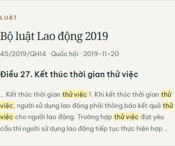

# Full-text nội bộ và kiểm tra key — 19/09/2026

## Kết quả và phạm vi

Full-text local đã chạy trên **4.969 văn bản thật, 101.857 đoạn**, SQLite 263.274.496 byte. Không thay thế title index, không ghi lại corpus, không thay đổi Pinecone/Qdrant. Đây là lát cắt local, không phải 14.962 văn bản online hoặc toàn bộ 518.255 văn bản.

UI có chọn tìm nội dung, tìm cụm từ không phân biệt dấu/hoa thường, filters trước LIMIT, highlight được escape, link đúng Điều/Khoản, 20 kết quả/trang và giới hạn phân trang được giải thích. Chỉ mục khác hash với nguồn đọc bị từ chối thay vì đưa trích đoạn cũ tới reader. Một văn bản có thể xuất hiện nhiều đoạn; không có semantic search hoặc xác nhận hiệu lực.



## Kiểm chứng

- 27 unit/route tests passed, 1 warning. Các fixture xác định dùng trong unit tests không phải bằng chứng live-provider.
- PostgreSQL thật chạy bằng PGlite 0.5.8: 7 assertions trên fixture hợp đồng; một kiểm tra riêng bằng Điều 24, văn bản 333670 / 45/2019/QH14 từ ContentStore, đối chiếu SHA và offset chính xác. Đây là SQL integration cục bộ, **không phải Supabase production**.
- Chrome thật trên app local: desktop 1440 và mobile 390 không tràn ngang; highlight có mặt; mở đúng `/documents/333670#section-30` (Điều 27); không có page error. Không chặn/mô phỏng network.
- Năm truy vấn chỉ mục thật được lưu trong `local-index-queries.json`; thời gian chỉ riêng index 0,06–0,18 giây, không phải latency HTTP cuối cùng. Truy vấn thử việc có thể trả văn bản cũ: không được suy luận còn hiệu lực từ thứ hạng tìm kiếm.
- Bộ Python toàn dự án lần đầu: **1.319 passed, 2 failed, 4 skipped, 30 warnings**. Hai lỗi timeout khởi động 30 giây; chạy riêng lại giữ nguyên timeout: **2 passed**. Không đổi kết quả lần thất bại thành passed. Lượt cuối sau bổ sung kiểm tra hash: **1.322 passed, 4 skipped, 30 warnings, 314,39 giây**, exit 0. Các lần thất bại trước đó vẫn giữ trong log nội bộ.
- Key Logfire mới: US `/v1/info` 200, EU 401. Một trace vô danh gửi thật qua SDK tới US `/v1/traces` **200**, `force_flush=true`; xem `logfire-export.json`. Không ghi secret. Log Vercel đọc trong lượt này vẫn có invalid token/401; chưa xác nhận production nhận key mới.

## Lệnh tái chạy

```powershell
.venv/Scripts/python.exe -m app.ingestion.body_fts --store data/v3/content_store.sqlite3 --output data/v3/legal_body_fts.sqlite3 --limit 5000
.venv/Scripts/python.exe -m pytest tests/services/test_body_search.py tests/test_legal_routes.py tests/services/test_legal_browser.py -q
.venv/Scripts/python.exe -m pytest -q --junitxml=tmp/body-search-20260919/full-final.xml
npm install --prefix tmp/body-search-20260919/pg --no-save --ignore-scripts --no-audit --no-fund @electric-sql/pglite@0.5.8
node tests/sql/body_search_contract.mjs tmp/body-search-20260919/pg
```

Build từ chối ghi đè file có sẵn: chọn đường dẫn mới khi thử lại. Runtime local tìm `legal_body_fts.sqlite3` cạnh ContentStore được chọn. Chỉ mục không được đóng gói lên Vercel. Muốn chạy kiểm tra SQL với văn bản thật, truyền thêm JSON fixture được trích từ ContentStore; lần thực thi này lưu trong `tmp/body-search-20260919/real-sql-fixture.json`. Không phát hành nội dung corpus thành fixture của repository.

## Online còn thiếu gì

`migrations/20260919_legal_body_search.sql` là migration **chưa áp dụng**: batch, passage, active pointer, RLS, phrase/unaccent query, kiểm tra hash/đoạn nguyên văn trước publish, giữ generation cũ. SQL engine đã bắt hai lỗi trước khi sửa: sai chữ ký GRANT và tham số NULL bỏ qua LIMIT. Kiểm tra hiện đã qua. Migration yêu cầu extension `unaccent` ở schema `extensions`; nếu installation có vị trí khác phải kiểm tra và điều chỉnh trước khi áp dụng.

Chưa có PostgreSQL connection/admin credential trong cấu hình đang dùng. Publishable/service-role REST key không tự cung cấp quyền DDL. Cần kết nối SQL, kiểm tra dung lượng database, áp dụng schema, importer có giới hạn và runtime RPC online trước khi bật UI production. Import online, migration Supabase, full-corpus body benchmark: **NOT RUN**. Không thay bằng quét ILIKE không index hoặc giả vờ dùng lát cắt local cho toàn kho online.

Registry hiệu lực toàn corpus và chất lượng trả lời đủ căn cứ vẫn chưa hoàn thành. Report không nâng metadata/snippet hoặc kết quả HTTP 200 thành chứng nhận đúng luật. Portal 10/10 và Công báo 0/10 neo cũ là kết quả discovery riêng, không phải kết quả full-text hay answer correctness.

## Provenance

`manifest.json` lưu Git base, dirty flag, diff SHA-256 và hash từng source mới/sửa (bao gồm untracked). Kết quả browser, SQL, truy vấn index và trace là các file kèm theo. Dữ liệu thô chứa logs production/phiên làm việc nằm ở `tmp`, không commit. Các thay đổi skill/config có trước được giữ nguyên và không đưa vào commit này.


## Sau push / production: chưa đạt

Ba commit `d235654`, `5bc972a`, `34422b9` đã push lên main. Vercel deployment `dpl_g46HQB2Fr91yUu7VBux3ajcyG8rz` của SHA `34422b9` ở trạng thái Ready; alias chính trỏ đúng deployment này. Tuy nhiên smoke thật thất bại: tìm số hiệu và đọc văn bản đều **503**. Body search chưa bật trả 503 đúng hợp đồng; không được tính là tính năng online đã đạt.

Kiểm tra trực tiếp Supabase từ local báo `getaddrinfo failed`. Cả Google và Cloudflare DNS-over-HTTPS trả DNS status **3 (NXDOMAIN)** cho hostname cấu hình; xem `supabase-dns.json`. Chưa truy cập được trạng thái project trong Dashboard nên không kết luận pause/xóa/sai URL. [Tài liệu Supabase về pause/restore](https://supabase.com/docs/guides/platform/free-project-pausing) và [chẩn đoán hostname](https://supabase.com/docs/guides/troubleshooting/resolving-database-hostname-and-managing-your-ip-address-pVlwE0) chỉ là hướng điều tra, không phải bằng chứng trạng thái project này.

Runtime không đổi sang corpus local để che lỗi online. Cần xác minh/khôi phục endpoint Supabase trước khi nghiệm thu lại. Logfire key local đã xuất trace 200; log 401 đã đọc thuộc deployment trước, chưa có log khả dụng của deployment mới lúc kiểm tra. Việc đổi secret production đang chờ xác nhận riêng theo AGENTS.md. Các file `production-smoke.json` và `deployment.json` ghi riêng giới hạn này.
