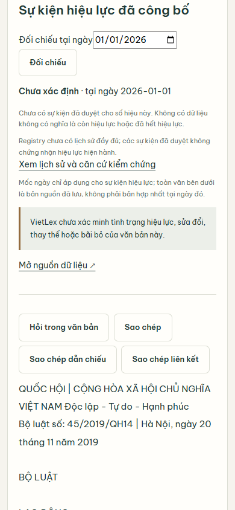
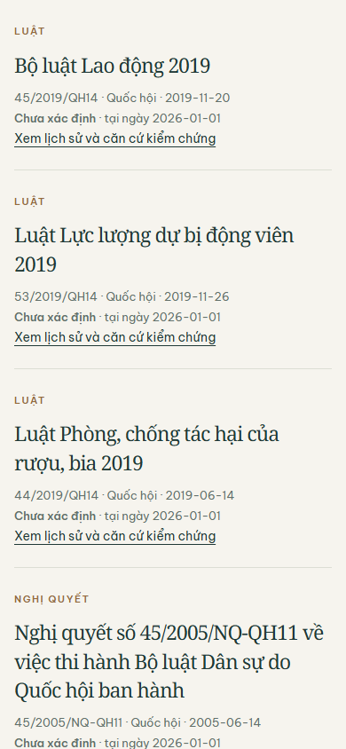

# Registry trong reader/search — 20/09/2026

Người dùng chọn ngày đối chiếu ngay trên trang tra cứu và trang đọc. Kết quả hiển thị sự kiện đã được người quản trị duyệt/công bố, liên kết tới lịch sử và trích dẫn gốc. Ngày được giữ khi mở văn bản từ kết quả tìm kiếm. Mốc ngày không biến toàn văn thành bản hợp nhất và không lọc corpus thành các văn bản còn hiệu lực.

Một batch Mongo cho tối đa 20 số hiệu/trang; chỉ state=published; tối đa 200 record, quá giới hạn báo không thể đọc đầy đủ thay vì suy diễn từ tập bị cắt. Deadline 3 giây; registry unavailable/timeout vẫn giữ nội dung đọc và có cảnh báo khác với không có sự kiện. Không công bố hoặc thu hồi dữ liệu pháp lý trong lượt này.

## Kiểm chứng

- TDD chức năng: 5 failed đúng nguyên nhân thiếu tích hợp → 28 focused passed. Full-suite vòng đầu phát hiện một lỗi thật do body-search trả dict còn metadata trả object (1 failed, 1.369 passed, 4 skipped); đã sửa đúng nhánh dữ liệu. UI search được rút gọn sau kiểm tra ảnh mobile; test chống cảnh báo lặp được quan sát RED. Bản cuối: 41 focused passed; log loại lỗi cũng có RED→GREEN. Unit fixtures có sự kiện giả định được ghi rõ chỉ dành cho test, không ghi vào Mongo hoặc báo cáo live.
- Local corpus thật + Mongo thật: ngày 21/09 full-text 200 (2,437 giây), search 200 (1,219 giây), reader 200 (1,813 giây), ngày 2025-02-30 trả 422. Registry chưa có sự kiện cho 45/2019/QH14, UI hiển thị chưa xác định; không giả tạo sự kiện để có ảnh đẹp.
- Chrome thật 1440×1050 và 390×844: không tràn ngang, không page errors, giữ ngày 01/01/2026, có liên kết lịch sử. Đọc lại reader có 238 phần/190.585 ký tự, không mất toàn văn; outline mobile là khung cuộn.
- Ruff trên 317 Python tracked files: PASS. Repository artifact gate: PASS. Full suite cuối ngày 21/09: **1.371 passed, 4 skipped, 31 warnings**, 372,07 giây. Bốn test skipped không được tính là đã kiểm chứng.
- Production reader/search mới chưa nghiệm thu: backend Supabase vẫn NXDOMAIN ở kiểm tra trước. Không dùng local để tuyên bố production pass.

## Môi trường

Lần test đầu không chạy được vì venv thiếu pydantic và nhiều gói runtime/build tools; không tính đó là RED chức năng. Đã khôi phục qua pyproject.toml, giữ xác thực TLS. Một lần pip bị DLL websockets khóa; dừng đúng local server kiểm thử rồi cài thành công. Phiên bản sau sửa được lưu tại runtime-versions.json. Websockets được đưa về 15.0.1 để tương thích langgraph. `pip check` còn báo ba conflict của pyppeteer 2.0.0 với pyee/urllib3/websockets; pyppeteer không thuộc dependency runtime dự án, các conflict này chưa sửa. Không coi môi trường toàn cục là sạch hoàn toàn.

## Lệnh

```powershell
.venv/Scripts/python.exe -m pytest tests/test_legal_routes.py tests/services/test_legal_registry_store.py tests/test_legal_registry_routes.py tests/services/test_legal_registry.py -q
.venv/Scripts/python.exe tmp/continuation-20260920/registry_browser.py
.venv/Scripts/python.exe tmp/continuation-20260920/registry_focus_browser.py
.venv/Scripts/python.exe scripts/check_repository_artifacts.py
.venv/Scripts/python.exe -m pytest -q --junitxml=tmp/continuation-20260921/registry-final-full.xml
```

Runtime files và SHA-256: source-hashes.json. Tests: tests/test_legal_routes.py, tests/services/test_legal_registry_store.py. Không gọi AI/provider cho phần registry này. Human legal publication và production search thành công: NOT RUN.





## Kiểm tra tiếp ngày 21/09

Hai lượt chụp Chrome sau startup trước đó đã hiển thị registry unavailable; giữ ảnh `earlier-focus-*`, không chỉ giữ lượt đạt. Chín lượt đo lại HTTP/Mongo đều 200, registry đọc được, 0,141–0,515 giây. Chụp lại trên server chứa source cuối: reader/search đều hiển thị unknown (registry trống), không unavailable; xem registry-focus.json. Deadline 3 giây và cảnh báo phân biệt lỗi/không có dữ liệu được giữ; không khẳng định kết nối sẽ không bao giờ chậm.

Supabase vẫn NXDOMAIN trên Cloudflare/Google ngày 21/09, REST ConnectError. Công cụ UI quản trị không khởi động được do sandbox ACL; chưa xác định trạng thái Dashboard, không suy đoán project đã bị xóa/paused. Không chạy migration hay ingestion remote.
