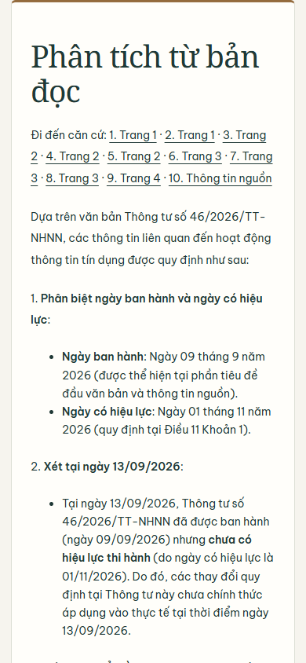
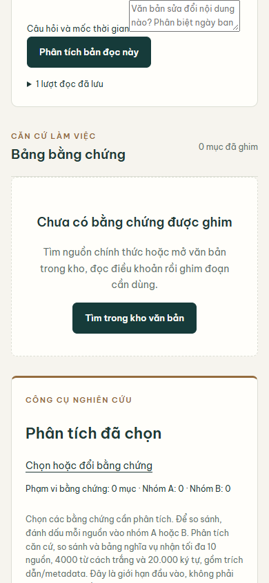
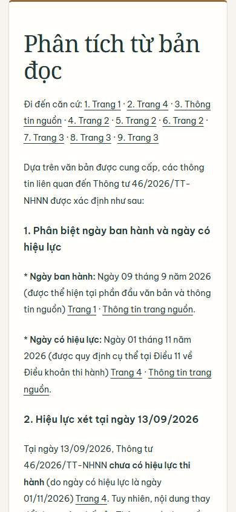

# Phân tích bản nguồn đã lưu — 20/09/2026

Workflow mới: tab Nguồn → “Hỏi từ toàn bộ bản đọc đang lưu” → câu hỏi/mốc thời gian → kết quả đã lưu với trích dẫn và liên kết về lượt đọc gốc. Gom đúng URL/hash PDF và các trang đang giữ, theo thứ tự trang; không tự đọc thêm hay mở rộng corpus. Giới hạn 120.000 ký tự / 24.000 từ cách trắng, tối đa 64 căn cứ; vượt giới hạn báo rõ trước provider, không cắt ngầm. Trang còn thiếu vẫn được liệt kê. Quota/auth/ownership/CSRF hiện có được giữ.

Model chọn ID đoạn server tạo; server lấy câu trích nguyên văn từ bản lưu. Metadata số hiệu/ngày của cổng nguồn có nhãn riêng, không giả làm câu trích PDF. Điều này kiểm tra được nguồn của câu trích, không chứng minh mọi diễn giải đúng luật. Phân tích trích đoạn đã ghim vẫn là chức năng riêng, không đổi scope ngầm.

## Bằng chứng thật

- [10 câu gốc / raw input-output / manifest](../../evaluation/runs/retained-source-ten-20260919T163801Z/REPORT.md): 10 phản hồi hợp lệ, 142 ID căn cứ tồn tại; model đánh giá 9 đủ/1 thiếu trong phạm vi nguồn. 178 trang OCR được giữ; không phải 10/10 câu đã được chuyên gia xác nhận đúng luật.
- 10 số hiệu không có trong toàn bộ 518.255 metadata local và slice v3 4.969 văn bản. Chưa kiểm tra vắng ở mọi remote index.
- HTTP thật local: tạo hồ sơ 303 → tải/OCR PDF Chính phủ 4 trang 200 → phân tích 303 → đọc lại Mongo 200. Lượt cuối tái sử dụng bản đọc, không OCR lại; có trích dẫn metadata. Không mock các response live.
- Chrome thật 1440×1050 và 390×844: form nguồn hiển thị, kết quả và căn cứ đọc được, không tràn ngang, không JS page errors. Ảnh dưới đây là local, không phải ảnh production.
- Registry đã triển khai tại commit `4b4968a`: public/admin 200; metadata search vẫn 503. Không công bố sự kiện pháp lý thay reviewer.
- Qdrant ngày 20/09: đúng một `query_points(limit=1)` trả 1 point trong 2,344 giây, không mutation. Không quan sát được timer hibernation nên không tuyên bố đã reset timer.
- Supabase ngày 20/09: Cloudflare và Google DNS đều status 3/NXDOMAIN; REST ConnectError; không có SQL connection trong env/.env. Full-text online vẫn chưa bật.

## Kiểm thử và lệnh

Các unit tests dùng doubles riêng để kiểm tra nhánh lỗi/quyền; không gọi provider. Full-suite cuối: **1.363 passed, 4 skipped, 30 warnings**, 311,41 giây. Full-suite trước phát hiện 1 lỗi stylesheet trang lỗi; đã sửa và chạy lại gate liên quan (6 passed), sau đó toàn bộ suite. Bốn test skipped không được tính là đã nghiệm thu.

```powershell
.venv/Scripts/python.exe -m pytest tests/test_redesign_navigation.py tests/test_retained_source_routes.py -q
.venv/Scripts/python.exe -m pytest -q --junitxml=tmp/continuation-20260920/release-full.xml
.venv/Scripts/python.exe tmp/continuation-20260919/retained_ten_metadata.py
.venv/Scripts/python.exe tmp/continuation-20260919/retained_api_final.py
.venv/Scripts/python.exe tmp/continuation-20260919/retained_browser.py
```

Runtime files: `app/services/retained_source_analysis.py`, `app/api/retained_source_routes.py`, `app/main.py`, `app/static/js/source-analysis.js`, templates `retained_source_answer`, `retained_source_error`, `workspace_source_library`, `research_workspace`. Tests: `tests/services/test_retained_source_analysis.py`, `tests/test_retained_source_routes.py`.

## UI thật





## Chưa nghiệm thu

Production `2d75af7`, deployment `dpl_J4b16unoKXUJbpzbh34kk8wZTW5C` Ready: workspace 200 → POST phân tích 303 (10,156 giây) → GET kết quả 200/no-store, có căn cứ và scope. Chrome production desktop/mobile không tràn ngang, không page errors; form và citation hiện đúng. Không OCR lại. Xem `production-retained.json` và `production-retained-browser.json`. Chưa có adjudication pháp lý đầy đủ theo claim; không có điểm “đúng luật”. OCR có thể sai; bản lưu và kết quả cùng retention hồ sơ, chỉ 50 phân tích gần nhất. Registry chưa có sự kiện được reviewer công bố. Full-text online cần Supabase hoạt động và quyền SQL; không chạy migration/ingestion remote khi thiếu kết nối.

## Production UI và trạng thái Git

Runtime commit `4662e99`, evidence/docs `2d75af7` đã push `origin/main`. Những file không thuộc phạm vi thay đổi vẫn được giữ, working tree không được tuyên bố sạch.



Lệnh production: `.venv/Scripts/python.exe tmp/continuation-20260920/production_retained.py`; `.venv/Scripts/python.exe tmp/continuation-20260920/production_browser.py`. Script chứa đường dẫn state đăng nhập cục bộ; chỉ output an toàn được lưu vào Git. Log pytest giữ nguyên whitespace gốc của cảnh báo.
