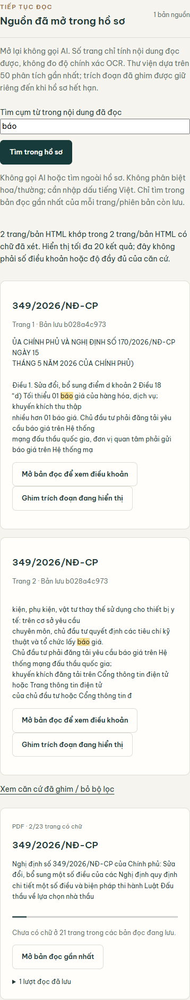

# Saved-source phrase search — real verification, 2026-09-14

Runtime commits: `a8c5fa9` (browser newline pin fix), `bf6421d` (saved-source search). Both pushed to origin/main. Production deployment `dpl_8M4cvWftfnSwuPyoRQLoLAfSuTb7` is Ready and serves https://vietlex-legal-rag.vercel.app. Its actual Vercel build log identifies `main`, commit `bf6421d`.

## Delivered behavior

Sources now searches phrases in retained official readings, shows escaped highlights, page and source version, opens the saved reader and pins the displayed excerpt. Case-insensitive, Vietnamese accents required, whitespace-tolerant matching. Only the last 50 analyses/up to 3 sources each; latest reading per URL/version/page; up to 20 matching pages shown. A zero result does not mean no legal provision exists. Search makes no AI or web discovery request. Existing owner/expiry checks, CSRF and rate limits remain.

Real browser testing found a 422 `quote_not_in_source`: multipart forms normalize line endings. The fix recovers the exact saved substring with equivalent CR/LF representation, preserving original evidence text and ID. Spaces, punctuation or different wording remain rejected.

## Evidence

- Focused unit/route suite: **32 passed, 1 warning**. Regression first failed with expected 422 instead of 200. Unit tests use isolated doubles; they are not live-provider evidence.
- Full provider-free suite: **1297 passed, 30 warnings, 313.33 seconds**; integration and visual suites excluded. Source remained stable during this run, but was uncommitted at launch; see manifest caveat.
- Actual local Chrome + real MongoDB: 2 matching pages for `báo`; POST pin 200; UI success; GET readback 200; exact excerpt equality. Desktop 1440×1050 and mobile 390×844: no horizontal overflow or page errors.
- Actual production Chrome: 1 matching page for `hàng không`; POST pin 200; UI success; GET readback 200; exact excerpt equality. Same viewport checks passed. These are retained public-source readings, not fresh online discovery or an OCR accuracy test.
- Ruff and `git diff --check` passed for changed source/tests. No new provider/model configuration or legal status promotion.
- Initial browser evidence retains the actual 422. Harness-only failures (Windows output encoding, an incorrect result directory and response-body collection that did not finish) are not counted as application passes; final browser proof uses visible UI status and actual database readback.

## Commands

```powershell
.venv/Scripts/python.exe -m pytest tests/test_source_library.py -q -p no:cacheprovider --basetemp=tmp/saved-source-search-20260914/newline-red-retry
.venv/Scripts/python.exe -m pytest tests/test_saved_source_search.py tests/test_workspace_routes.py tests/test_source_library.py -q -p no:cacheprovider --basetemp=tmp/saved-source-search-20260914/newline-green
.venv/Scripts/python.exe -m ruff check app/api/trusted_source_routes.py app/api/workspace_routes.py app/services/workspace_presenter.py tests/test_saved_source_search.py tests/test_source_library.py tests/test_workspace_routes.py
.venv/Scripts/python.exe -m pytest tests --ignore=tests/integration --ignore=tests/visual -q -p no:cacheprovider --basetemp=tmp/saved-source-search-20260914/pytest-search-suite --junitxml=tmp/saved-source-search-20260914/full-search.xml
.venv/Scripts/python.exe tmp/saved-source-search-20260914/browser_final.py
.venv/Scripts/python.exe tmp/saved-source-search-20260914/production_browser.py
git push origin main
```

Vercel CLI 59.14.0: `deploy --cwd tmp/product-deploy-bf6421d --prod --skip-domain --yes --scope foxys-projects-5fe642e0` produced a separate Ready deployment. Auto-review rejected its promote command. No workaround promote was performed. Read-only inspection then found the Git integration had already deployed the same commit to the canonical domain; build-log and browser verification above refer to that Git deployment.

## Scope still incomplete

This is **not corpus-wide full-text/article search**, a global effective-date registry, or multi-domain web discovery. Logfire export still returns 401 for its configured token. The 30 deprecation warnings remain. No claim of zero bugs, production readiness, legal completeness or ten new out-of-corpus answers is made by this test.

Changed files: `app/api/trusted_source_routes.py`, `app/api/workspace_routes.py`, `app/services/workspace_presenter.py`, `app/static/css/research-workflow.css`, `app/templates/workspace_source_library.html`, `tests/test_source_library.py`, `tests/test_workspace_routes.py`, `tests/test_saved_source_search.py`; documentation accompanies this report. Unrelated local user/configuration changes remain unstaged.

Only this curated report, summary, manifest and public-source screenshot are published. Raw logs, browser harnesses and workspace/session data remain local; hashes in the manifest identify available local evidence, not downloadable public files.


