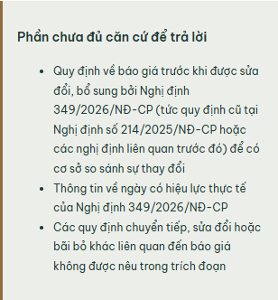

# Selected research context and unanswered requests

Runtime `f4fcb37`, pushed to origin/main. Vercel Git deployment `dpl_Amtnzw2vbPMuT7U8GMG497FQz38d` is Ready and serves https://vietlex-legal-rag.vercel.app; build log names commit `f4fcb37`. Production checked 2026-09-19; local/provider runs on 2026-09-14/15.

## What changed

Selected evidence analysis and its shared-prompt consumers (comparison, obligations, reports, claim verification, admin model experiments) use `RESEARCH_CONTEXT_MAX_WORDS=4000`, validated 720..12000. Existing 20,000-character and 10-source limits still apply, including citation/metadata. Inputs are rejected rather than silently truncated. Chat retrieval and contract-review batching retain 720; no vector/provider/model/credential change.

Selected answers must explicitly return `unanswered_parts`. Missing/invalid structure fails validation. A nonempty list forces `insufficient_evidence` regardless of the model's status label. This enforces internal consistency, **not semantic truth**: the model can still invent or miss a gap. UI displays these parts and linked evidence, including saved history. User/admin screens explain the separate budgets and distinguish whitespace words from billed model tokens.

## Verified

- Focused Python: 52 passed, 1 warning; observed RED before fixes. Full final suite: **1300 passed, 30 warnings, 442.63 seconds**. Unit doubles are isolated tests, not live proof. Integration/visual directories excluded from this suite.
- Ruff, JS syntax and diff whitespace checks passed. Browser checks below are actual Chrome, not mocked DOM/network.
- Same two real saved excerpts, **995 whitespace words without metadata**: production before **422 evidence_scope_too_large**, production after **200**, Vertex/Gemini success, two exact snapshot IDs retained.
- Actual production history readback: missing-part list equals persisted response, 2 source links, no page errors or horizontal overflow at desktop 1440×1050/mobile 390×844.
- No fictional corpus or model response was inserted. Production test uses previously saved public legal sources in an authorized test workspace.

## Ten real questions

The diagnostic selects <=1800-character exact page excerpts from previously read PDFs, ranks by question words and reserves an effective-date passage, then admits up to 10 under the actual input budget. This selector is an **offline experiment**, not shipped automatic retrieval. Both budget and passage selection changed from the earlier two-excerpt baseline; no isolated causal claim is made. Four short documents supplied all retained text. Questions keep the explicit as-of date 13/09/2026 for comparison, not today's date.

Final MINIMAL run: **10/10 provider success**, 10/10 selected-ID validity, **2 ok / 8 insufficient_evidence**, 60,878 input + 8,981 output = 69,859 provider-reported tokens. Status/ID validity are technical metrics, not legal accuracy. Original-document accuracy, current legal effect and claim-by-claim legal audit are not certified.

| Case | Final model/service status | Manual finding / limitation |
| --- | --- | --- |
| agriculture | insufficient_evidence | Không còn suy đoán tên Bộ Nông nghiệp và Phát triển nông thôn trong lượt cuối; còn diễn đạt sai về trang bị khuyết. |
| aviation | insufficient_evidence | Đã đánh dấu thiếu căn cứ cốt lõi: cần nội dung Quyết định 2007/QĐ-TTg cho ngày áp dụng được hỏi. |
| credit | insufficient_evidence | Còn lỗi: nói thiếu phần giữa trang 2/3 dù toàn bộ chữ lưu đã được cấp. Không đạt gate độ trung thực về phạm vi nguồn. |
| electricity | insufficient_evidence | Nêu ngày hiệu lực tương lai; chưa trả lời đầy đủ phần hỗ trợ thực chất của câu hỏi. |
| health | ok | Trả mức phụ cấp và phân biệt ngày hiệu lực/ngày thực hiện; chưa kiểm toán từng claim hoặc văn bản sửa đổi bên ngoài. |
| imports | insufficient_evidence | Nêu một số tiêu chí/giám định; thiếu đoạn điều khoản hiệu lực và tiêu chí chi tiết trong selection. |
| maritime | insufficient_evidence | Có điều kiện cơ sở vật chất/giảng viên và ngày hiệu lực tương lai; chưa đủ toàn bộ căn cứ; còn cách diễn đạt khuyết trang. |
| procurement | insufficient_evidence | Chỉ một phần văn bản được chọn; báo thiếu phần thay đổi còn lại. Cách gọi trang không được chọn là bị khuyết vẫn không chính xác về bản gốc. |
| reserves | insufficient_evidence | Phân biệt phần dự trữ chiến lược có ngày hiệu lực riêng; không đủ nội dung quản lý toàn văn trong selection. |
| resources_tax | ok | Nêu nội dung sửa đổi, bãi bỏ và kỳ tính thuế; chưa chứng nhận tình trạng hiện hành. |

The aviation core-answer status defect was reproduced, resisted a prompt-only attempt, then passed with structured unanswered parts. The agriculture ministry-name guess disappeared in the final sample. **Credit still falsely claims a gap between pages despite all retained text being supplied.** Other selected-page answers also use unjustified language about a defective original. This is a failed source-completeness quality gate, not a fully fixed benchmark.

A same-input/model/output-cap MEDIUM experiment improved the credit sample but **5/10 outputs hit MAX_TOKENS** (health, procurement, resources_tax, agriculture, reserves). It is rejected; production remains MINIMAL. Its additional calls/cost are separate from the final-run token total above; no monetary cost was calculated.

## Exact verification commands

```powershell
.venv/Scripts/python.exe -m pytest tests/services/test_research_analysis.py tests/test_source_temporal_context.py tests/test_workspace_routes.py tests/test_public_templates.py -q -p no:cacheprovider --basetemp=tmp/selected-context-20260915/answer-green
.venv/Scripts/python.exe -m pytest tests --ignore=tests/integration --ignore=tests/visual -q -p no:cacheprovider --basetemp=tmp/selected-context-20260915/pytest-final-context-suite --junitxml=tmp/selected-context-20260915/full-final-context.xml
.venv/Scripts/python.exe tmp/selected-context-20260914/api_budget_live.py https://vietlex-legal-rag.vercel.app production-budget-green
.venv/Scripts/python.exe tmp/selected-context-20260915/production_browser_answer.py
node --check app/static/js/research-workspace.js
git push origin main
```

Changed runtime/tests: `app/config.py`, `app/services/research_analysis.py`, `app/api/workspace_routes.py`, `app/static/js/research-workspace.js`, `app/templates/admin_inventory.html`, `app/templates/research_workspace.html`, `tests/services/test_research_analysis.py`, `tests/test_source_temporal_context.py`. Unrelated local user/config changes are not included.

Global remaining work includes corpus body/article indexing, verified legal-effect lifecycle data, broader proven online discovery and Logfire token 401. No zero-error or production-readiness claim. Raw evidence is retained locally and hashed in the manifest; only curated summaries and this actual public-source UI image are published.


