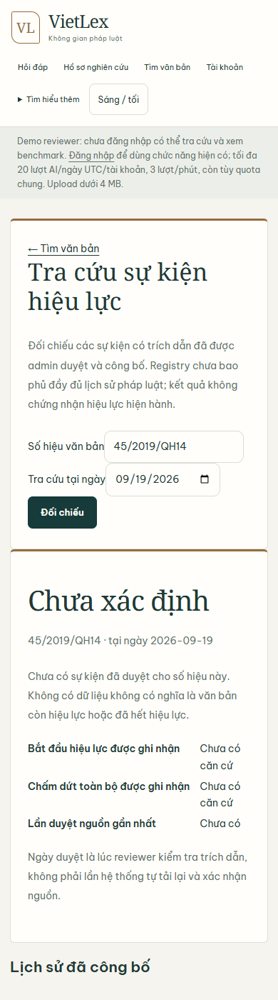
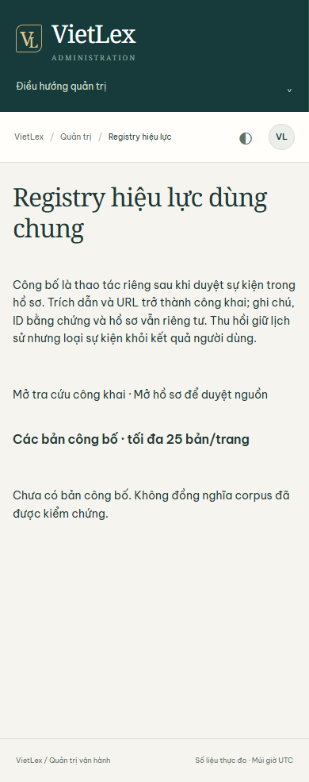

# Shared legal registry — 19/09/2026

Implemented at `6c1be85`. A reviewed workspace analysis remains private until an admin explicitly publishes it. Publication revalidates the immutable evidence snapshot, records reviewer/publisher/time, and copies public assertions into a durable Mongo collection independent of workspace expiry. Withdrawal preserves its reason and actor; retry cannot reactivate it.

Public `/legal-status` projects only published events at the requested date. Relationships are directional; partial amendment is not whole-document repeal. Missing data stays unknown; database failure is HTTP 503, not an empty successful registry. The UI explains that reviewed events do not establish a complete legal history or certify current law. No corpus/vector migration and no automatic evidence promotion.

## Verification

- Focused unit/API: **39 passed**. Full provider-free suite: **1,350 passed, 4 skipped, 30 warnings**, 236.93 seconds. Unit tests use synthetic fixtures/doubles, not live legal evidence.
- Chrome + actual local application + actual configured Mongo: public lookup and authenticated admin HTTP 200, no published records; date form works; desktop 1440×1050 and mobile 390×844 have no horizontal overflow.
- **NOT RUN:** live publish/withdraw. These are human legal review actions; no fabricated or agent-certified legal event was inserted to make the UI appear populated.
- Production smoke recorded separately after deployment. Successful empty lookup is not evidence that real legal history has been populated.

Commands:

```powershell
.venv/Scripts/python.exe -m pytest tests/test_legal_registry_routes.py tests/services/test_legal_registry.py tests/services/test_legal_registry_store.py tests/test_legal_effect_routes.py tests/services/test_legal_effect.py tests/test_legal_routes.py tests/test_product_quality.py -q
.venv/Scripts/python.exe -m pytest -q --junitxml=tmp/continuation-20260919/registry-full.xml
.venv/Scripts/python.exe tmp/continuation-20260919/registry_browser.py
.venv/Scripts/python.exe tmp/continuation-20260919/registry_admin_browser.py
```

No provider calls in registry operations. Public quotes/official URLs may be published only after the explicit admin checkbox; private workspace notes and evidence IDs are excluded. Mongo failures remain typed. Publication and withdrawal store their audit with the same atomic document mutation.

## Actual UI captures

These are local application captures backed by real Mongo, not production images or synthetic populated screens.




